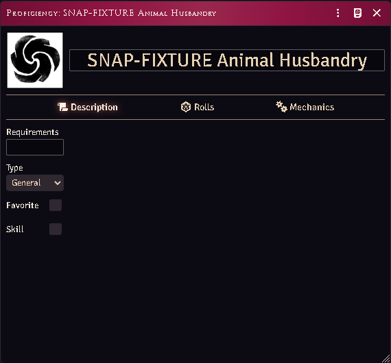
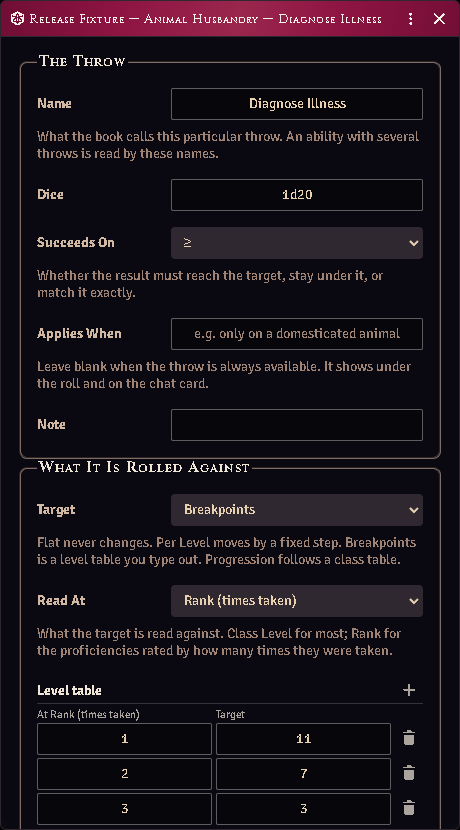

# Proficiencies and class powers

The system's own `ability` item, given a real model: several throws instead of
one, targets that scale with level or rank, and selections that light up the
matching proficiency pills.



*An ability item with its rolls and mechanics tabs.*

## The sheet

Open any **ability** item. Beyond core's fields:

- **Mechanics** — the structured effect model (what this ability actually does),
  with the system's own Active Effects folded in rather than kept in a separate
  tab.
- **Rolls** — every throw the ability makes.
- **Selections** — the picks a proficiency of this category can take.

## Multiple rolls

Core stores **one** roll per ability, so every route into a roll — the sheet's
proficiency row, a chat card button, `item.use()`, a hotbar macro — could only
ever reach an ability's *first* throw, while the Rolls tab showed all of them.
The same ability rolled differently depending on where you clicked.

This module owns the ability roll path and routes all of them to the same place.
Add as many throws as the ability has; they all work from everywhere.

## Typing in a throw

The **Rolls** tab is a list you edit like an inventory:

- **Add a throw** puts a new one at the bottom and opens it.
- The **pencil** on a row opens that throw; the **trash** deletes it, after
  asking.
- The row itself is still the roll button.

The window that opens holds everything about that one throw — what it is called,
what it rolls, whether the result must reach the target or stay under it, and
when it applies. Changes save as you make them; there is no Save button.



*Animal Husbandry's diagnosis throw as the book prints it: read at rank, and a
level table of three steps — 11+ at one rank, 7+ at two, 3+ at three.*

**Read At** is the thing to get right. Most throws are read against class level;
the proficiencies the books rate by how many times they were taken — Animal
Husbandry, Naturalism — are read against **rank**. The line at the bottom of the
window shows what the throw comes to for the character holding it, which is the
quickest way to check you typed the table the way the page prints it.

## Level tables

Set **Target** to *Breakpoints* and the window grows a table. Add one step for
each point where the printed number changes — a step holds from where it starts
until the next one begins, so a throw that is 11+ at one rank, 7+ at two and 3+
at three is three steps, not one per level.

The table belongs to that throw. Sharing one table between abilities is not
built yet.

*Per Level* is the shape for a target that moves by a fixed amount each level
rather than in steps; a target that gets easier moves **down**, so write the
change negative. *Progression* is for a throw the book rates off another class's
table — the table itself is not carried yet, so the sheet shows the progression
instead of a number.

**An ability with no roll shows itself instead of rolling.** Core intends this,
but tests a field that defaults to `"1d20"` and is therefore never empty — so a
proficiency that makes no throw used to post a d20 against a target of 0.

## What a throw looks like in chat

A proficiency throw posts on the same card the system uses for every other roll:
the ability's name in the banner, its image beside it, and the verdict with the
target it was read against — `Success (14+)`. If the book puts a condition on the
throw ("only on a domesticated animal"), it sits under the result, so the table
can see what the roll assumed. A throw on a shared compendium item says so
instead of scoring itself, because there is no character to read its ladder
against.

## Selections

Some proficiencies are not finished until you say WHICH: Weapon Focus names a
weapon group, Fighting Style Specialization a style, Combat Trickery a
manoeuvre, Art/Craft a discipline. Those abilities show a box per printed
choice, and ticking one is guaranteed to light the matching proficiency pill —
the keys are the same ones the profile strips match on, so a pick you tick is a
pick the rules actually read.

**A pick outside the list is still valid.** Art/Craft, Profession, Labor and
Performance are open — the boxes are the entries the books name, not a limit —
so a craft your Judge approved goes in the free-text line under the boxes. That
line is also where a selection goes when you clear the boxes entirely, so you
can always type one by hand.

**A campaign can give those open families its own boxes.** If your world keeps
naming the same professions, a Judge registers them once and they appear as
ticks beside the printed ones, for everybody:

```js
acksExtras.lib.tables.registerTable(
  { id: "acks.selectionVocab", tables: { profession: { vintner: { label: "Vintner" } } } },
  { priority: 20 },
);
```

The closed families — Weapon Focus, Martial Training, fighting styles, Combat
Trickery, Elementalism — take no additions, because each entry drives a rule the
module resolves and a sixth fighting style would be a box that changes nothing.
Languages are not on this list either: they are documents you fill slots with,
not words you tick.

**Imported characters keep their picks.** A template that says
"Fighting Style Spec. (weapon & shield)" ticks *Weapon & Shield*, and one that
says "Swords" ticks *Swords & Daggers*, rather than leaving the words sitting in
free text where nothing matches them.

**The name follows the pick.** Choosing a selection renames the ability to
carry it — *Weapon Focus* becomes *Weapon Focus (Swords & Daggers)* — so you
never type the parenthesis yourself. Changing the pick rewrites the suffix
instead of adding a second one, and clearing every box takes it off again.

Fighting styles list the five the combat rules resolve. A sixth that the rules
cannot place would be a choice that grants nothing, so it is not offered.

## Common problems

**The sheet died with "the partial could not be found".** Open an ability first
after a reload and the system's Active Effects partial may not be registered yet.
The module preloads it; if the system renames the file, the tab renders without
that block rather than breaking.

**A shared world item shows a ladder instead of a number.** It has no owner to
resolve against, so it presents the ladder itself. That is correct.

**My roll target is 0.** A core record sitting at its schema defaults (`1d20`,
target 0) is not a roll — those are field initials, not a throw anyone entered.
