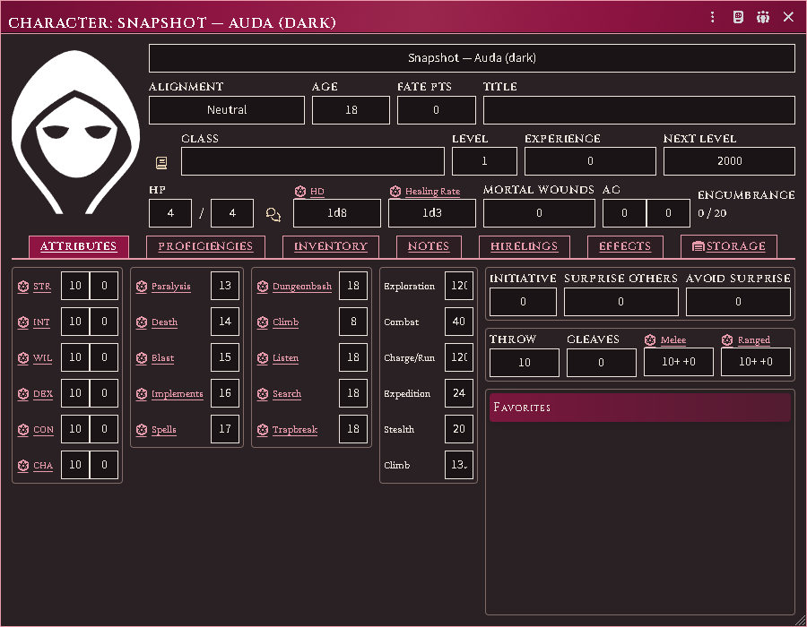

# Appearance

Every window this module opens — and every window the ACKS system opens — is
drawn from one palette: the burgundy spot colour and warm black the books are
printed in, on parchment or on tooled leather depending on your seat.

*The system's own character sheet on a dark seat, wearing the ACKS frame.*

## Pick a colour scheme

**Configure Settings → Module Settings → Extras → ACKS colour scheme.** Per
player; it changes nothing for anyone else at the table.

| Setting | What it does |
|---|---|
| **Follow Foundry** (default) | Matches whatever colour scheme the rest of your client uses |
| **Always light** | Parchment, whatever Foundry is set to |
| **Always dark** | Tooled leather, whatever Foundry is set to |

Follow Foundry genuinely follows. Foundry lets you theme application windows
separately from the rest of the interface (**Configure Settings → Core → Colour
Scheme**), and the ACKS palette tracks whichever of those applies to the window
you are looking at.

One combination is imperfect: with the interface set **dark** and application
windows set **light**, ACKS surfaces stay dark inside those windows. Set ACKS
colour scheme to **Always light** and it resolves.

## Change the text size

**ACKS font size** sets the base size, in pixels, for every ACKS surface —
follower cards, module windows, and the system's sheets. One knob rescales the
whole family; Foundry's own UI scale applies on top of it.

## Choose how much styling the system's sheets take

**ACKS styling on system sheets** decides how far the look reaches into the
windows the ACKS *system* opens — the character sheet, the item sheet, its
dialogs.

| Setting | What it does |
|---|---|
| **Full dress** (default) | Banners, tabs and ACKS write-in fields throughout. The character sheet opens wider to fit them |
| **Palette only** | The system keeps its own layout, spacing and width; only the colours change |

Both follow your colour scheme. This setting is how much ACKS, never whether
dark mode works.

Full dress widens the character sheet by about 90px. The ACKS write-in fields
are roomier than the ones that sheet was laid out around, so it is given the room
rather than made to do without them — and it is a minimum, not a fixed width, so
if you drag the sheet wider it stays where you put it. If you would rather keep
the sheet exactly as the system draws it, that is what **Palette only** is for.

There used to be a **Character-sheet theme** on/off toggle. Off never returned
you to a neutral Foundry — it left this module's windows in the ACKS look and the
system's in Foundry's default one — and the ACKS system publishes no dark palette
of its own, so on a dark seat it put the module's panels on a page drawn for a
light one. The choice above replaces it.

## Colour is never the only signal

No distinction in this module is carried by hue alone. A lit lamp and an unlit
one differ by the weight of the glyph, not its colour; a magical light and a
mundane one are different marks. That is partly the books' own discipline — they
are printed in one spot colour and a black — and partly so the interface still
reads on a colourblind seat, in greyscale, or printed.
