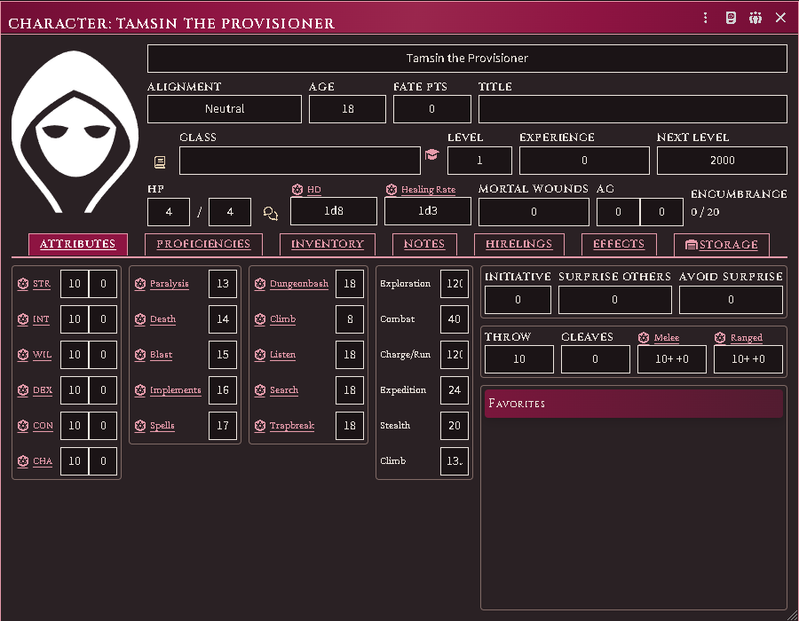
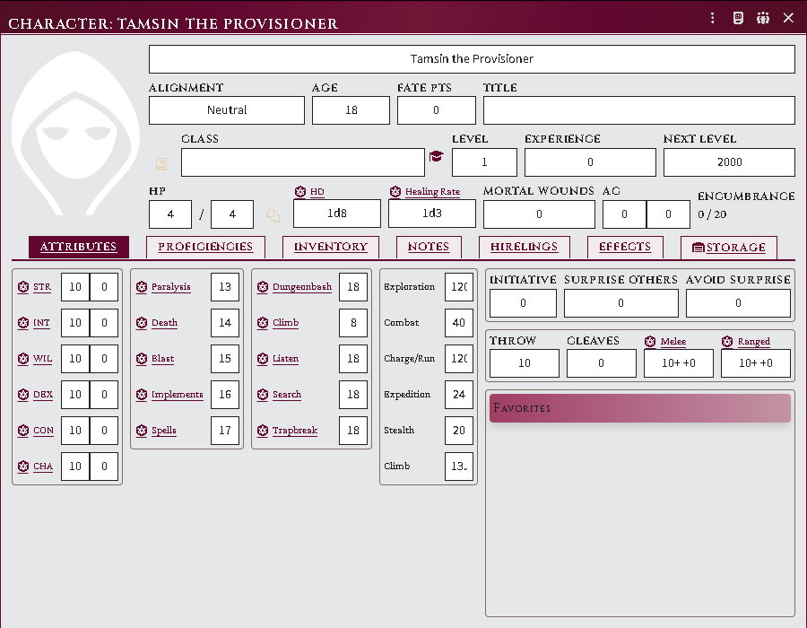
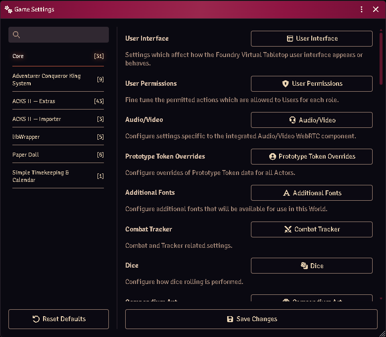
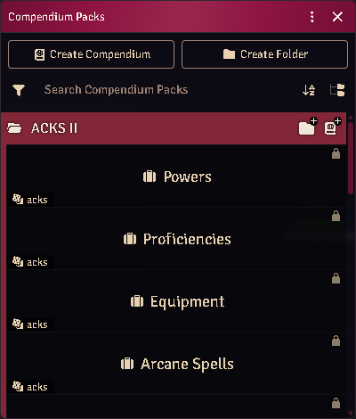

# Appearance

Every window this module opens — and every window the ACKS system opens — is
drawn from one palette: the burgundy spot colour and warm black the books are
printed in, on parchment or on tooled leather depending on your seat.

If that is not what you want, **ACKS look → System style** turns all of it off.
Start there; the rest of this page describes the settings that shape the book
look, and they only apply while you are using it.

*The system's own character sheet on a dark seat, in the ACKS palette.*

*The same sheet on a light seat: ruled page, boxed write-in fields.*

## Turn the ACKS look off

**Configure Settings → Module Settings → Extras → ACKS look.** Per player; it
changes nothing for anyone else at the table.

| Setting | What it does |
|---|---|
| **Book style** (default) | The ACKS palette and lettering, everywhere this module draws |
| **System style** | No ACKS palette and no ACKS lettering anywhere — every surface uses the colours and faces your client already uses |

System style is a genuine opt-out rather than a lighter version of the same
thing. It covers this module's own windows too — follower cards, the location
and henchmen sheets, every dialog — not just the system's. Your roll cards in
chat change the most visibly, because those are dressed by this module and
nothing else.

Two honest limits. **It gives you the ACKS *system's* look, not a neutral
Foundry**: the system itself paints every window header and hardcodes some of its
own dialog colours, and turning this module down cannot turn that off. And
**light versus dark becomes Foundry's business** — the ACKS colour scheme setting
below stops applying, because there is no ACKS palette left for it to pin. Set
your seat in **Configure Settings → Core → Colour Scheme** instead.

Text size is not part of the look and keeps working either way; see below.

## Pick a colour scheme

**Configure Settings → Module Settings → Extras → ACKS colour scheme.** Per
player; it changes nothing for anyone else at the table.

| Setting | What it does |
|---|---|
| **Follow Foundry** (default) | Matches whatever colour scheme the rest of your client uses |
| **Always light** | Parchment, whatever Foundry is set to |
| **Always dark** | Tooled leather, whatever Foundry is set to |

*The per-player setting that holds the ACKS look steady.*

Follow Foundry genuinely follows. Foundry lets you theme application windows
separately from the rest of the interface (**Configure Settings → Core → Colour
Scheme**), and the ACKS palette tracks whichever of those applies to the window
you are looking at.

One combination is imperfect: with the interface set **dark** and application
windows set **light**, ACKS surfaces stay dark inside those windows. Set ACKS
colour scheme to **Always light** and it resolves.

## Change the text size

**ACKS font size** sets the base size, in pixels, for every ACKS surface —
follower cards, module windows, and the system's sheets. One knob rescales the
whole family; Foundry's own UI scale applies on top of it.

## Choose how much styling the system's sheets take

**ACKS styling on system sheets** decides how far the look reaches into the
windows the ACKS *system* opens — the character sheet, the item sheet, its
dialogs.

| Setting | What it does |
|---|---|
| **Full dress** (default) | Banners, tabs and ACKS write-in fields throughout. The character sheet opens wider to fit them |
| **Palette only** | The system keeps its own layout, spacing and width; only the colours change |

Both follow your colour scheme. This setting is how much ACKS, never whether
dark mode works.

Full dress widens the character sheet by about 90px. The ACKS write-in fields
are roomier than the ones that sheet was laid out around, so it is given the room
rather than made to do without them — and it is a minimum, not a fixed width, so
if you drag the sheet wider it stays where you put it. If you would rather keep
the sheet exactly as the system draws it, that is what **Palette only** is for.

There used to be a **Character-sheet theme** on/off toggle, and it was removed
because off never returned you to anything coherent: it left this module's
windows in the ACKS look and the system's in Foundry's default one, and on a dark
seat it could put ACKS panels on a page drawn for a light one. **ACKS look →
System style** is the opt-out done properly — everything stands down together, so
there is no half-dressed state to land in, and nothing is left picking its
colours from a different scheme than the window around it.

## Where the ACKS compendia live

The **Compendium Packs** sidebar gathers every ACKS pack under one folder —
this module's, the other modules in the family, and the system's own — instead
of leaving them loose at the root among everything else installed.

*Every ACKS pack under one folder, rather than loose at the root.*

The folder is matched by name, so every ACKS module declaring it lands in the
same one rather than each making its own.

## Colour is never the only signal

No distinction in this module is carried by hue alone. A lit lamp and an unlit
one differ by the weight of the glyph, not its colour; a magical light and a
mundane one are different marks. That is partly the books' own discipline — they
are printed in one spot colour and a black — and partly so the interface still
reads on a colourblind seat, in greyscale, or printed.
