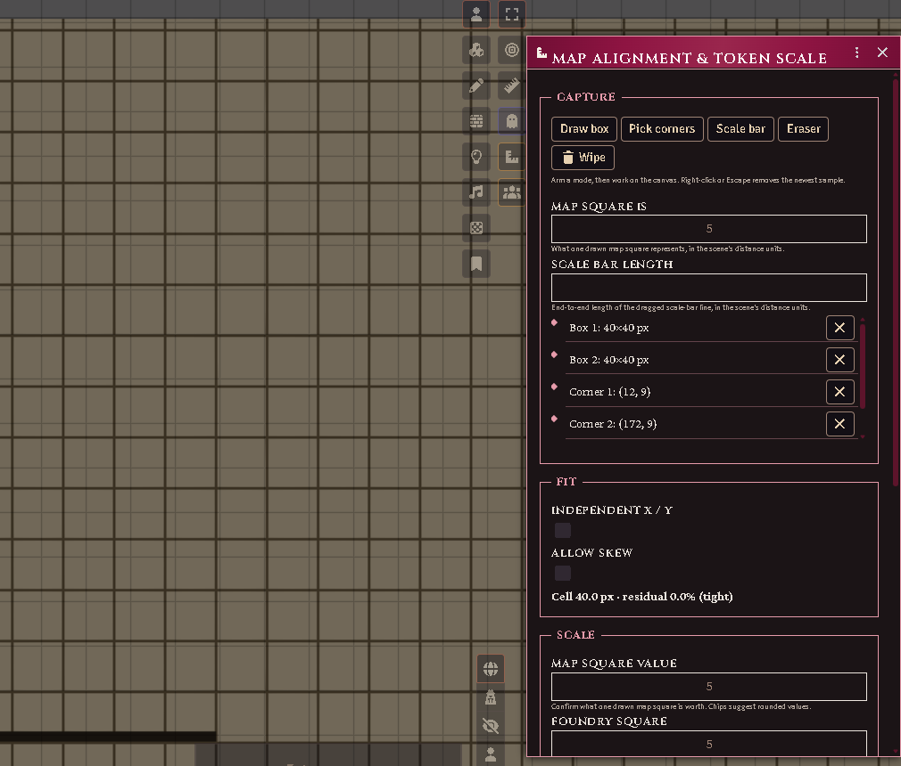

# Map alignment & token scale

Most map images arrive slightly wrong: the drawn grid does not line up with
Foundry's, its cells are an odd number of pixels, and the only statement of
scale is a printed bar in the margin. The assistant fixes all three from a
few samples you draw on the canvas, then sizes tokens to what they actually
are.

Open it from the **token controls** (the combined-ruler icon), or from the
**Battlemap** row in the scene's configuration. GM only.

*The assistant mid-calibration: boxes and corners sampled, the fit locked on,
the scale waiting to be confirmed.*

## Teaching it the grid

Arm a capture mode and work on the canvas. Mix and match — more samples make
a better fit, and the red preview grid snaps onto the map's lines as soon as
it has enough:

- **Draw box** — drag a rectangle over one drawn map square. Do a couple in
  different corners of the map. If you know what a square represents (many
  maps say "1 square = 5 feet"), type it in **Map square is**.
- **Pick corners** — click grid intersections. Corners several squares apart
  are the most informative kind of sample.
- **Scale bar** — drag end-to-end along the map's printed scale bar, then
  type the distance it represents.
- **Eraser** — click a sample to remove it. Right-click or Escape removes the
  newest one; **Wipe** clears everything.

The fit panel reports the cell size and how well the samples agree. If the
map was scanned stretched, tick **Independent X / Y**; if it was scanned
crooked, tick **Allow skew** — the fit then reports the skew and rotation it
found, and offers to **bake a corrected image** (a straightened copy saved
beside the original; your original file is never touched).

## Confirming the scale

The assistant shows what it derived a map square to be worth — from the scale
bar, or from what you typed — with chips for the likely intended value (4.9
becomes 5). Confirm it.

Then choose the **Foundry square**. Leave it empty and one Foundry square is
one drawn map square. On a coarse map — a wilderness sheet drawn at 100' per
square, say — you can instead ask for 5' squares, and each drawn box carries
a neat 20×20 of them. A warning appears if the two grids cannot share lines.

## Applying

Two separate buttons, in either order, as often as you like:

- **Apply grid to scene** rescales and shifts the background so Foundry's
  grid sits exactly on the map's, and sets the scene's distance-per-square.
  Foundry repositions anything already placed proportionally — the
  confirmation dialog reminds you.
- **Rescale tokens on scene** resizes every token to its real footprint at
  the scene's scale: monsters by their size category, everything else
  man-sized unless told otherwise. A formation's party token is left to the
  formation rules, which size it by its frontage.

After applying, the scene auto-sizes tokens as they are dropped — a Large
monster lands 2×1, a character on a 100' wilderness grid lands as a quarter
square. Turn this off with the **Auto-size tokens** checkbox in the scene's
configuration.

## The size hotbar

Select tokens and click a chip — 2½', 5', 10' and up, or a custom value — to
stamp that footprint on them. **Reset selected to default** removes the stamp
and re-derives from the creature's size. A stamped footprint sticks to the
token and survives rescales.

## Formations

A party token is as wide as its marching frontage in feet (each body's width
is the **March width per body** world setting) and as deep as its ranks, at
whatever scale the scene uses — turn the column east and the token turns with
it. Set the frontage on the party sheet as always.
