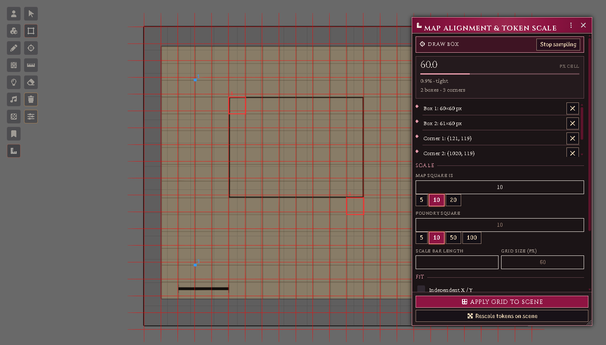
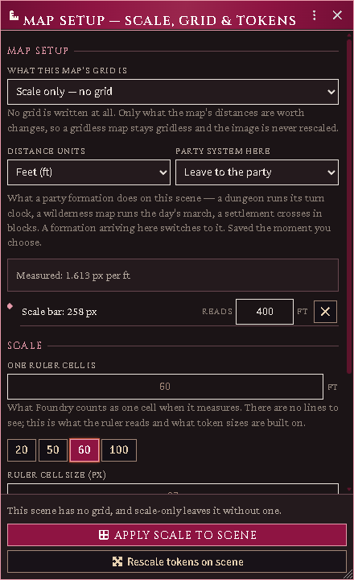
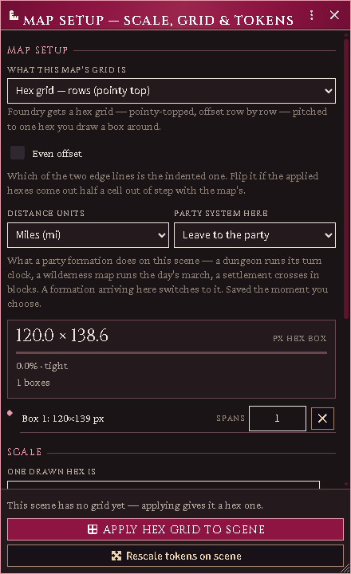

# Map alignment & token scale

Most map images arrive slightly wrong: the drawn grid does not line up with
Foundry's, its cells are an odd number of pixels, and the only statement of
scale is a printed bar in the margin. The assistant fixes all three from a
few samples you draw on the canvas, then sizes tokens to what they actually
are.

It starts by asking what kind of map this is — squares, hexes, or no grid at
all — because everything else reads differently under that answer.

Two parts, and they do different jobs. **Battlemap** in the scene controls
down the left of the canvas — the ruler-and-square icon — holds the four ways
of sampling a map, plus a wipe. The panel it opens is where the numbers and
the buttons live, with the apply pinned to the bottom so it is never something
to scroll for.

Entering the group brings the panel up for you; the close button on its title
bar puts it away. Drag it wherever suits the map you are aligning — it opens
clear of the middle. Nothing is lost by closing it: your samples and the
numbers you typed belong to the scene, and they are still there when you come
back. The scene's configuration has a **Battlemap** row as a second way in.
GM only.

*The panel is a window: it opens over the map, carries its own title bar and
close button, and moves wherever you put it. Draw box is armed on the left,
two boxes and three corners are sampled on the map's own squares, and the
fitted lattice is drawn over the image. The card reads the cell it measured
and how well the samples agree; underneath, the two scale decisions — what the
map's square is worth, and what a Foundry square should be — each with its own
chips. Stop sampling sits at the top, the apply at the bottom.*

## What kind of map is this?

Four answers, at the top of the panel. The rest of the panel changes to suit
the one you pick, and it opens on whatever the scene already uses.

- **Square grid** — the ordinary battlemap. Foundry gets a square grid fitted
  to the boxes you draw on the map's own squares.
- **Hex grid — rows** (pointy-topped) or **columns** (flat-topped) — a
  wilderness or campaign sheet. Draw a box around **one** hex and say what a
  hex is worth; one drawn hex becomes one Foundry hex. If the applied hexes
  come out half a cell out of step with the map's, tick **Even offset**.
- **Scale only — no grid** — the map has no grid to fit, or you do not want
  one. Drag along its printed scale bar, say what the bar reads, and the scene
  measures true: the ruler and token sizes are right, the image is never
  rescaled, and a gridless map stays gridless.

*Scale only. The map's printed bar has been dragged and told what it reads —
400 feet — on the bar's own row, and the panel says what it measured: 1.613
pixels per foot. Below it, what one ruler cell should be worth, with chips for
round values near the one it would pick by itself.*

**Distance units** are yours to name — feet, yards, miles, metres,
kilometres — and are written to the scene with the scale. Everything that
knows a real length converts through them, so a party on a map of six-mile
hexes is sized as a party rather than as a county.

**Party system here** says what a party formation does on this scene: a
dungeon runs its turn clock, a wilderness map runs the day's march, a
settlement crosses in blocks. A formation arriving takes that system, and
follows if you change it while they are standing there. Leave it at *Leave to
the party* and nothing is imposed. It saves the moment you choose it — there
is no need to apply a grid to label a map.

*The same panel set to hexes. One box has been drawn around a single hex; the
card reads the box it measured, and the apply says which grid it will write.*

## Teaching it the grid

Pick a tool from the Battlemap controls and work on the canvas — the panel
mirrors them if you would rather stay in the window. Mix and match: more
samples make a better fit, and the red preview grid snaps onto the map's lines
as soon as it has enough. Closing the panel keeps your samples; the tools go
on working.

- **Draw box** — drag a rectangle over the map's own squares. Do a couple in
  different corners of the map. A box does not have to be one square: drag
  across a run of them and say how many it **spans** on the box's own row —
  easier to aim, and a better measurement. If you know what a square
  represents (many maps say "1 square = 5 feet"), type it in **One drawn
  square is**.
- **Pick corners** — click grid intersections. Corners several squares apart
  are the most informative kind of sample.
- **Scale bar** — drag end-to-end along the map's printed scale bar, then
  type what it **reads** on the bar's own row.
- **Eraser** — click a sample to remove it. **Ctrl+Z** removes the newest one
  and **Wipe** clears everything. The right mouse button is left alone, so you
  can pan across a big map without losing samples.

**Stopping.** The arrow at the head of the Battlemap tools is *off* — nothing
is armed until you pick a mode, and picking the arrow again stops. So does
**Escape**, and so does the **Stop sampling** button that appears in the panel
whenever a mode is armed. Your samples are kept either way.

The fit panel reports the cell size and how well the samples agree. If the
map was scanned stretched, tick **Independent X / Y**; if it was scanned
crooked, tick **Allow skew** — the fit then reports the skew and rotation it
found, and offers to **bake a corrected image** (a straightened copy saved
beside the original; your original file is never touched).

## Confirming the scale

The assistant shows what it derived a map square to be worth — from the scale
bar, or from what you typed — with chips for the likely intended value (4.9
becomes 5). Confirm it.

Then choose the **One Foundry square is** — the grid this actually writes.
Leave it empty and one Foundry square is one drawn map square. On a coarse map — a wilderness sheet drawn at 100' per
square, say — you can instead ask for 5' squares, and each drawn box carries
a neat 20×20 of them. A warning appears if the two grids cannot share lines.

## Applying

Two separate buttons, in either order, as often as you like:

- **Apply grid to scene** rescales and shifts the background so Foundry's
  grid sits exactly on the map's, and sets the scene's distance-per-square.
  Foundry repositions anything already placed proportionally — the
  confirmation dialog reminds you. On a hex map the button says **Apply hex
  grid**, and lands the hex you drew a box around on a real one.
- **Apply scale to scene**, in the scale-only mode, writes nothing but what
  the map's distances are worth. Nothing is rescaled and nothing moves.
- **Rescale tokens on scene** resizes every token to its real footprint at
  the scene's scale: monsters by their size category, everything else
  man-sized unless told otherwise. A formation's party token is left to the
  formation rules, which size it by its frontage.

After applying, the scene auto-sizes tokens as they are dropped — a Large
monster lands 2×1, a character on a 100' wilderness grid lands as a quarter
square. Turn this off with the **Auto-size tokens** checkbox in the scene's
configuration.

## The size hotbar

Selecting tokens means the ordinary **Token** controls, so switch back to them
when you want to — the panel stays open where you left it. Select tokens and
click a chip — 2½', 5', 10' and up, or a custom value — to stamp that
footprint on them. **Reset selected to default** removes the stamp
and re-derives from the creature's size. A stamped footprint sticks to the
token and survives rescales.

## Formations

A party token is as wide as its marching frontage in feet (each body's width
is the **March width per body** world setting) and as deep as its ranks, at
whatever scale the scene uses — turn the column east and the token turns with
it. Set the frontage on the party sheet as always.
