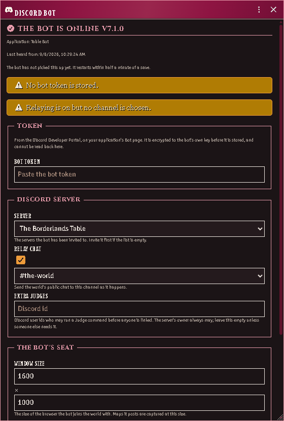
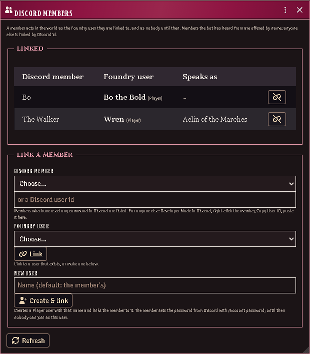

# Playing from Discord

Extras ships a bot that lives on the same machine as your Foundry server,
holds a seat of its own in the world, and lets the members of your Discord
server roll, speak and read their characters without opening Foundry. It is
the first step toward play-by-post: the world keeps every roll and every
word, and Discord is where they are made.

You set it up **in Foundry**: one window under Module Settings holds the
token, the server and the channel, and the bot on your host reads them from
the world. The host is asked only how to reach that world.

Every command runs **as the Foundry user the member is linked to**. A member
can only use characters that user owns, and the bot's own seat decides
nothing. The Judge links members; nobody links themselves.

## Walkthrough

Six steps, once. Nothing is typed on the server that a window in Foundry can
be asked instead, and afterwards the bot follows Foundry's module updater on
its own.

### 1. The host

The bot runs on the machine that runs Foundry, as a service beside it. That
machine needs:

- **Linux with systemd** — Debian, Ubuntu and their relatives; a Proxmox VM
  or container is fine.
- **Node 22 or newer.** `node -v` says which you have; Foundry itself runs
  on Node, so it is usually there already.
- **A Chromium-family browser** for the seat: `sudo apt install chromium`.
  Nothing shows on a screen; the bot drives it headless, and finds the
  browser by itself.
- **The Extras module installed** in Foundry, 7.1.0 or later. The bot's code
  is inside it: `discord/` under the module's directory in your Foundry data
  path, `Data/modules/acks-extras/discord`.

### 2. The Discord application

In the [Discord Developer Portal](https://discord.com/developers/applications):

1. **New Application**; name it after your table.
2. On the **Bot** page, **Reset Token**. Keep the token where you can paste
   it into Foundry in step 5; the portal shows it once.
3. On the **OAuth2** page, in the URL generator, tick the scopes **bot** and
   **applications.commands**, then the bot permissions **Send Messages**,
   **Embed Links**, **Attach Files** and **Read Message History**. Open the
   URL it makes, pick your server, authorise.

That is all the portal is needed for. No ids to copy, no developer mode to
turn on: the bot reads its own application, the servers it was invited to
and their channels, and offers them to you in Foundry.

### 3. The bot's Foundry user

In Foundry's user management, create a user for the bot: role **Assistant
Gamemaster**, named **Discord** (the name the bot looks for unless told
another), and a password if your world uses them. The bot joins as this user
and everything it posts is credited to it, so keep the user for the bot
alone.

### 4. Install the service

On the host, in the bot's directory:

```bash
cd /path/to/foundrydata/Data/modules/acks-extras/discord && sudo npm run install-service
```

It asks only what the bot needs to reach your world: Foundry's address as
the machine sees it, the bot's Foundry user and password, the browser it
found, the local port its seat listens on, and the account it will run as
(the owner of the module directory, which is what lets it keep its
dependencies there). On a standard host every answer is already filled in
and you press Enter through all of them. Then it writes them to
`/etc/acks-extras-discord.env`, readable by root only, renders the systemd
unit for this machine, installs the bot's dependencies in front of you (a
minute or two the first time — npm's own output, as the service's user),
enables the service, and waits a few seconds to show you its state and the
first lines of its journal: the seat joining, or the reason it did not.

Run it again whenever you like, including over an earlier attempt that did
not work: it stops what is there, clears any failure state, rewrites both
files and takes over a `node_modules` another account left behind. Anything
Discord-related an earlier install kept in `/etc` is dropped and named — those
values live in Foundry now.

If `sudo npm` cannot find npm (Node installed through a version manager), run
the script with the node you have instead:

```bash
sudo "$(command -v node)" src/install-service.mjs
```

Watch it come up:

```bash
sudo journalctl -u acks-extras-discord -f
```

The log shows the seat joining the world, then the bot saying it has no
token yet and is waiting for one. That is the expected state at this point.

### 5. Configure it in Foundry



In Foundry, **Settings → Module Settings → ACKS II Extras → Discord Bot**.
The window opens on the bot's own report: it says the bot is waiting, and
lists what is still missing.

1. **Paste the bot token** and save. It is encrypted to a key the bot made on
   your server before it is stored, so it is not readable by anyone in your
   world — including you, afterwards: the field shows only how long it was
   and its last four characters. To replace it, paste a new one.
2. The bot restarts within half a minute and logs in. Re-open the window: it
   now says **online**, names your application, and the **Server** and
   **Relay chat** boxes have become dropdowns of the servers and channels
   the bot can actually see.
3. **Choose the server** (a bot invited to only one is already using it) and,
   if you want the world's chat in Discord, the **channel** to relay it to.
   Save. The bot restarts again and registers its commands on that server.

Every later change — a different channel, relaying off, a bigger map
capture — is the same window and the same half minute. Nothing goes back to
the terminal.

**Who may run a Judge command** before anyone is linked: the Discord
server's owner, always, without being listed. The **Extra Judges** field
takes Discord user ids for the rare case of a second one (turn on Developer
Mode in Discord, right-click the member, **Copy User ID**).

### 6. First commands

In your server, `/whoami` answers you as the Judge. Link a player with
`/link set member: foundry:`; the Foundry name autocompletes. That player's
`/whoami` now names their user, `/character use` lists what they own, and
`/sheet`, `/roll` and `/say` work as described below. In a party's channel,
`/party bind formation:` ties the channel to a formation and `/map` posts its
scene.

Anyone can `/roll 2d6` from the first minute, linked or not.

## Players and their accounts



Three ways to connect a member of your server to a user in your world; all
three end in the same place.

- **In Foundry: Settings → Module Settings → ACKS II Extras → Discord
  Members.** Every link the world holds is listed, with who each member
  speaks as. To make one, pick the member and the user and press **Link**.
  The member list is everyone who has used any command in your server — ask
  a new player to run `/whoami` and they appear by name; for anyone else,
  paste their Discord id (Developer Mode, right-click, Copy User ID). A
  member with no user yet: type a name, or leave it to take theirs, and
  press **Create & link** — a Player user is made and linked in one go.
- **In Discord: `/link set member: foundry:`** links to a user that exists.
- **In Discord: `/account create member:`** makes the Player user and links
  the member, the same as the window's button. `name:` overrides the name.

A user made either way starts with **a password nobody knows** — not you,
not the bot. Until the player sets one, nobody can join as that user.

**Players set their own password from Discord: `/account password new:`**,
eight characters or more. The reply is only theirs to see, the bot never
writes it to its log, and any Foundry session they had open is signed out
by the change. This is a player's convenience, not a Judge's tool: a member
can only set the password of the user they are linked to, and a Gamemaster
user's password is never set from Discord at all, however the member is
linked — your seat is yours.

Discord itself carries what is typed into a command, as it carries any
message. A table that would rather no password pass through Discord keeps
using Foundry's own user management, which is untouched by any of this.

### Staying current

Nothing to do. Update the module in Foundry's **Add-on Modules** like any
other. The bot checks the module's manifest every half minute: when the
updater has replaced the directory it exits, the service restarts it on the
new code, puts its dependencies back if they went with the old directory, and
registers the commands again only if the release changed them. Your answers
live in the world and under `/etc`, neither of which the updater touches. The
journal shows the whole thing happen.

### Restarting, starting, installing

**Restart the bot** sits at the top of the Discord Bot window whenever the
bot has recently been heard from. Press it and the bot exits and its service
brings it straight back, on whatever the window holds — the same path a
saved change takes, for when the bot is running and you want it to start
over anyway. It cannot start a bot that is not running or install one that is
not installed: Foundry has no hand on the host, and a request through the
world reaches only a bot that is already listening. Starting is the service's
job (`Restart=always`, so a bot that exits or crashes is back within
seconds, and it comes up with the host), and installing is the one command in
[Install the service](#4-install-the-service), run again as often as you like.

### Running it by hand instead

On Windows, or on a test box without systemd, put a `.env` beside `src/`
(`.env.example` lists every value) and run `npm start` in the bot's
directory. It installs its own dependencies when they are missing, and it is
still configured from Foundry — the `.env` carries only how to reach the
world. Anything you do set there wins over the window, which is the escape
hatch if you would rather keep the token on the host. After a module update,
or after a change in the window, you restart it yourself.

### Removing it

```bash
sudo npm run install-service -- --remove
```

stops the service and deletes the unit and the environment file. The module
directory is untouched, and so is the configuration in your world — clear
the token with the window's own button if the bot is not coming back.

## The Judge's commands

- **`/link set member: foundry:`** binds a Discord member to a Foundry user;
  the Foundry name autocompletes. **`/link drop member:`** removes it and
  **`/link list`** shows every binding the world holds. A member linked to a
  Gamemaster user is a Judge in Discord too.
- **`/account create member: name:`** makes a Player user for a member and
  links them (above).
- **`/party bind formation:`** makes the current channel a party's channel;
  the formation autocompletes from the world's parties. **`/party show`**
  and **`/party unbind`** read and drop it.
- **`/map`** posts the party's scene as the bot's seat sees it, centred on
  the party token when the scene has one. `scale:` zooms (1 is the scene's
  own size), `private:` shows it only to you. It is the Judge's view, with
  everything the Judge can see; a players'-eyes map is planned.

## Playing

- **`/whoami`** says which Foundry user you are linked to and who you are
  speaking as.
- **`/character list`** shows the characters you own; **`/character use
  name:`** picks the one you speak and roll as from then on.
- **`/sheet`** shows your character's vitals, saves, purse and what is in
  hand, only to you unless you add `public:`. `character:` reads another
  character you own.
- **`/roll what:`** makes a throw. The list autocompletes from everything the
  character's sheet can roll: saves, checks, initiative, attacks by weapon,
  abilities. The card lands in the world's chat as the character, and the
  result comes back to you in Discord.
- **`/roll 2d6+3`** — any dice formula in the same command, for anyone in
  the server, linked or not. It is Foundry's own dice: `d20`, `3d6kh2`,
  `4dF`, `d%`, exploding and rerolled dice all read as they do in Foundry's
  chat. The result is posted to the channel with your name. If you are
  linked and have a character chosen, the world keeps the throw in its chat
  as that character too.
- **`/account password new:`** sets your own Foundry password (above).
- **`/say text:`** speaks in the world's chat as your character; `emote:`
  makes it an action instead of words.

If the bot has a chat channel, the world's public chat appears there as it
happens: what players in Foundry say and roll, and what the Judge posts.
Whispers and blind rolls stay in Foundry, and a roll you made from Discord is
not shown twice.

## When something is off

- **`npm` dies at once with `ENOENT … process.cwd … uv_cwd`.** Your shell
  is inside a directory Foundry's updater has since replaced — every module
  update deletes and recreates `modules/acks-extras/`. `cd` into the
  directory again (the same path) and run the command again.
- **The installer seems to hang, or ends saying the service is not
  running.** Two causes before 7.1.2, both fixed: the questions were drawn
  invisibly (the installer was waiting for an answer at a blank cursor —
  pressing Enter took the default), and the first start installed the bot's
  dependencies out of sight. Now the questions show, npm runs in front of
  you, and the installer ends with `systemctl is-active` and the journal's
  last lines, which name the cause. Fix it and run the same command again.
  To run it with no questions at all, redirect stdin (`</dev/null`): every
  answer comes from the environment variable of the same name, else from
  the last install.
- **The token field is greyed out.** It unlocks when the bot has announced
  its key, which happens the moment the bot's seat joins the world — so a
  locked field means the service is not running, or its seat cannot reach
  the world: `systemctl status acks-extras-discord` and the journal. Press
  **Refresh** in the window once it is up.
- **The seat never becomes ready.** The journal names the step: the browser
  path, a world that is not running at the address you gave, or a Foundry
  user that does not exist with that password. Those four are the host's
  answers — fix them by running the install command again.
- **The commands do not appear in Discord.** The bot registers them at
  start, on the server chosen in the window; check the journal for the
  registration line and that a server is chosen. Discord shows guild
  commands at once.
- **The window says the token was sealed to a key the bot no longer holds.**
  The bot's state directory was replaced (a rebuilt host, a removed
  `/var/lib/acks-extras-discord`). Paste the token again and save.
- **The window says no bot has announced itself.** Nothing has ever joined
  this world as the bot. Check `systemctl status acks-extras-discord` and
  the journal: the seat has to reach the world before anything can be
  configured.
- **"You are not linked".** The Judge links you — `/link set` in Discord, or
  the Discord Members window in Foundry, where you are already listed by
  name because you just ran a command.
- **"That is not yours to do: a Gamemaster's password…"** By design. A
  Judge's password changes in Foundry's user management, never from
  Discord.
- **A player cannot join as the user you made for them.** They have not set
  a password yet: `/account password new:` in Discord.
- **`/map` answers that the seat has no scene.** Bind the channel to a party
  whose formation has a scene, or have the Judge view one; the seat shows the
  party's scene when the channel has a party.
