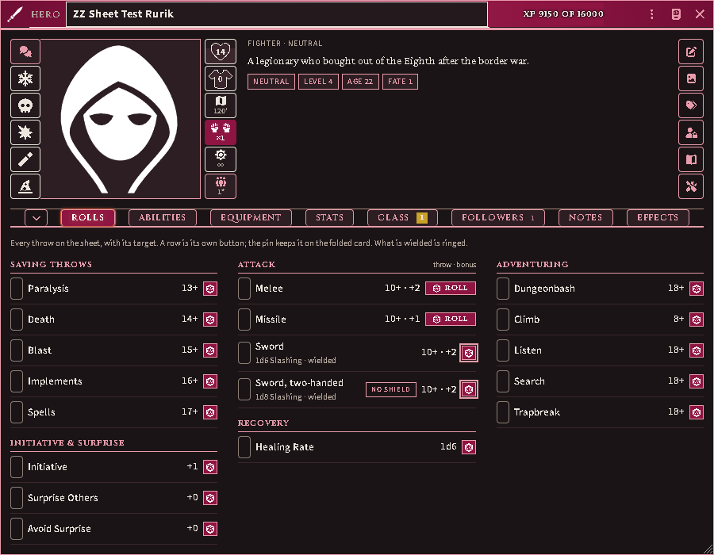
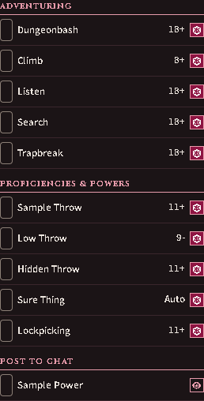
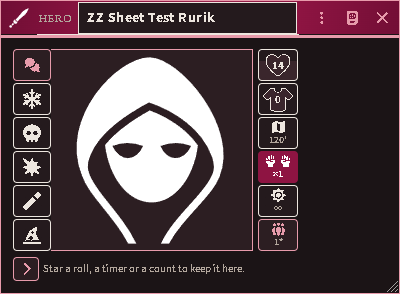
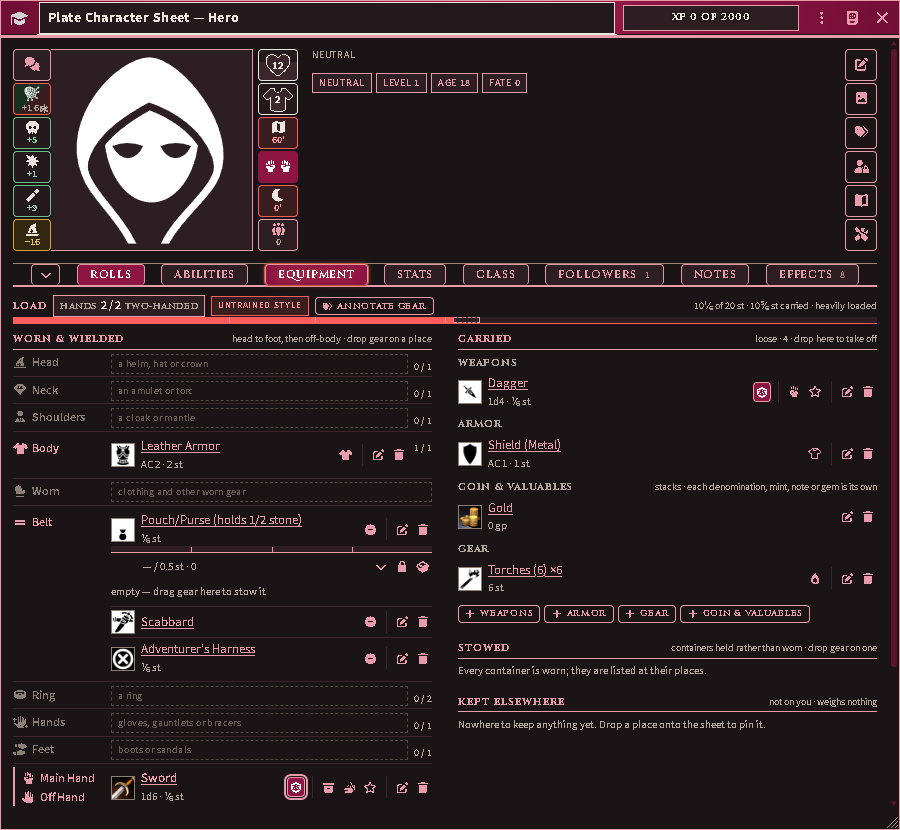
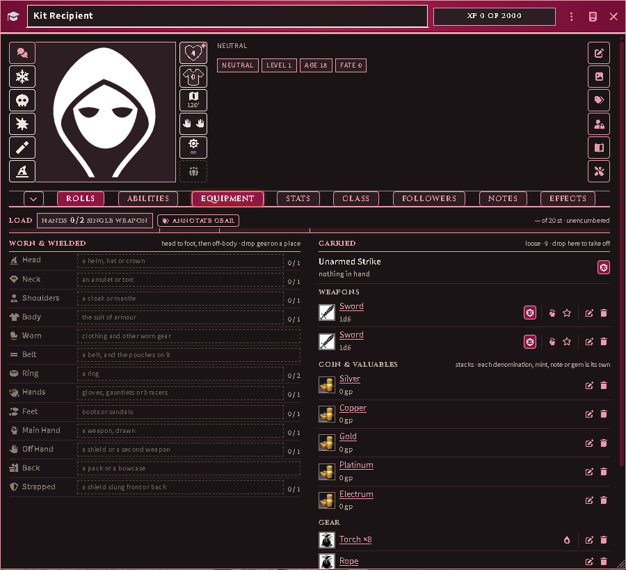
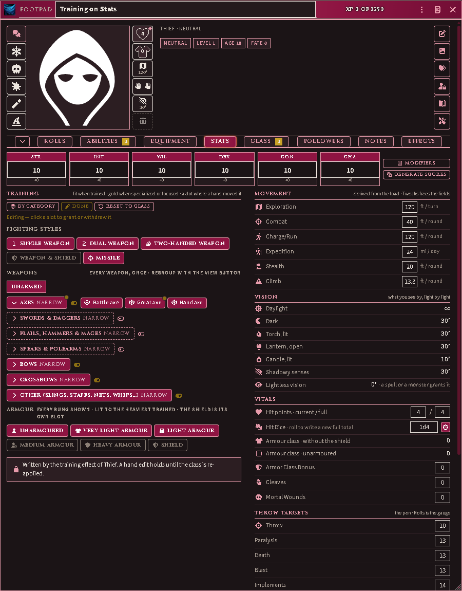
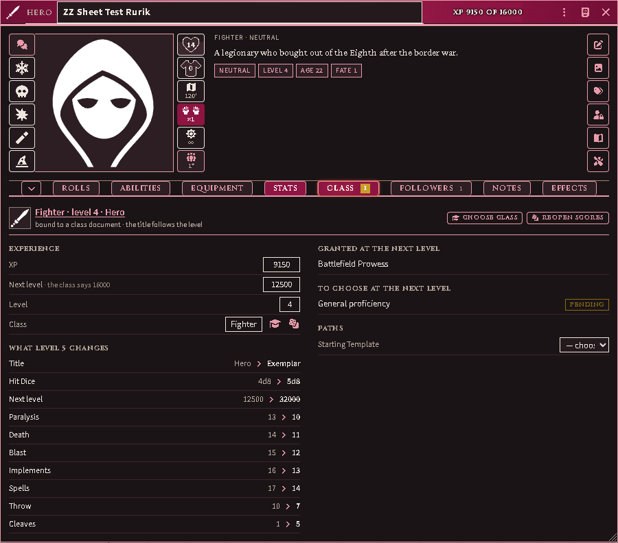
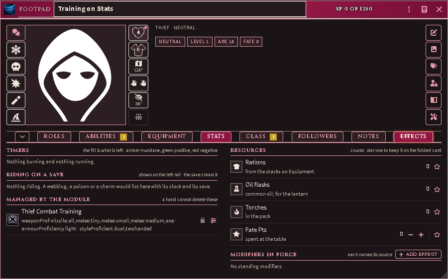

# The character sheet

Every character opens on the module's own sheet: the band across the window
header, the portrait between two rails, and tabs organised by what you do at
the table rather than by document type. The system's sheet is still there —
Sheet Config, on any actor, switches back — and nothing is migrated: the two
read and write the same fields.

*Rolls: every throw on the sheet with its target, the wielded weapon ringed,
and a pin on each row for the folded card.*

## Rolls

Every throw is a row, and the whole row is the button. A proficiency or power
that makes no throw is a row too, under **Post to chat**, ending in an eye:
clicking it posts the ability's card, the one the Abilities tab's eye posts.
The pin on any row keeps it on the folded card; for an ability, the pin is its
own favourite star. A throw asks for a situational modifier first
([Proficiencies and powers](abilities.md#what-a-throw-looks-like-in-chat));
hold Shift to roll at once.

*A power with no throw under Post to chat, its eye where a throw's die would
be.*

## The band and the rails

The header carries the class glyph, the level title, the name and the XP
bar. The bar goes gold when the threshold is reached and reads *Level up*;
the Class tab goes gold with it and carries the wizard.

Down the left of the portrait: Influence, then the five saves. A save cell
shows its glyph; the target is in its tooltip and on Rolls. A condition that
a save clears rides on that cell — its image, its clock, the save's glyph in
the corner — and a modifier in force on the save colours it with the number.
Clicking rolls the save.

Down the right: hit points inside the heart with the fill as the fraction
(red at zero, where a click opens Mortal Wounds); armour class inside the
shield, the shirt or a dashed box, cycling with the shield, without it and
unarmoured on click; movement for the mode you are in, amber or red when the
load slows you, with a menu of the six modes; the grip, two hands open or
clenched, joined on one haft for a two-handed weapon, with the cleave count
beside them and a menu to draw, sheathe or change grip; what you see by —
a burning source with its reach and burn-down, daylight, a dark sense, or
the dark at 0′ — with a menu to light, douse, shutter or ready a torch; and
the party: how many of the character's henchmen are on the scene, with an
asterisk for each summon present (`1**` is one henchman and two summons),
red while a henchman is down with a calamity pending. Click it for who is
here — a pick selects the token — and, as the owner, to bind the tokens you
have selected as this character's summons or release them. When the
character marches in a formation that is on the scene, the cell is the
formation and opens the party sheet.

The far-right rail is sheet tools only: description, portrait, the alignment
and age and fate tags, ownership, source, Tweaks.

## Folding

The chevron before the tab strip folds the sheet to the table card: the
band, the portrait, the rails and, along the bottom, the starred rolls,
timers and counts. The fold is remembered per user, so an observer can fold
a sheet they cannot edit.

## Equipment

The Load header's underline is the encumbrance bar with the breakpoints as
ticks. The fill is the burden you move under. Where the carrying rules forgive
some of what you carry — an adventurer's harness, a slung shield, the clothes
on your back — a dashed, unfilled phantom runs on from the fill to your true
weight, the header reads both figures, and hovering the bar says how much is
forgiven. Every wear slot lists on the left, head to foot then off-body, and is
a drop target; a weapon held in both hands spans Main hand and Off hand as one
row rather than taking a place of its own; a worn container shows its capacity
bar and its contents. The count on a place is magic items against the form's
allowance or armour and weapons against the one place, whichever is larger,
and clothing takes no room. Loose
gear files on the right by kind, containers you carry rather than wear sit
under Stowed, and every place holding your goods lists under Kept elsewhere.
Drop a thing on a place to wear or draw it, on a container to store it, on
the right column to take it off or out.

Drop a bundle — a kit from the Items directory, a class template's package —
and its goods arrive, each row as the items it names. A stack you already carry
is topped up when the arriving goods are identical to it; anything else arrives
as a stack of its own. A row whose item is gone is filled from the library item
of the same name and type; one that still finds nothing is named in a warning,
and the rest arrive.

*A kit of two swords, six torches and a rope dropped on a character carrying two
torches: the swords under Weapons, one stack of eight torches and the rope under
Gear.*

## Stats

What is not a throw: the attributes, the training, movement by mode, vision
light by light, the vitals, and the throw targets that Rolls reads.

Every field you can type into holds the figure you typed — the stored value,
never the sum an effect makes of it. Where an effect changes a field (a
proficiency, an item, an effect written by hand) the field is marked, and
hovering it names the figure in force. That is why an AC modifier of 0 can sit
beside an AC that shows the effect applied: the modifier is yours, the AC is
the sheet's arithmetic.

**Training** is where a character's combat training is read and edited. Every
fighting style, every weapon in the game as its own pill, every armour rung
and the shield; lit when trained, gold when specialised or focused. The view
button regroups the weapons — by category, by size, or as one flat list — and
each group's header is captioned with the kind of choice it is (broad, narrow,
unrestricted). Hover a pill to see where the training came from when it was
not the class: an ability, another effect, the sheet's own profile.

An owner presses **Edit** to arm the pills: click a weapon, a whole group's
toggle, a style, an armour rung (it sets the ceiling; clicking the ceiling
clears it) or the shield (which is the Weapon & Shield style). A pill that
another source lit refuses the click and names the source. A pill moved off
what the class prints wears a dot, and **Reset to class** puts the printed
training back. A character with no class gets a *Training, by hand* effect on
the first edit; applying a class later replaces it.

## Class, Magic, Followers, Notes, Effects

Class shows the bound class document, the XP pair, and — while the bar is
full — what the next level changes, grants and asks, with the Level up button.
Magic appears for a caster, with the casting pools and the repertoire. Followers
renders the hirelings as Follower Cards beside the Roster chip. Notes holds the
notes and the relationships on record.

Effects is where the timers live — what is burning, what is blessing you, what
is riding on a save — with the counts a player checks between fights (rations,
oil, torches, fate points, a caster's pools) and the modifiers in force. A
star on any row keeps it on the folded card.
