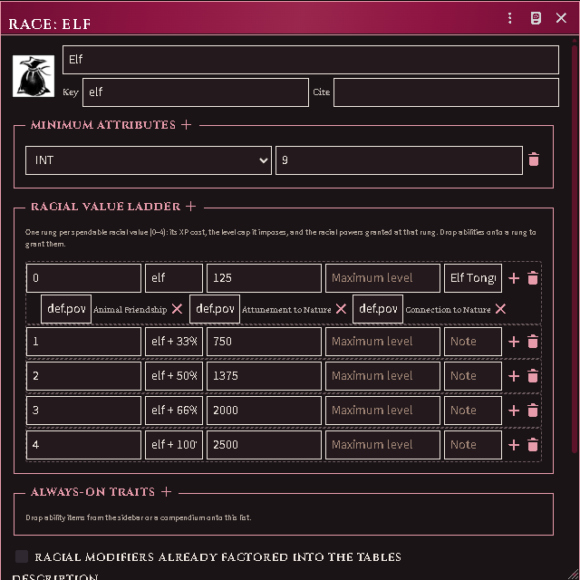

# Classes — using them at the table

## Getting class documents

Import them from your own book: connect the Revised Rulebook — and By This
Axe, if you own it — in ACKS Importer, then run
`acksImporter.importClasses()` (or the macro). Every class arrives as a
**Class** item — progressions, saves, awards, starting templates — read from
your PDF. Or build homebrew from scratch: **Create Item → Class** opens the
same constructor.

*The constructor's Casting editor: traditions, slot grid, pool schedule and
caster-level ladder.*

## On the character sheet

Three small controls appear beside the class field:

- **Graduation cap** — bind the character to a class document and apply its
  printed numbers for the current level (saves, attack throw, title,
  XP-to-next, hit dice, cleaves, spell slots). The confirm lists every change
  old → new and flags anything you hand-edited since the last apply.

  It also hands over **the abilities that level owes** — Adventuring, every
  power and proficiency the class awards at or below the level you set, and a
  picker for each choice the ladder leaves open. A character bound at 5th
  arrives with all five levels' awards, not with the fifth level's alone. What
  they already carry is not given twice, and what lands is posted to chat.
  Dropping a class document onto the sheet does the same thing.

  Applying the same class at the same level again is how a character who was
  bound before this existed collects what they were always owed: the fields
  will show nothing to change, and the abilities will still be listed.
- **Dice** (level 1 characters) — roll a starting template: 3d6, then choose
  the rolled template or any lower band. Applying grants the proficiencies
  (ranks and selections included), the equipment — each piece named as
  printed over its base item's mechanics — the coin, and your Intellect
  bonus proficiency picks.
- **Rising arrow** (when XP qualifies) — the level-up wizard: HP rerolled per
  RAW (full Hit Dice, Constitution per die, never on the flat bonus past
  9th, minimum one over the old maximum — an additive house rule is a world
  setting), the new level's powers granted, class/general proficiency picks
  offered, slots bumped.

*Rolling a starting template: the attribute rule and the scores, the class
above the template die, and what is left to choose.*

The graduation cap opens the same three-column page for a character who is
already played: the level being set and the ladder picks that come with it, the
class and its optional starting package, and each choice that level owes.

*Binding a class to a played character. The starting package is opt-in and
defaults to none — it is ADDED to what the character already holds rather than
replacing it, because binding a class to someone who has been adventuring is the
opposite act to generating them.*

**A proficiency you already have is an answer.** Each choice lists what the
character already holds first, and picking it closes the choice and grants
nothing — you no longer have to take something unwanted and delete it
afterwards. Beside the options sit *already covered*, for the proficiency the
choice never listed, and *leave open*, the one answer that closes nothing and
asks again next time. A choice answered anywhere — here, at level-up, or during
character generation — is remembered, so re-applying a class does not walk a
5th-level character through every decision they have ever made.

Casters get a per-tradition slot strip under the class field — click a pip to
spend, click a spent pip to refund, the bed icon to rest. The Nobiran's
arcane and divine pools sit side by side.

## Advanced mode — the class builder

The constructor's **Builder** tab is the Judges Journal's custom-class
workflow as a tool for balanced homebrew — it never replaces the simple
constructor, and it never blocks: the printed tables stay hand-editable in
both modes, and the accounting line reports (points spent, power picks
left, the 2nd-level XP cost) rather than enforces.

Tick *Advanced mode*, set your build values — Hit Die, Fighting (with the
1-point a/b split), Thievery and its chosen skills, one row per **magic
value** (arcane and divine arrive with the Judges Journal import;
ceremonial, gnostic, alchemy, eldritch, fairie or your own tradition are
rows of the same shape once their tables are in the world), and a racial
value spent against a bound **race document**. Trade-offs and custom powers
have their own lists. **Derive class tables** then shows exactly what it
will write — XP schedule, hit die, maximum level, attack throws, saves-as,
cleaves, casting grids, ladders, racial traits — plus every question the
imported tables could not answer, and applies it as one update you can
tweak afterwards.

*The Builder tab on an imported Ready-for-Play example: build values, the
accounting line, and Derive.*

Everything numeric comes from your own book: run the ACKS Importer table
import with the Judges Journal connected and the builder tables,
the Dwarf and Elf race documents, and the printed Ready-for-Play builds on
the core and demi-human classes all land together — open any of those
classes on the Builder tab and Derive reproduces its printed spread.

A **race document** (its own item type) carries the racial value ladder:
each rung's XP cost and granted powers, the race's attribute floors, how it
stacks with a magic category, and its post-8th XP increases. Simple-mode
classes may bind one too.

*A race document's value ladder — rung XP costs, granted powers, attribute
floors and always-on traits.*

## Keeping documents current

After reconnecting your book, `acksImporter.cookbookUpdateClasses()` rewrites
imported class documents from the page (hand edits on them are replaced —
the confirm says so). `repairSaveReferences` under
`acksExtras.classes` finds stale save-key references world-wide; dry-run by
default.
