# Classes — using them at the table

## Getting class documents

Import them from your own book: connect the Revised Rulebook — and By This
Axe, if you own it — in the importer, then run
`acksExtras.importer.importClasses()` (or the macro in the Macros compendium). Every class arrives as a
**Class** item — progressions, saves, awards, starting templates — read from
your PDF. Or build homebrew from scratch: **Create Item → Class** opens the
same constructor.

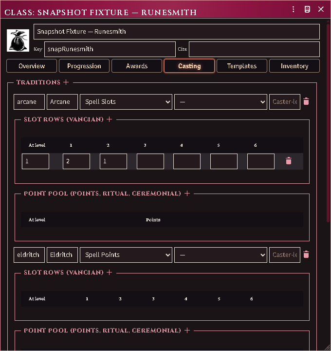

*The constructor's Casting editor: traditions, slot grid, pool schedule and
caster-level ladder.*

The same constructor records what a class speaks and how many more tongues it
may choose.

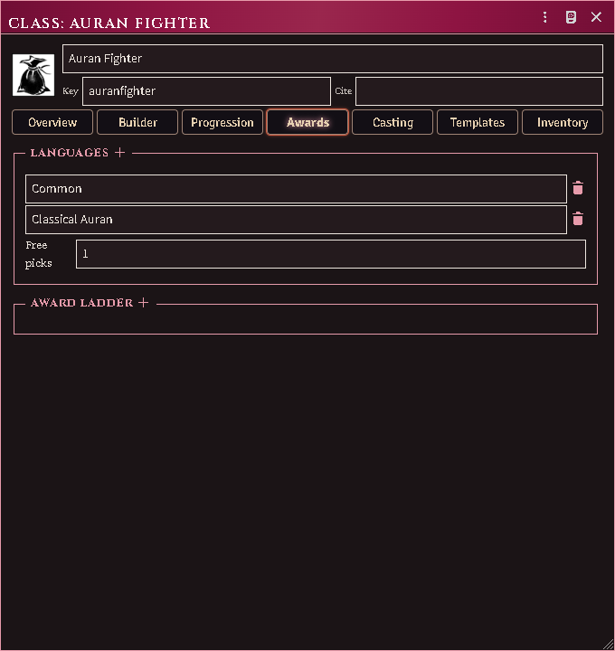

*What a class speaks and how many more it may choose, beside its award ladder.*

## On the character sheet

Three small controls appear beside the class field:

- **Graduation cap** — bind the character to a class document and apply its
  printed numbers for the current level (saves, attack throw, title,
  XP-to-next, hit dice, cleaves, spell slots). The confirm lists every change
  old → new and flags anything you hand-edited since the last apply.

  It also hands over **the abilities that level owes** — Adventuring, every
  power and proficiency the class awards at or below the level you set, and a
  picker for each choice the ladder leaves open. A character bound at 5th
  arrives with all five levels' awards, not with the fifth level's alone. What
  they already carry is not given twice, and what lands is posted to chat.
  Dropping a class document onto the sheet does the same thing.

  Applying the same class at the same level again is how a character who was
  bound before this existed collects what they were always owed: the fields
  will show nothing to change, and the abilities will still be listed.

  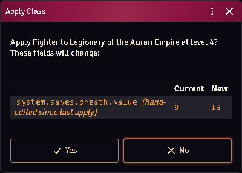

  *Every change old → new before it lands, with hand edits flagged.*
- **Dice** (level 1 characters) — roll a starting template: 3d6, then choose
  the rolled template or any lower band. The menu stays closed until the die
  gives it something to offer, and a class whose entry prints no packages
  leaves it closed for good — the note under the menu says which of the two you
  are looking at. A Judge's override lifts the die, never the empty class. Applying grants the proficiencies
  (ranks and selections included), the equipment — each piece named as
  printed over its base item's mechanics — the coin, and your Intellect
  bonus proficiency picks.

  Each template can be a **package**: a bundle item holding the template's
  actual abilities and gear as world documents, linked from a 3d6 roll table
  on the class (the importer builds these; the class sheet's Templates tab
  has a *Build packages* button for hand-made classes). If the import got a
  piece wrong — a staff that landed as un-wieldable plain inventory instead
  of a weapon — open the package, fix that one item, and every character
  generated from the template afterwards gets the corrected version. Your
  repairs survive re-imports.

  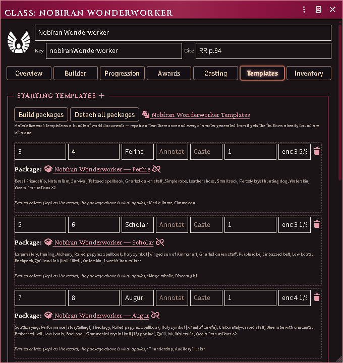

  *A class's Templates tab with its packages built: each band is a bundle of
  real, repairable documents.*
- **Rising arrow** (when XP qualifies) — the level-up wizard: HP rerolled per
  RAW (full Hit Dice, Constitution per die, never on the flat bonus past
  9th, minimum one over the old maximum — an additive house rule is a world
  setting), the new level's powers granted, class/general proficiency picks
  offered, slots bumped.

  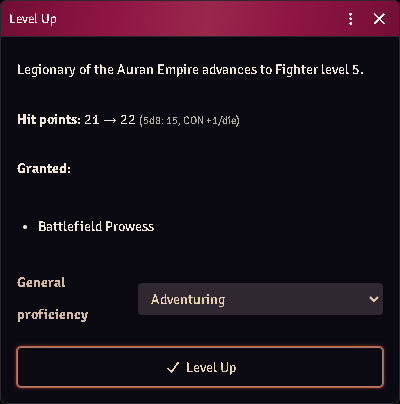

  *The level-up wizard: the HP reroll it will apply, the powers granted, the
  picks offered.*

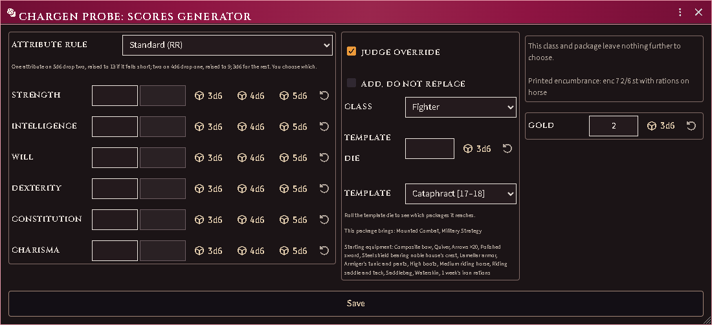

*Rolling a starting template: the attribute rule and the scores, the class
above the template die, and what is left to choose.*

The graduation cap opens the same three-column page for a character who is
already played: the level being set and the ladder picks that come with it, the
class and its optional starting package, and each choice that level owes.

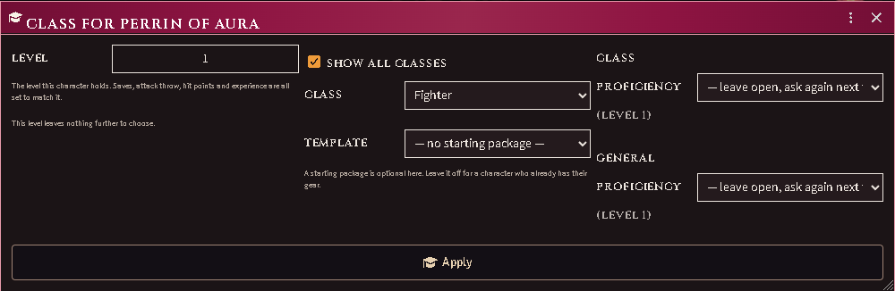

*Binding a class to a played character. The starting package is opt-in and
defaults to none — it is ADDED to what the character already holds rather than
replacing it, because binding a class to someone who has been adventuring is the
opposite act to generating them.*

**A proficiency you already have is an answer.** Each choice lists what the
character already holds first, and picking it closes the choice and grants
nothing — you no longer have to take something unwanted and delete it
afterwards. Beside the options sit *already covered*, for the proficiency the
choice never listed, and *leave open*, the one answer that closes nothing and
asks again next time. A choice answered anywhere — here, at level-up, or during
character generation — is remembered, so re-applying a class does not walk a
5th-level character through every decision they have ever made.

Casters get a per-tradition slot strip under the class field — click a pip to
spend, click a spent pip to refund, the bed icon to rest. The Nobiran's
arcane and divine pools sit side by side.

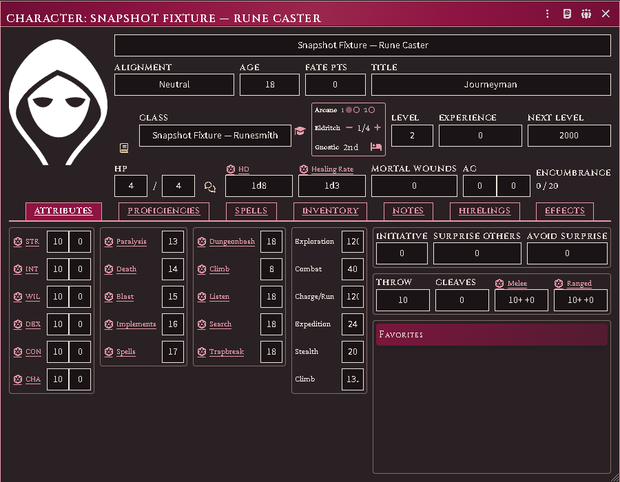

*Slot pips, a points pool with its −/+ pair, the gnostic capacity rung, and the
rest control.*

### Class modifiers — what the class trained them in

Applying a class copies its combat training onto the character. That copy lives
on the **Effects** tab as a **Class modifiers** section: the fighting styles,
weapon classes and armour rungs the class grants, each one a switch. Click a
slot to grant it, click a lit one to withdraw it.

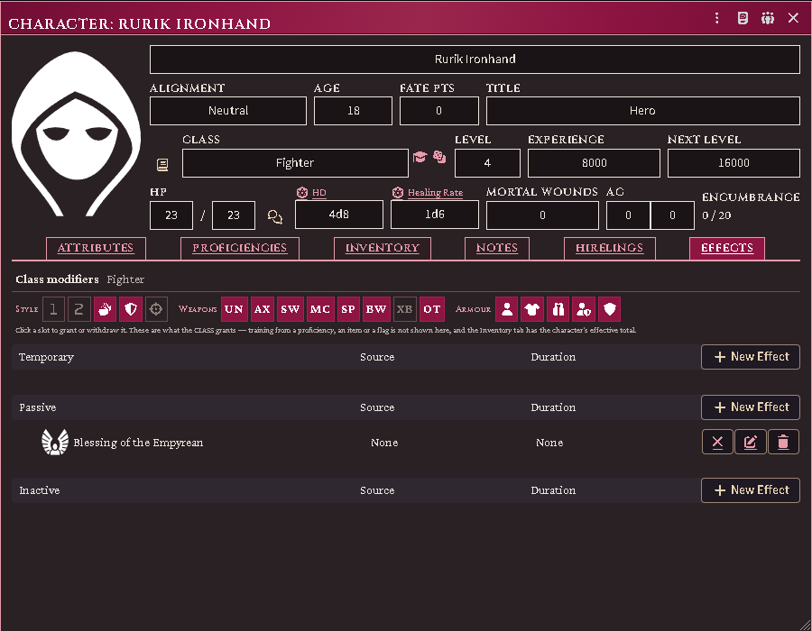

*A Fighter with the dual-weapon style and crossbows withdrawn — the two outlined
slots. The hand-made effect below keeps its own controls.*

Two things are worth knowing about it:

- **It shows what the CLASS grants, not the character's total.** Training also
  arrives from proficiencies, items and flags, and a slot lit by one of those
  could not honestly be switched off here. The Inventory tab's Training row is
  the effective total; this is the class's share of it.
- **Armour is a ladder.** A click sets the heaviest armour allowed and lights
  every rung below it; clicking the top rung clears the grant entirely.

Re-applying the class restores its full grant, which is how you undo a set of
edits. The effect itself cannot be deleted — see below.

### Effects the module maintains

The Class modifiers training and the Equipment Loadout are machinery, not notes:
deleting either quietly breaks the character, so both refuse deletion and show a
lock where the trash would be. They can still be edited, emptied and disabled —
emptying the training is how you leave a character deliberately untrained, and
it stays that way until the class is applied again. The loadout is rebuilt from
what is equipped, so emptying that one lasts only until the next change.
Deleting the character works exactly as before.

## Advanced mode — the class builder

The constructor's **Builder** tab is the Judges Journal's custom-class
workflow as a tool for balanced homebrew — it never replaces the simple
constructor, and it never blocks: the printed tables stay hand-editable in
both modes, and the accounting line reports (points spent, power picks
left, the 2nd-level XP cost) rather than enforces.

Tick *Advanced mode*, set your build values — Hit Die, Fighting (with the
1-point a/b split), Thievery and its chosen skills, one row per **magic
value** (arcane and divine arrive with the Judges Journal import;
ceremonial, gnostic, alchemy, eldritch, fairie or your own tradition are
rows of the same shape once their tables are in the world), and a racial
value spent against a bound **race document**. Trade-offs and custom powers
have their own lists. **Derive class tables** then shows exactly what it
will write — XP schedule, hit die, maximum level, attack throws, saves-as,
cleaves, casting grids, ladders, racial traits — plus every question the
imported tables could not answer, and applies it as one update you can
tweak afterwards.

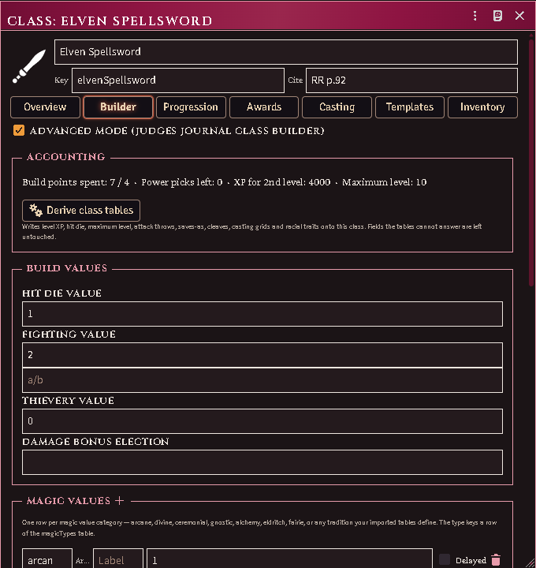

*The Builder tab on an imported Ready-for-Play example: build values, the
accounting line, and Derive.*

Everything numeric comes from your own book: run the importer to import tables
import with the Judges Journal connected and the builder tables,
the Dwarf and Elf race documents, and the printed Ready-for-Play builds on
the core and demi-human classes all land together — open any of those
classes on the Builder tab and Derive reproduces its printed spread.

A **race document** (its own item type) carries the racial value ladder:
each rung's XP cost and granted powers, the race's attribute floors, how it
stacks with a magic category, and its post-8th XP increases. Simple-mode
classes may bind one too.

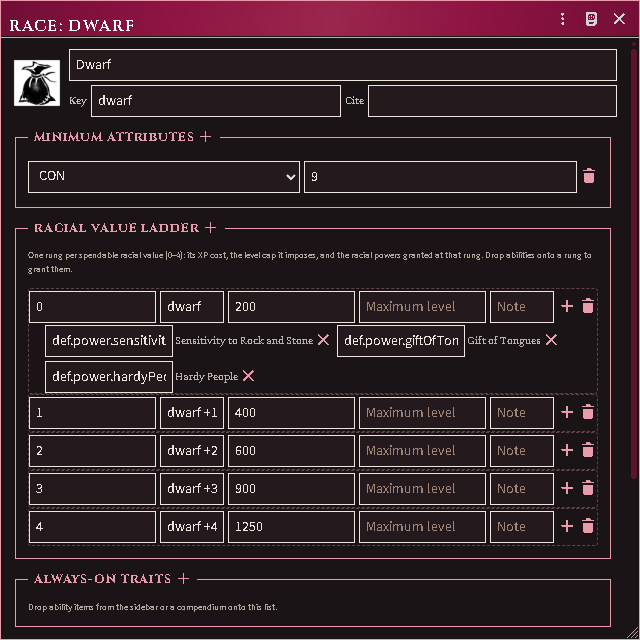

*A race document's value ladder — rung XP costs, attribute floors, and every
granted power resolved to the definition its rung names.*

## Keeping documents current

After reconnecting your book, `acksExtras.importer.cookbookUpdateClasses()` rewrites
imported class documents from the page (hand edits on them are replaced —
the confirm says so). `repairSaveReferences` under
`acksExtras.classes` finds stale save-key references world-wide; dry-run by
default.

## Paths — when a class offers a choice

Some classes are not one thing. A Barbarian's training depends on their region;
a Zaharan has a dark path; a dwarf has a caste. On the class sheet these are
**Paths**: named groups, each holding options of which a character takes exactly
one, and an option can carry its own weapon, armour and fighting-style training.

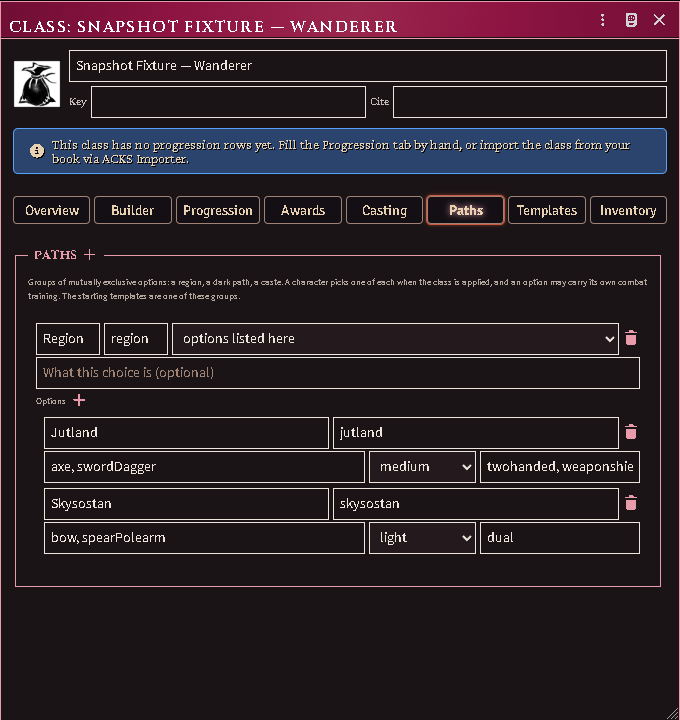

**Imported classes get theirs automatically.** Every class you import has a
Starting Template group, and a class whose book prints a variant table — the
Barbarian's regions — gets that group too, with each region's own weapons,
armour and fighting styles.

**You can write your own.** On the Paths tab, **+** adds a group; inside it, **+**
adds an option; each option takes a weapon list, an armour rung and its fighting
styles. A group can instead be pointed at the class's starting templates.

**Your starting templates are one of these groups.** They are shown in the list
beside the others, and nothing about them moved — the same rows, the same
package bundles, the same 3d6 table you already had.

When you apply a class to a character, you are asked once for each group, with
whatever the character already chose pre-selected. Choosing a region grants that
region's training; choosing a different one later swaps it rather than adding a
second. **A group you leave unanswered grants nothing** — the module will not
pick a region for you.

Taking a starting template that names a variant answers the group for you:
"Pit Fighter (Jutland)" chooses Jutland, and the training follows. A template
that names no variant leaves your choice alone, and so does a second template if
you have already chosen.

## Picks a character still owes

A printed starting package does not only hand things over. Sometimes it hands
over a choice — "and one spell of character's choice" — and until now that
arrived as a sentence on an item's note, where nothing on the character showed
it and the pick was quietly never made.

Such a row now arrives on the character as a marker named for the question it
asks. The chargen chat card lists it under its own heading, apart from what was
granted and from what could not be resolved. Clicking the marker opens the
chooser; what you pick replaces it.

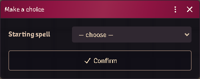

The list is drawn from the class's own traditions, and — for spells only — from
whatever spell compendia the world has, so a table that has imported no spell
list of its own can still answer the offer. Nothing is chosen for you: the
control opens on "— choose —", so closing it without deciding leaves the pick
standing rather than spending it on whichever option sorted first.

Answering is remembered against the character, not against the row's position,
so re-running the generator or re-applying the class never asks twice and never
brings a settled pick back.

## What a race adds after 9th level

Past 9th level a class stops gaining Hit Dice and gains a flat number of hit
points instead. The rate comes from the class's saving-throw progression, and
some races add to it. Both numbers are read from your own books; the race's
share is on the race document, where you can also type it for a race the
importer has no recipe for.

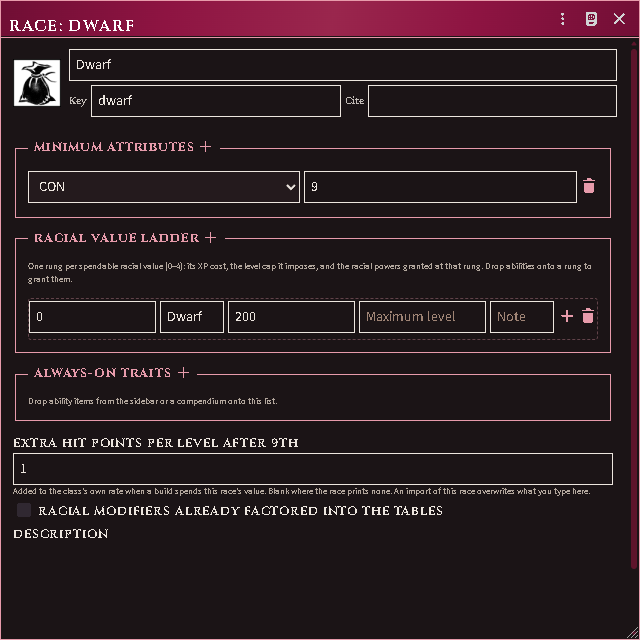

A build that spends this race's value picks the bonus up on the next Derive; the
class's level table then shows the printed flat on every row past 9th. Where the
world has not imported the class-side rate, the derive reports that gap by name
and writes no flat at all rather than guessing one.
