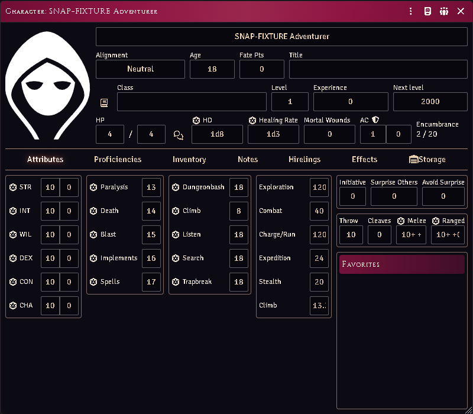
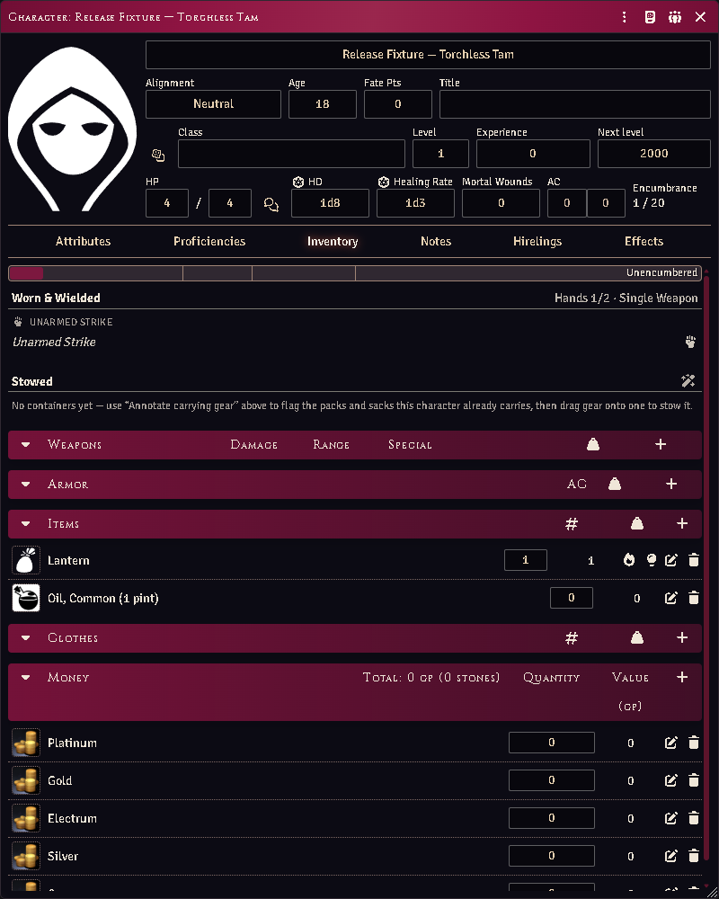

# Equipment, containers and fighting styles

The character sheet's inventory grows containers, wear locations and hand
accounting. Core's own rows are moved into place rather than rebuilt, so every
control you already knew keeps working.

*A character inventory with containers and wear buckets.*

## Wear and hands

Equip an item and it lands in a **wear bucket** — head to foot, then off-body.
One taxonomy drives the buckets and the loadout summary, so they cannot disagree.

Hands are counted. A two-handed weapon needs both; a lit torch occupies one, and
you cannot light one with no hand free. The controls sit in their own box beside
core's, because core's control column is a fixed 35–60px and anything added
inside it overflows.

## Lighting a lamp from your own sheet

A character in a party formation gets light controls on the lamp itself — one to
**light** it, and once it is burning, **douse / re-light** plus, on a lantern,
**open / close the shutter**. They do the same thing as the party sheet's light
panel, on the row where the gear already is.

*Tam's lantern, with its light controls on the row. Hands read 1/2 — the lit
lamp is holding one of them.*

Players use these on their own characters: the click is declared to the Judge's
client, which checks the character is yours and carries it out, and the table
sees what was declared. What a player may do is unchanged — you still need the
lamp, its oil, and a hand free. A Judge clicking the same control is the Judge,
so the gear and the hand are supplied rather than demanded.

## Where gear is worn

The system only lets a **weapon** or a suit of **armour** be equipped, so a
cloak, a pair of gloves, a belt pouch or a backpack had nowhere to be worn. Gear
now declares its own place, and every worn item that is not a weapon or armour
gets a **wear / take off** control on its row.

Run **Annotate Equipment (RAW profiles)** from the module's macro compendium and
it fills this in for everything a character (or the whole world) owns:

- garments land on the body part they name — cloaks on the shoulders, boots on
  the feet, gloves on the hands, belts and sashes at the belt;
- carrying gear lands where it rides, with the RAW cost of reaching into it: an
  adventurer's harness, belt pouch, bowcase, quiver or sheath is **free** to draw
  from, while a backpack, rucksack or sack costs an **action in lieu of
  movement** (RR pp. 293–294);
- rations, tools, rope, loot and coin declare nothing, because they are carried
  rather than worn — that is what keeps them plain goods.

**The slot is a guess, and you can correct it.** Open any item, go to
**Construction**, and set *Worn at*. Three answers matter:

| Choice | Means |
|---|---|
| *Auto (…)* | let the module infer it from the item's name and type |
| a slot | this is where it sits, whatever it is called |
| *Carried — worn nowhere* | it is not worn at all — and this **overrides the name**, so a "Great Helm" you have ruled to be a trophy stays a trophy |

A slot's only rule is that you cannot wear two of the same thing, so a wrong
guess costs nothing but that. Rings are the exception the Treasure Tome spells
out: you benefit from **two**, and a third stops all of them working.

## Containers

**New container** on the equipment tab. Drop items onto its bucket to stow them.

- A container shows its own header, load, and controls next to the gear it
  holds — there is no separate window.
- Coins are stowable (they go in a pouch) even though they have no weight.
- Locked and concealed containers are supported: picking a lock does not remove
  it, so the two states are tracked separately.
- **Emptying** a container leaves its contents loose on the actor rather than
  deleting them.

## Ammunition and thrown weapons

Firing a launcher decrements its matching ammo. A bundle of darts decrements
likewise.

A **single** thrown weapon — a hand axe, a lone javelin — is not destroyed. It is
marked *thrown away*, unequipped, and stops weighing on you until recovered. Use
the **Recover** macro to clear the state.

There is no automatic recovery percentage, because the rules give none: recovery
is the Judge's call and thrown weapons come back by being picked up.

## Proficiency

With enforcement on (the default), a character wielding a weapon with no
Class-Training fighting-style item reads as non-proficient and takes the RR p.106
package — attacks as a 0th-level fighter, no attribute bonus to attack or AC.

Weapon and armour lists stay **permissive** when absent: no list means
proficient, so an unconfigured character is not punished. It is the *style* that
is required.

Configure a character with its Class Training items and the gate is correct. The
`proficiencyEnforcement` setting has `auto` and `off` if you would rather not.

## Named items and overlays

Optional overlays add: named-item rung tracking (advancing on levels gained
while wielding, not on the wielder's absolute level), masterwork and scavenged
condition, enclosing helms, JJ shield variants and combat maneuvers. Each is a
separate setting.

## Common problems

**The container section vanished.** It should not — sections always render, even
empty. If a bucket is missing entirely, report it.

**A shield gives no bonus.** JJ shield variants: a shield strapped on the back
protects only the rear, which is situational rather than ordinary AC.

**"You have no free hand."** Something is already held. Sheathe or stow it — the
loadout summary shows what is occupying what.

**A torch is an item, not a weapon.** Correct: a torch is carried as a stack and
becomes a 1d4 weapon only when one is readied for use.
