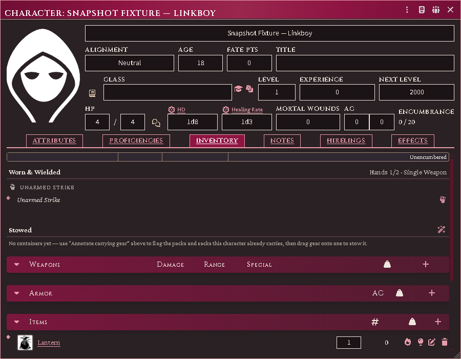
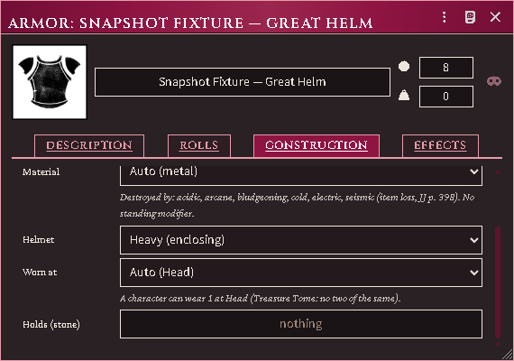
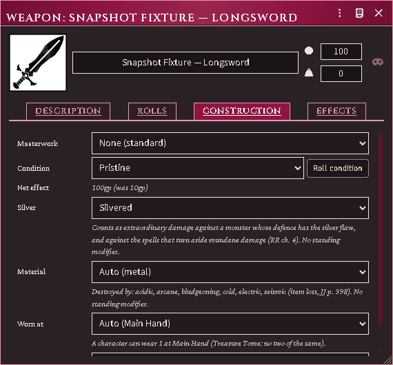
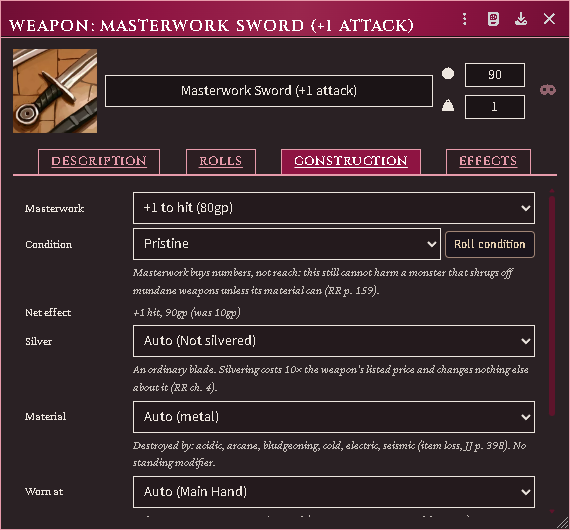
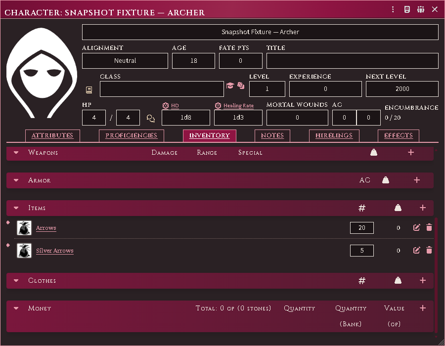
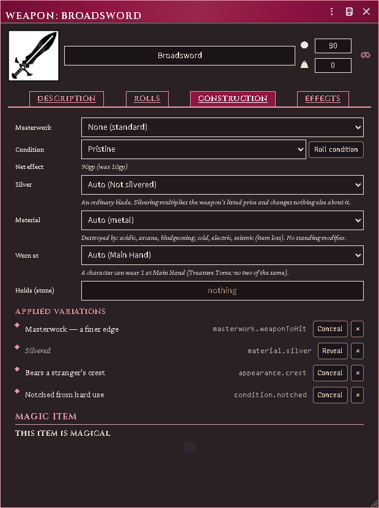
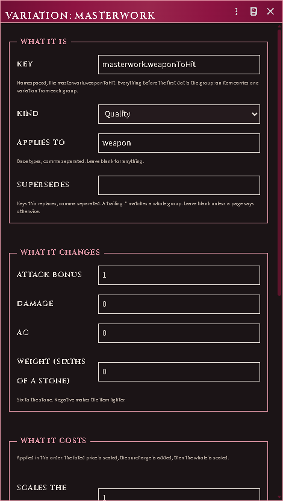
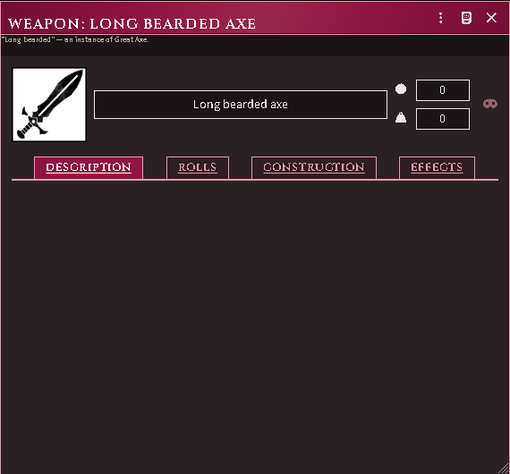

# Equipment, containers and fighting styles

The character sheet's inventory grows containers, wear locations and hand
accounting. Core's own rows are moved into place rather than rebuilt, so every
control you already knew keeps working.

*The inventory: what is worn and wielded, what is stowed, hands read 1/2 because
the lit lamp is holding one of them — and the lantern's own light controls on
the row where the gear already is.*

## Wear and hands

Equip an item and it lands in a **wear bucket** — head to foot, then off-body.
One taxonomy drives the buckets and the loadout summary, so they cannot disagree.

Hands are counted. A two-handed weapon needs both; a lit torch occupies one, and
you cannot light one with no hand free. The controls sit in their own box beside
core's, because core's control column is a fixed 35–60px and anything added
inside it overflows.

## Lighting a lamp from your own sheet

Every character gets light controls on the lamp itself — one to **light** it,
and once it is burning, **douse / re-light** plus, on a lantern, **open / close
the shutter**. They sit on the row where the gear already is.

You do not need to be in a party to use them. A character marching with nobody
keeps their own lights, and their token lights the room for it. What it costs is
the same either way: a free hand, the lamp, and a flask of oil — one of which is
burnt when you strike it.

The difference is what happens next. A party's lights belong to the marching
order, which burns them down as the dungeon turns pass and warns you when one is
about to go out. A light struck alone has no dungeon turn to burn against, so it
stays lit until you put it out.

Players use these on their own characters: the click is declared to the Judge's
client, which checks the character is yours and carries it out, and the table
sees what was declared. What a player may do is unchanged — you still need the
lamp, its oil, and a hand free. A Judge clicking the same control is the Judge,
so the gear and the hand are supplied rather than demanded.

## Where gear is worn

The system only lets a **weapon** or a suit of **armour** be equipped, so a
cloak, a pair of gloves, a belt pouch or a backpack had nowhere to be worn. Gear
now declares its own place, and every worn item that is not a weapon or armour
gets a **wear / take off** control on its row.

Run **Annotate Equipment (RAW profiles)** from the module's macro compendium and
it fills this in for everything a character (or the whole world) owns:

- garments land on the body part they name — cloaks on the shoulders, boots on
  the feet, gloves on the hands, belts and sashes at the belt;
- carrying gear lands where it rides, with the RAW cost of reaching into it: an
  adventurer's harness, belt pouch, bowcase, quiver or sheath is **free** to draw
  from, while a backpack, rucksack or sack costs an **action in lieu of
  movement** (RR pp. 293–294);
- rations, tools, rope, loot and coin declare nothing, because they are carried
  rather than worn — that is what keeps them plain goods.

**The slot is a guess, and you can correct it.** Open any item, go to
**Construction**, and set *Worn at*. Three answers matter:

| Choice | Means |
|---|---|
| *Auto (…)* | let the module infer it from the item's name and type |
| a slot | this is where it sits, whatever it is called |
| *Carried — worn nowhere* | it is not worn at all — and this **overrides the name**, so a "Great Helm" you have ruled to be a trophy stays a trophy |

*Where a piece of gear is worn, what it holds, and what reaching into it costs.*

A slot's only rule is that you cannot wear two of the same thing, so a wrong
guess costs nothing but that. Rings are the exception the Treasure Tome spells
out: you benefit from **two**, and a third stops all of them working.

## Silvered weapons

RAW lets you commission a silver version of **any** common weapon for 10× its
listed price, not just the Silver Dagger on the price list. Open the weapon, go
to **Construction**, and set *Silver* to **Silvered** — the price goes up tenfold
and nothing else about the weapon changes, which is exactly what the rules say
happens.

| Choice | Means |
|---|---|
| *Auto (…)* | read it off the weapon table and the name — a Silver Dagger or a "Silvered Sword" is already silver, and costs nothing extra because you bought it that way |
| *Silvered* | plate this weapon now: 10× the listed price |
| *Not silvered* | it is not silver whatever it is called |

*A silvered weapon's Construction tab: the Silver control, and what the plating
buys.*

What silver buys is not a bonus — it is what the blade **counts as**. A monster
whose defence has the silver flaw treats it as magic, and the spells that turn
aside mundane damage do not turn it aside. Mark the flaw on the monster's
**Defenses** tab, beside *Mundane* and *Extraordinary*; the stat block will say
"silver weapons deal extraordinary damage against it" when it applies.

Masterwork is a separate thing and does not help here: it buys +1 to hit or
damage, never the ability to harm something that shrugs off ordinary weapons.
The sheet says so under the tier picker.

*A shipped sample's Construction tab naming the tier it is, with the net effect
against its base price.*

*Plain and silver stacks side by side; the silver one declared for firing.*

**Silver arrows are never spent by accident.** With both plain and silver
ammunition in your pack, shots come out of the plain stack until it is empty, and
when a silver round does go the notification says so. There is no way yet to
declare "fire the silver ones now" — to shoot silver deliberately, keep it as the
only ammunition to hand, or spend it by hand on the stack.

## Containers

**New container** on the equipment tab. Drop items onto its bucket to stow them.

- A container shows its own header, load, and controls next to the gear it
  holds — there is no separate window.
- Coins are stowable (they go in a pouch) even though they have no weight.
- Locked and concealed containers are supported: picking a lock does not remove
  it, so the two states are tracked separately.
- **Emptying** a container leaves its contents loose on the actor rather than
  deleting them.

## Ammunition and thrown weapons

Firing a launcher decrements its matching ammo. A bundle of darts decrements
likewise.

A **single** thrown weapon — a hand axe, a lone javelin — is not destroyed. It is
marked *thrown away*, unequipped, and stops weighing on you until recovered. Use
the **Recover** macro to clear the state.

There is no automatic recovery percentage, because the rules give none: recovery
is the Judge's call and thrown weapons come back by being picked up.

**A quiver of arrows is arrows.** "Quiver, 20 Arrows" and "Case, 20 Bolts" are
sold packed, so they are the ammunition rather than something to put ammunition
in — the count on the row is what you have, and it goes down as you shoot. They
still ride your belt and are still free to draw from.

If a quiver in your world shows a capacity it should not have — *0 / 1 st,
empty*, next to a name that says twenty arrows — run **Annotate carrying gear**
from the inventory header once. It clears the capacity and leaves the count
alone, so a half-empty quiver is not refilled.

## Proficiency

With enforcement on (the default), a character wielding a weapon with no
Class-Training fighting-style item reads as non-proficient and takes the RR p.106
package — attacks as a 0th-level fighter, no attribute bonus to attack or AC.

Weapon and armour lists stay **permissive** when absent: no list means
proficient, so an unconfigured character is not punished. It is the *style* that
is required.

Configure a character with its Class Training items and the gate is correct. The
`proficiencyEnforcement` setting has `auto` and `off` if you would rather not.

## Variations

A **variation** is one way an item differs from its plain self: masterwork, a
silvering, a notch taken out of the edge, a stranger's crest, a name. Each is a
document, and you put it on an item the way you put a rope in a backpack — drag
it onto the item, and it is listed on the item's **Construction** tab under
*Applied variations* until you take it off.

Several can be true of one blade at once. Two of the same kind cannot: try to
add a second masterwork and the refusal names the one already there. Each time
anything changes, the item's attack bonus, damage, AC, weight and price are
recomputed from its plain self, so what you see is always the sum of what is on
it now — take everything off and the item is exactly what it was.

**Conceal** hides a variation from the players. They see the item without it and
priced without it, while everything it does still applies: a disguised magic
sword hits as a magic sword. Revealing one is what identifying an item *is* —
there is no separate step. **Legible** is the other question: an inscription in
a tongue nobody present reads is seen and not understood.

### Writing your own

You do not need to have imported anything. Make a **Variation** item on the
Items tab and fill it in: what it is, what it changes, what it costs, and who
may know about it.

The **key** is the one field worth care. It is namespaced — `masterwork.weaponToHit`,
`material.silver` — and everything before the first dot is the group. An item
carries one variation from each group, so the group is what decides which of
your variations exclude each other. Everything after the dot is yours to name.

The three cost fields are applied in the order the rules use them: the item's
listed price is scaled, the flat surcharge is added, then the whole is scaled.

> **The old fields still work.** Masterwork, Silver and the shield variant are
> still their own controls further up the same tab, with their own numbers.
> Whichever of the two you use owns that kind of difference — put a masterwork
> variation on an item whose Masterwork field is set and it is refused by name,
> so the same change can never be counted twice. Those fields retire once the
> importer can publish them as variations from your own books.

## Named items and overlays

Optional overlays add: named-item rung tracking (advancing on levels gained
while wielding, not on the wielder's absolute level), masterwork and scavenged
condition, enclosing helms, JJ shield variants and combat maneuvers. Each is a
separate setting.

An item made from another wears a badge naming what it was made from, so an
embellished blade is never mistaken for the plain one it copies.

*A skinned item's badge naming its base, with the embellishment set apart.*

## The item sheet

Every piece of gear — weapon, armour, item, coin — opens in one sheet whose
shape never changes: a title band, an art row, and a strip of tabs that exist
only when there is something to put on them.

**The title band** is the window's own header: the name, a quantity badge on a
stack, the value and the weight (in stone — type it in stone, it is stored in
sixths), a scene chip on a chart, and a Damaged / Destroyed tag when the item
has taken harm. Damage cannot be disguised, so that tag shows whatever else the
sheet is hiding.

**The art row.** Left of the art, a rail of small cells: what the item is (a
weapon shows its damage-type glyph), where it is worn, and up to two **pinned
rolls** — click a roll's lozenge on the Rolls tab to pin it, and the art carries
it as a button. Right of the art, the state cells: **EQP** wears or wields it
(on a stack it splits one out and equips that; click again to restack), **PIN**
favourites it on the character sheet, **CAP** shows how full a container is,
**LOCK** appears on a locked one. Beside the description, the editor rail:
description editor, art, tags and base type, ownership (on a world item), and
for the Judge the item's source and identification.

**The tabs**, always in this order and only when earned:

- **Rolls** — a weapon's attack modes, the special manoeuvres when that overlay
  is on, a spell book's recorded formulae, a locked container's Pick / Break
  rows. Roll buttons appear only where a real throw exists — the lock rows need
  the character's own Lockpicking or Dungeon Bashing.
- **Chart** — drop a Scene on any item and it becomes a chart of that scene;
  *Update From Exploration* captures the explored fog of war and records how
  much of the scene is charted.
- **Durability** — condition, armour class now-of-full, material; and on a
  container, **the lock**: locked, quality, the pick modifier, the keys that
  open it (drop key items on the row), fragile contents, and the Bash button.
- **Effects** — the item's own Active Effects (hidden from players until a magic
  item is identified), what the bearer grants it (class, proficiencies,
  attributes — read only), and for a named item **The Name**: the pip track,
  the true name (Judge only), guessing and renaming.
- **Contents** — a container's load bar, what is inside, and the drop zone that
  names what it accepts and quotes its refusal. A spell book keeps its page
  count and formula list here.
- **Appearance** (Judge only) — whether the item is magical, what the players
  know (found / aura seen / identified) and its aura school; and the
  **disguise**: tick *Can be disguised*, drop any item on the panel, and players
  see that item's name, art, description and price while the real effects keep
  working. *Preview As Player* shows what they see.
- **Details** — the price ledger (listed price, plating, masterwork, variations,
  condition, final) with the value mode (Priced / Unknown / N/A), the applied
  variations, the feature switches (*Holds other items*, capacity, *Will
  Accept* kinds and the refusal message), the construction controls, and the
  core record fields.

An item with nothing to roll, no effects, no durability and no contents — coin,
gems, a trinket — drops the tabs and the state rail entirely; a quiet **Details**
button unfolds that one panel when you need it.

## Common problems

**The container section vanished.** It should not — sections always render, even
empty. If a bucket is missing entirely, report it.

**A shield gives no bonus.** JJ shield variants: a shield strapped on the back
protects only the rear, which is situational rather than ordinary AC.

**"You have no free hand."** Something is already held. Sheathe or stow it — the
loadout summary shows what is occupying what.

**A torch is an item, not a weapon.** Correct: a torch is carried as a stack and
becomes a 1d4 weapon only when one is readied for use.
