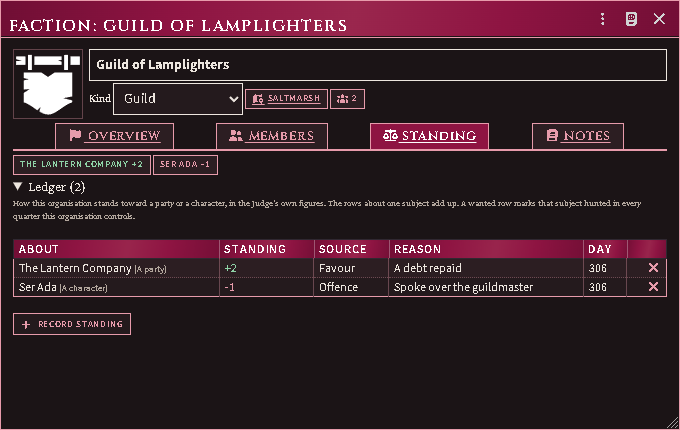

# Factions, standing and status

A **faction** is an organisation the party has dealings with: a guild, a
temple, a syndicate, a noble house, the watch. It is an actor like any other,
so it has a sheet, a token, a place in a folder, and a name the reaction roller
can aim at. What it adds is a **ledger**: how this organisation stands toward a
party or a character, in figures the Judge writes.

Nothing on the ledger is a score the book prints. The module keeps the rows,
adds them up, and carries the total to the places it matters; what a favour is
worth is yours to say.

*A guild's ledger: a favour owed to the party, an offence held against one of
its members, and the running total for each above the rows.*

## Make a faction

Actors sidebar → **Create Actor** → type **Faction**.

**Overview** says what the organisation is and what it holds.

- **Kind** — guild, temple, syndicate, noble house, watch, merchant house or
  other. It is a label, with one exception described under *Legal authority*
  below.
- **Seat** — the place it is found at. Drag a place onto the sheet; the first
  one you drop takes the empty seat.
- **Places** — the other roofs it is behind: a chapter hall, a front, a
  safehouse. Once there is a seat, every further place you drop lands here.
  Type what it is beside the name; the eye hides one from players, and ×
  strikes it off. Dropping a place on the **Seat** row moves the seat instead.
- **Leader** — drag an actor onto the leader row.
- **Part of** — the organisation this one belongs to. Drag a faction onto the
  sheet while Overview or Members is showing, or pick one. A faction cannot be
  put above one it already answers to.
- **Quarters it controls** — pick a district and press **Control**. The list
  offers every Region marked as a district on any scene
  ([streets and quarters](formation.md#streets-and-quarters)); × releases one.

**Members** is the roster. Drag actors onto the sheet to enrol them; the eye
hides a member from players, and × strikes one off. The count in the header
counts a group's whole stack.

**Notes** has a shared page and a private one only the Judge can read.

## Who deals with whom

**Relations** is what this organisation thinks of the others. Pick one in the
picker and press **Add**, or drag a faction onto the tab, then set the
**stance** — allied, friendly, neutral, rival or hostile — and write a line
about what lies between them. The eye hides a row from players; × drops it.

A stance is a word, not a number. It says nothing about the dice, and nothing
adds it to a throw; what a feud costs is a ledger row, below.

Each side keeps its own row. A guild that believes the syndicate is friendly
while the syndicate has it down as prey is two rows that disagree, and that is
the point. **How others regard it** underneath is the other side of the book,
read here and written on their sheets. **The party and its members** is the
ledger's running total for every subject it names, so one tab tells you where
this organisation stands with another organisation, with a character and with
the party at once.

Only the Judge writes relations and places. Players who can open the sheet read
them, and never see a row marked hidden.

## Keep the ledger

On **Standing**, press **Record standing** and say:

- **About** — everyone, one party, one character, or another organisation.
- **Standing** — a signed number. Yours.
- **Source** — favour, offence, crime, wanted, or the Judge's word.
- **Reason** — what happened, for the next time you read the row.

Dragging an actor or a faction onto the Standing tab opens the same prompt
already about them. Rows are stamped with the day they were written. The rows
about one subject add up, and the totals sit above the ledger; × strikes a row.

A row about a party counts for every member of it, a row about a character
counts for that character alone, and a row about an organisation counts for
everyone on its roster — which is how a feud between two houses reaches the
guildsman standing in front of you. Players who can open the sheet can read the
ledger and cannot write to it.

## What standing does

**It prices the reception.** When a character rolls a reaction, the roller
lists **Standing with** each organisation that has a say, with the ledger's
total for that character and their party:

- the organisation itself, when it is the target;
- every organisation the target is a member of;
- every organisation controlling the quarter the party stands in, whoever the
  target is.

These add to the district's own figure and to each other, each organisation
once. Rolls that are not a reception — loyalty, morale, obedience — are left
alone.

When an organisation across the table has written down what it thinks of one
the speaker belongs to, and that stance is anything but neutral, the roller
says so — *<Syndicate> regards <Guild> as Hostile* — with no figure beside it.
It is there so you can see the room before you decide; it adds nothing.

**It sets the hunt.** A **Wanted** row marks its subject hunted in every
quarter the organisation controls. When the party enters the city inside one,
or crosses into one, the settlement board's **Hunted here** ticks itself and
names who is hunting; the district's hunted table then answers in place of its
ordinary one. Untick it and your word stands for as long as the party stays in
that quarter: the ledger is asked again only when they cross into another or
come back to the city.

**Legal authority.** When a watch or a noble house controls the quarter and
lists the rolling character as a member, the roller says **Legal authority
here** and names it. The note adds nothing. Whether authority applies to this
conversation is still the tick on the dialog.

**It can move a market, if you want it to.** *Settings → Standing per market
step* is 0 by default, which leaves hiring untouched. Set it to a number and
that much standing, held by the organisations seated at or holding a market's
place (or a place it is inside) or controlling its quarter, moves that market one class
for that recruiter: larger for goodwill, smaller for ill will. The town's own
monthly pool is never moved, only what this recruiter finds in it.

## Status

The reaction roller's social status row fills itself with how many ranks the
speaker stands above the target, when both have a rank. A rank comes from the
domains module if it is installed, or from an item on the actor named like
`Rank: 2 (Harbourmaster)` — the number is the rank and is yours to set, the
words in brackets are the title. Nobody ranked, nothing filled.

## From the adventure books

Books that describe a settlement's organisations bring them in as factions.
The importer's **getting started** run has an organisations step: each one
arrives seated in its quarter's place, with the people the book lists for it
enrolled from whatever the world already holds. Two things are left for you,
because the book does not print them: the **kind**, and the **quarters it
controls**, since which Region is that quarter is your map's business.

Running the step again makes nothing twice, and a faction you deleted comes
back with its roster.
