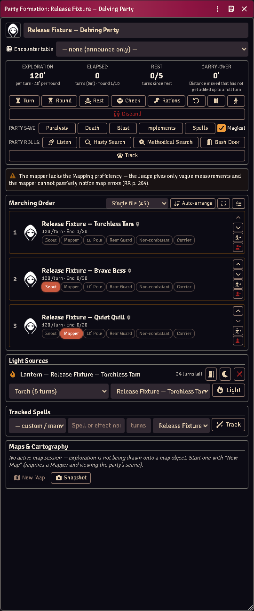

# Exploration formations

A **formation** is the party as one thing: a marching order, one token on the
map, one exploration clock, and party-wide checks that resolve every member.

*The party sheet: exploration clock, party saves and rolls, and the marching
order with its roles — Bess scouting, Quill on the map. Tam's lantern is in the
Light Sources panel with 24 turns left; the Judge handed it over and the lamp,
its oil and a free hand came with it.*

## Build one

Select the party's tokens → **Add to party**, or create a **Party Formation**
actor and add members from its sheet.

Members take roles — front, flank, rear, mapper, light-bearer — and the order is
the marching order. The party actor itself holds almost nothing; the formation
record holds the state.

When a formation takes the field, member tokens are stashed and one party token
stands in their place. Disbanding restores every stashed token to where it came
from.

## Deploying, and which way the column points

A combat deploy lays the marching order out as a block: files abreast, ranks
behind, **facing the way the party token faces**. The heading is the token's
own rotation snapped to a cardinal — core rotates the token every time it is
dragged or walked, so the party token is already a record of which way the
party last marched, and turning it by hand (Shift+scroll with it selected)
turns the whole deploy.

An unrotated token faces **south**, so a party whose token has never turned
deploys its column trailing away to the **north**. (Before v4.8.0 the column
always trailed south of the token regardless of facing — if your table had
gotten used to that, turn the party token to face north and the old layout is
back.)

## Saved marching orders

The party sheet's march controls **save** the current arrangement under a name
and **load** one back; the party token's HUD carries a **form up** button that
applies a saved order and gathers everyone on the map back inside the token.
With one order saved the button applies it outright; with several it asks.

A saved order records the shape — who stands where, their roles, how many march
abreast — and nothing else, so restoring one can lose an arrangement but never
a character. Someone saved but gone is dropped and the line closes up; someone
new keeps the back rank.

For macros, the same calls the sheet uses (all of them **write to the world
setting** — none is a dry run):

- `saveTemplate(formation, name)` — formation first, then the name.
- `applyTemplate(formation, template)` — takes the template **object** (from
  `getTemplate(id)` or `listTemplates()`), not an id, and rewrites the
  formation's marching order.
- `formUp(formation, template)` — apply, then gather the deployed back in.

## The clock

Moving the party token advances the exploration clock in turns. Torches burn
down, spell durations tick, and the rest cycle tracks when the party is due one.

Light is real: a lit torch occupies a hand, lights the party token, and goes out
when it burns through.

## Handing things out

A player has to own a torch to light one, and a free hand to hold it. **You do
not.** When a Judge gives a member a light from the party sheet, the gear appears
in their pack and a hand is emptied to hold it — the shield goes on the back
before the sword is sheathed, and nothing is put away that did not need to be. A
lantern arrives with its flask of oil. The same applies to roles that need a kit:
put someone on the map and they are handed a quill and parchment.

Nothing here blocks you. If the world has no such item to copy, or the character's
hands are full of *lit torches* — which sheathing cannot fix — you get told, and
it happens anyway.

**Mapping takes both hands.** The quill is in one and the parchment in the other
for as long as the role is held, which is why a mapper cannot also have a weapon
drawn. Set the role down and the hands come back.

## Seeing in the dark

*Nobody typed these numbers. A Cave Lurker's stat block records lightless vision
to 90', so its token gets 90' of monochromatic sight — and Foundry derives the
Darkvision and Light Perception detection modes from it.*

Every token's vision now comes from its own sheet, whether or not it is in a
party. Ordinary eyes see **only what a light source reveals** — walk a torchless
character into a black corridor and they see nothing, which is the rule. A
character with **lightless vision** (or infravision) sees its recorded range,
and a thief's **shadowy senses** reach 30'; both see as dim light — colourless,
no reading, no fine detail.

**Night vision** works differently from either, because it is not sight without
light — it is sight that makes more of the light there is. It brightens dim light
to daylight, and indoors it carries **twice as far as the light it is seeing
by**: a creature standing in a torch's 15' bright radius sees 30'. It does not
need to be *its* torch — the party's lamp will do, which is exactly the creature
watching you from beyond the edge of your own light. In a corridor with nothing
burning at all there is nothing to double, and a night-eyed creature is as blind
as you are.

> So if you want a monster to see indoors and it has no lightless vision, you do
> not need to give it any: put Night Vision on its stat block and make sure
> something nearby is lit. If you want it to see in *pitch dark*, that is
> lightless vision, and it is a different line on the sheet.

Monsters answer from their Full Monster Sheet stat block, so a creature with
lightless vision or echolocation gets it without you configuring anything. The
member list shows each character's dark-sight range beside their speed.

**Each sense behaves like itself, not like eyes.** That is the part worth
knowing at the table:

| Sense | Finds an invisible creature | Works in magical darkness | Reaches through walls | Stopped by |
|---|---|---|---|---|
| Lightless vision | no | no | no | blindness; a **hiding** character proficient in Hiding |
| Shadowy senses | yes | no | no | deafness, silence, **running** |
| Echolocation | yes | **yes** | no | deafness, silence |
| Mechanoreception (terrestrial) | yes | yes | **yes** — but only creatures that *move* | — |
| Mechanoreception (other) | yes | yes | no | — |

So a bat still hunts you inside a *darkness* spell, and going invisible does not
help; a thief creeping on shadowy senses goes blind the moment they break into a
run; and a burrowing horror feels you through the floor only while you are
moving.

Two of those need a switch Foundry does not ship, so this module adds them to the
token HUD: **Hiding** and **Running**. Neither is guessed — toggle them when the
character declares it.

If you want a token to see differently, **edit its vision by hand** — from then
on that token is yours and the module leaves it alone. The world setting
*Token vision from ACKS senses* turns the whole thing off.

### Bringing old scenes up to date

Tokens are re-derived when you open their scene or change the creature's sheet,
so a campaign already under way has scenes carrying whatever their tokens were
last set to. The **Migrate Token Vision** macro (in the ACKS Extras macro
compendium) does the lot at once: it walks every scene in the world, re-derives
every token from its sheet, and tells you how many it rewrote.

It asks one question first. Tokens you edited by hand are normally left alone
forever — that is the override working. Answer **Take hand-edited tokens back**
and it drops that protection so they follow their sheets again; those edits are
not recoverable afterwards, so the default is to leave them be. Run it after
switching the setting on, or after an update that changes how a sense is read.

## Sending a scout ahead

The party travels as one token, but any member can **detach** — the arrow button
in their row — and step out onto their own token. They stay in the formation:
turns, rest, encounters and their place in the marching order all keep counting.
What changes is that they now carry their own light and see with their own eyes,
which is the entire point of scouting.

Players can detach their own character; the GM can detach anyone.

A scout can range **one round's movement** ahead, then must wait for the party
to catch up or pass before going further — you will see a notice when they hit
the limit. This keeps the exploration clock honest: the party token is still
what spends dungeon turns.

Press the button again to bring them back, with everything that happened to them
while they were out. If a fight starts, the party deploys around the scout as
normal and the leash lifts for the combat.

## Party checks

**Party roll** resolves the check for every member and posts **one GM-whispered
card**, not a wall of per-member public cards: a table of who rolled, what they
got, the number they needed and whether it landed, with the modifier stack under
each name and anyone who could not attempt it named at the foot.

Party **saving throws** post the same card, and so does the Surprise Matrix
(below) — one shape for every roll the whole party makes at once.

Every number comes from your own imported book by way of acks-importer — this
module ships no skill ladder. Resolution order:

1. an explicit **Used for** binding on an ability item;
2. otherwise the ladder the item itself carries, at the owner's factored level;
3. otherwise the item's cookbook identity naming its skill.

Anything else falls back to the sheet's roll target.

The GM can overturn what the automation decided — the card is theirs.

## Surprise, on one card

Starting a combat opens the system's **Surprise Matrix**. Pick the square that
describes the encounter and the results come back as **one card** rather than a
chat message per combatant: monsters in one table, adventurers in the other,
each row naming the creature, its total and whether it was surprised.

Hover a total to see the dice and every modifier behind it. The rolls are the
system's own and are not changed by this — same numbers, same threshold, same
**Surprised** condition applied to the same creatures.

A **hidden** monster's result stays private: those rows travel on a second card
only the Judges can see, which is what the system already did for them one
message at a time. Nothing hidden means one card; something hidden means two.

Turn **Surprise results on one card** off to go back to the system's original
per-combatant messages. It takes effect on the next encounter — no reload.

## Skill audit

**Skill Audit** (GM) shows how every party roll resolves for every member: which
item or target is used, the auto-scaled level and factor, and each bonus in the
stack.

It is also the editor for **custom skills**: flag any ability item to take part
in a party roll, scale it on a thief progression, and set a level factor (0.5
for "as a thief of half his class level").

## Common problems

**A binding shows a skill that isn't there.** Its skill was never imported, or
the import was removed. The binding still lists itself so you can see your own
choice rather than a blank select — import the skill or rebind it.

**The map went dark.** Scene sync steps are fault-isolated, so one failure costs
only itself. Check the console for which step failed.

**A phantom party keeps coming back.** Records whose party actor was deleted are
pruned at world load. If one survives, its actor still exists somewhere.

**Saves look wrong.** The party does not save — `rollPartySave` reads each
member's own saves.
