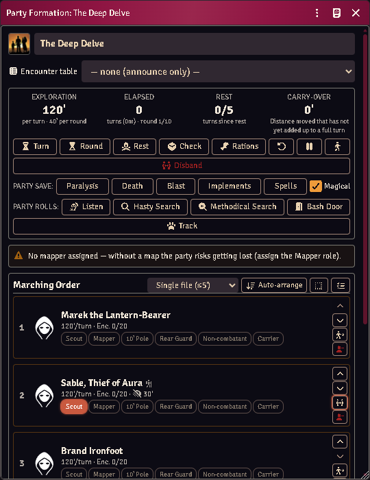
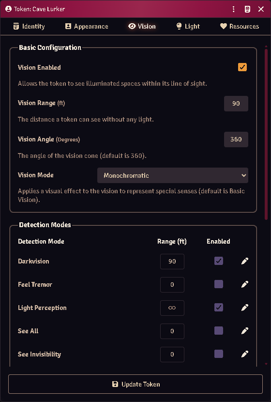

# Exploration formations

A **formation** is the party as one thing: a marching order, one token on the
map, one exploration clock, and party-wide checks that resolve every member.

*The party sheet: exploration clock, party saves and rolls, and the marching
order. Sable is out ahead on her own token — note the hiker badge, her 30'
dark-sight chip, and her lit detach control.*

## Build one

Select the party's tokens → **Add to party**, or create a **Party Formation**
actor and add members from its sheet.

Members take roles — front, flank, rear, mapper, light-bearer — and the order is
the marching order. The party actor itself holds almost nothing; the formation
record holds the state.

When a formation takes the field, member tokens are stashed and one party token
stands in their place. Disbanding restores every stashed token to where it came
from.

## The clock

Moving the party token advances the exploration clock in turns. Torches burn
down, spell durations tick, and the rest cycle tracks when the party is due one.

Light is real: a lit torch occupies a hand, lights the party token, and goes out
when it burns through.

## Seeing in the dark

*Nobody typed these numbers. A Cave Lurker's stat block records lightless vision
to 90', so its token gets 90' of monochromatic sight — and Foundry derives the
Darkvision and Light Perception detection modes from it.*

Every token's vision now comes from its own sheet, whether or not it is in a
party. Ordinary eyes see **only what a light source reveals** — walk a torchless
character into a black corridor and they see nothing, which is the rule. A
character with **lightless vision** (or infravision) sees its recorded range,
and a thief's **shadowy senses** reach 30'; both see as dim light — colourless,
no reading, no fine detail. **Night vision** brightens dim light but is just as
blind in total dark.

Monsters answer from their Full Monster Sheet stat block, so a creature with
lightless vision or echolocation gets it without you configuring anything. The
member list shows each character's dark-sight range beside their speed.

**Each sense behaves like itself, not like eyes.** That is the part worth
knowing at the table:

| Sense | Finds an invisible creature | Works in magical darkness | Reaches through walls | Stopped by |
|---|---|---|---|---|
| Lightless vision | no | no | no | blindness; a **hiding** character proficient in Hiding |
| Shadowy senses | yes | no | no | deafness, silence, **running** |
| Echolocation | yes | **yes** | no | deafness, silence |
| Mechanoreception (terrestrial) | yes | yes | **yes** — but only creatures that *move* | — |
| Mechanoreception (other) | yes | yes | no | — |

So a bat still hunts you inside a *darkness* spell, and going invisible does not
help; a thief creeping on shadowy senses goes blind the moment they break into a
run; and a burrowing horror feels you through the floor only while you are
moving.

Two of those need a switch Foundry does not ship, so this module adds them to the
token HUD: **Hiding** and **Running**. Neither is guessed — toggle them when the
character declares it.

If you want a token to see differently, **edit its vision by hand** — from then
on that token is yours and the module leaves it alone. The world setting
*Token vision from ACKS senses* turns the whole thing off.

## Sending a scout ahead

The party travels as one token, but any member can **detach** — the arrow button
in their row — and step out onto their own token. They stay in the formation:
turns, rest, encounters and their place in the marching order all keep counting.
What changes is that they now carry their own light and see with their own eyes,
which is the entire point of scouting.

Players can detach their own character; the GM can detach anyone.

A scout can range **one round's movement** ahead, then must wait for the party
to catch up or pass before going further — you will see a notice when they hit
the limit. This keeps the exploration clock honest: the party token is still
what spends dungeon turns.

Press the button again to bring them back, with everything that happened to them
while they were out. If a fight starts, the party deploys around the scout as
normal and the leash lifts for the combat.

## Party checks

**Party roll** resolves the check for every member and posts **one GM-whispered
card**, not a wall of per-member public cards.

Every number comes from your own imported book by way of acks-content — this
module ships no skill ladder. Resolution order:

1. an explicit **Used for** binding on an ability item;
2. otherwise the ladder the item itself carries, at the owner's factored level;
3. otherwise the item's cookbook identity naming its skill.

Anything else falls back to the sheet's roll target.

The GM can overturn what the automation decided — the card is theirs.

## Skill audit

**Skill Audit** (GM) shows how every party roll resolves for every member: which
item or target is used, the auto-scaled level and factor, and each bonus in the
stack.

It is also the editor for **custom skills**: flag any ability item to take part
in a party roll, scale it on a thief progression, and set a level factor (0.5
for "as a thief of half his class level").

## Common problems

**A binding shows a skill that isn't there.** Its skill was never imported, or
the import was removed. The binding still lists itself so you can see your own
choice rather than a blank select — import the skill or rebind it.

**The map went dark.** Scene sync steps are fault-isolated, so one failure costs
only itself. Check the console for which step failed.

**A phantom party keeps coming back.** Records whose party actor was deleted are
pruned at world load. If one survives, its actor still exists somewhere.

**Saves look wrong.** The party does not save — `rollPartySave` reads each
member's own saves.
