# Exploration formations

A **formation** is the party as one thing: a marching order, one token on the
map, one exploration clock, and party-wide checks that resolve every member.

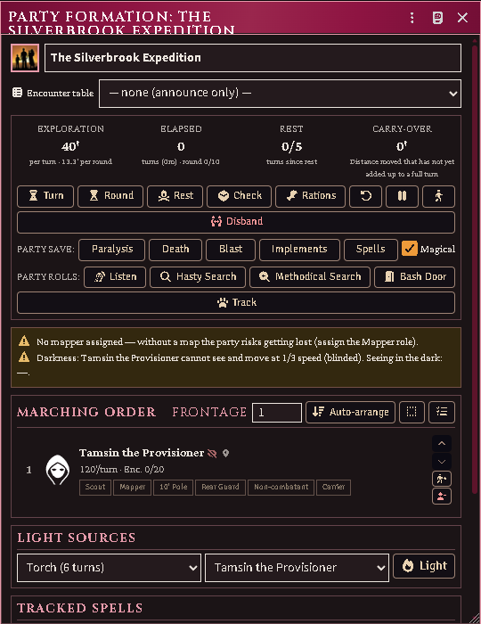

*The party sheet: the exploration clock with its carry-over, the party's saves
and rolls, the warnings it is under, the marching order with its role chips, and
the light sources burning down.*

## Build one

Select the party's tokens → **Add to party**, or create a **Party Formation**
actor and add members from its sheet.

Members take roles — front, flank, rear, mapper, light-bearer — and the order is
the marching order. The party actor itself holds almost nothing; the formation
record holds the state.

When a formation takes the field, member tokens are stashed and one party token
stands in their place. Disbanding restores every stashed token to where it came
from.

## Deploying, and which way the column points

A combat deploy lays the marching order out as a block: files abreast, ranks
behind, **facing the way the party token faces**. The heading is the token's
own rotation snapped to a cardinal — core rotates the token every time it is
dragged or walked, so the party token is already a record of which way the
party last marched, and turning it by hand (Shift+scroll with it selected)
turns the whole deploy.

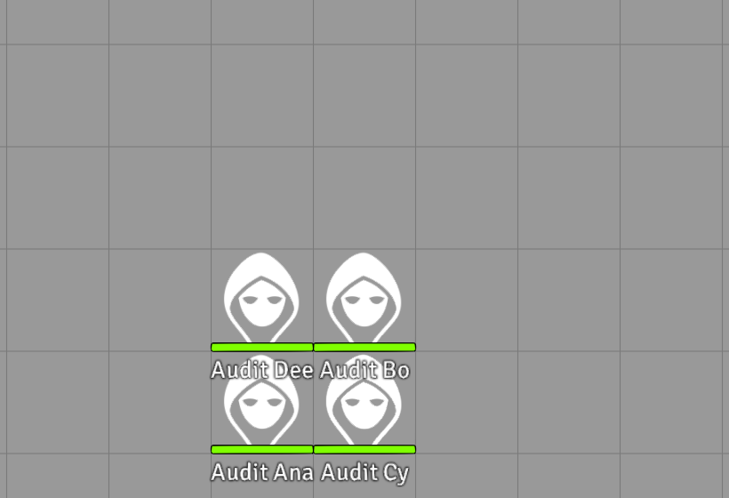

*A two-file block deployed on the canvas, trailing away behind the party token's
facing.*

An unrotated token faces **south**, so a party whose token has never turned
deploys its column trailing away to the **north**. (Before v4.8.0 the column
always trailed south of the token regardless of facing — if your table had
gotten used to that, turn the party token to face north and the old layout is
back.)

The party token itself **wears the formation's face** (since v4.14.0): as wide
as its frontage in feet — each body's width is the *March width per body*
world setting — and as deep as its ranks, at whatever scale the scene uses.
Turn the column and the token's width and depth swap with it.

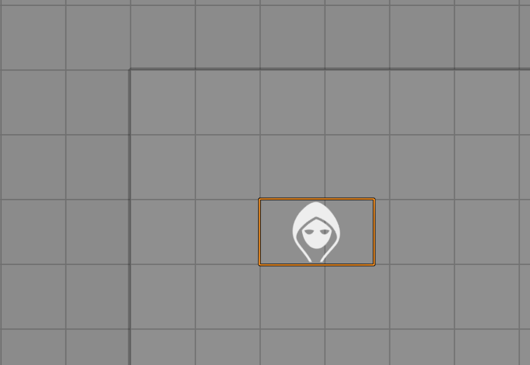

*Three abreast on a 5' grid: the party token stands its real width.*

## Saved marching orders

The party sheet's march controls **save** the current arrangement under a name
and **load** one back; the party token's HUD carries a **form up** button that
applies a saved order and gathers everyone on the map back inside the token.
With one order saved the button applies it outright; with several it asks.

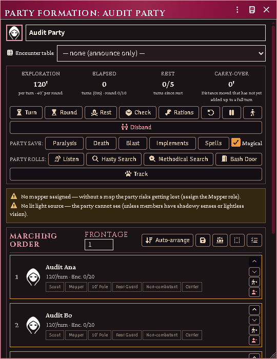

*The party sheet's march controls: frontage, the order, and the save that a
form-up restores.*

A saved order records the shape — who stands where, their roles, how many march
abreast — and nothing else, so restoring one can lose an arrangement but never
a character. Someone saved but gone is dropped and the line closes up; someone
new keeps the back rank.

### Calling it from a macro

The same calls the sheet uses. **The formation always comes first**, and none
of these is a dry run:

- `saveTemplate(formation, name)` — stores the current arrangement. Writes the
  world setting.
- `applyTemplate(formation, order)` — rewrites the formation's marching order.
  `order` is either a saved order (from `getTemplate(id)` or `listTemplates()`)
  or its **id**; both work.
- `formUp(formation, order)` — apply, then gather the deployed back in. Writes
  the formation and moves tokens.
- `deleteTemplate(order)` — forgets one, by order or by id.

To ask what an order *would* do without doing it, call `reconcile(members,
cells)` — it is the only call here that computes without writing.

Getting an argument wrong throws immediately and says what it wanted, rather
than half-working: reversing the pair reports *"arguments are reversed — the
formation comes first"*, and handing an applying call something that is
neither an order nor an id names what arrived instead.

Note that `applyTemplate` here is the **formation** one. `acks-extras`
publishes a second, unrelated `applyTemplate(actor, classItem, template, …)` on
the classes api for character generation; they share a name and share nothing
else.

## Traps

### Making one

A trap is an **item**. Make one on the Items tab (type *Trap*) and fill in what
it is: its level, what springs it, whether it is crudely built, how it resolves
— a saving throw, an attack throw, damage with no throw at all, or nothing the
module rolls — what it deals, and whether it takes only whoever set it off or
everything within reach.

Two fields are worth a word. **Springs on 1d6 of** is the secret trigger throw,
2 by default (so 1–2); widen it for a trap that is easy to set off and narrow it
for a hard one. **Attack throw** is the number your own book gives for a fighter
of the trap's level — the module ships no fighter progression, so you supply the
answer rather than the level.

For a pit, leave the damage blank and set the depth: 1d6 per 10 feet is filled
in for you, and ticking *Spiked* adds the 1d4 spikes at 1d6 each.

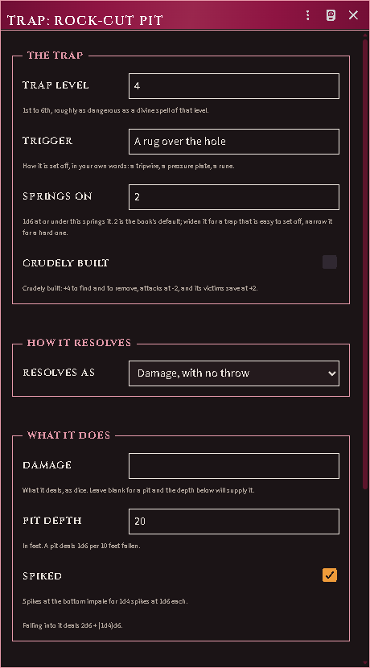

*A trap item: its level and trigger band, how it resolves, and a pit's depth
deriving its own damage.*

### Putting one in the dungeon

Two ways, on the **Walls** layer:

- **Lay a trap along the selected walls** puts a trap layer on whatever you have
  selected — an ordinary wall becomes a tripwire, and a door becomes a trapped
  door. The wall keeps doing its own job: a trap blocks nothing.
- **Enclose the selected walls as a trap area** takes a closed loop of walls and
  builds the region they contain — for a pit, a collapsing ceiling, anything
  the party stands *in* rather than crosses.

Then **drag a Trap item onto it**: onto the wall on the map, onto the trap row
on a wall's configuration sheet, or onto the Trap field of a region's Trap Zone
behavior. Dragging onto an untrapped wall lays the layer and assigns the trap in
one go.

You see a marker on each trap showing its state — armed, spotted, disarmed,
spent. **Players see nothing at all while a trap is hidden**, the same way they
see nothing of a secret door until it is found — and once the party HAS found
it, sprung it or disarmed it, they see its marker too. That is what they point
at to work on it.

A trap area is drawn for you and never for them, whichever scene layer they
open.

### What happens when the party walks in

All of it is whispered to you, including the times nothing happened.

Anyone who can search throws first — and not only against the trap in the way.
A thief moving at exploration speed throws against **every** hidden trap the
party passes within 5' of, 10' with a pole, measured against the ground they
actually walked rather than where they stopped. You hear about it only when
something is spotted; the misses are silent, or the log would be unreadable.
Each character gets one throw per trap per level, which is what a hasty search
costs them.

A thief at the front who makes it spots the trap before anyone touches it. Then
the 10' pole probes a square ahead of its bearer, then the party itself, rank by
rank, each on its own secret 1d6. The first throw that comes up inside the
trigger band springs it, and the party stops there rather than walking on.

At combat speed there is no pole and no searching — the party is moving too
fast for either, exactly as the book says.

Damage is **rolled and reported, not applied** — the card gives you the number
and the sheets stay yours. The number is already worked out against the throw:
a missed attack deals nothing, and a made save takes off whatever that trap says
it takes off (half, all of it, or nothing at all if the save only buys you a
choice about where you land).

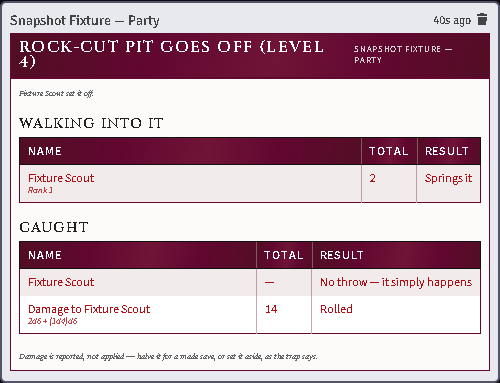

*The whispered card: who walked in, who sprang it on the secret 1d6, who was
caught, and what it dealt.*

### Getting past one

Press **Trapbreaking** on the party sheet. It asks the three questions the book
asks — who is working on it, which trap, and by which column of the table — and
shows you the throw before anyone spends the round or the turn.

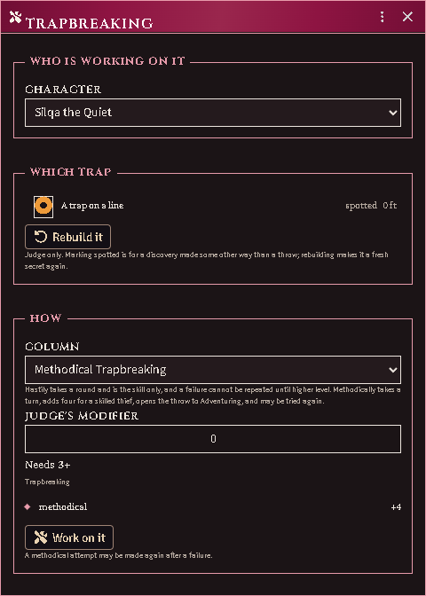

*The target is picked, never guessed: a party halted in a corridor can be
standing at more than one trap. The list holds only traps the party has found —
offering an unfound one would give it away — and you get a control to mark one
spotted when they found it some other way than a throw.*

Players see the same dialog whenever one of their characters could actually make
the throw, and their attempt is declared to you the way every other party action
is.

A character with thieves' tools can work on a trap the party is standing at:

- **Hastily** — one round, and the Trapbreaking skill only. An unmodified 1–3
  sets it off. Fail and that character cannot try this trap again until they
  gain a level.
- **Methodically** — one full turn. A skilled thief gets +4; a non-thief may try
  through Adventuring. Only an unmodified 1 sets it off, and a plain failure can
  be tried again.

Beat it and you choose: **disarm** it, which leaves it re-armable, or
**discharge** it deliberately, which spends it. A disarmed trap can be re-armed
later on a Trapbreaking throw.

A crude trap is +4 to find and to remove, attacks at -2, and is saved against
at +2.

## Doors

A door on the map opens its own window: what it is built of, how many spikes are
in it, and the three things a party does to one that will not open.

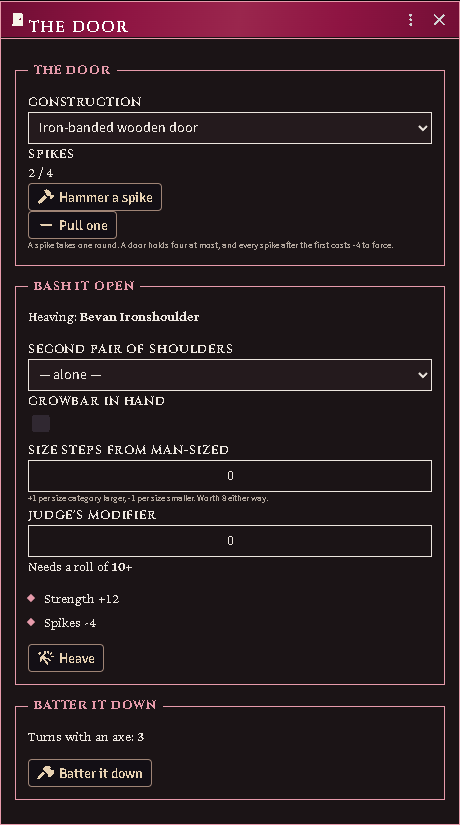

*Two spikes hammered in, the heave broken into its parts — Strength +12 against
spikes −4, needing 10+ — and what battering it down with an axe would cost in
turns.*

- **Spikes** go in one per round, four to a door, and every spike after the
  first makes forcing it harder. Pulling one back out is its own control.
- **Bash it open** is the throw, itemized before you take it: who is heaving,
  whether a second pair of shoulders is on it, a crowbar, how far from man-sized
  the heaver is, and the Judge's own modifier. The number it needs is shown, and
  so is every part of what you have.
- **Batter it down** is the slow certainty instead — the window says how many
  turns an axe wants, and you spend them.

## Dealing out experience

**Deal XP** divides an adventure's total between the party and shows the
division before it is given.

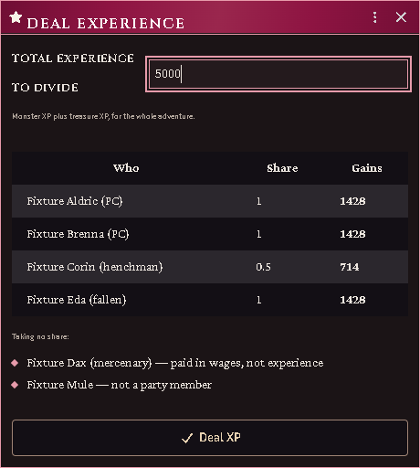

*Full shares to the player characters, a henchman at half, and the two taking
nothing named with the reason.*

Everyone's share is listed with what they will gain, and anyone taking nothing
is listed too, with why — a mercenary is paid in wages rather than experience, a
pack mule is not a party member. A fallen member still takes their share. Only
**Deal XP** writes anything.

## The clock

Moving the party token advances the exploration clock in turns. Torches burn
down, spell durations tick, and the rest cycle tracks when the party is due one.

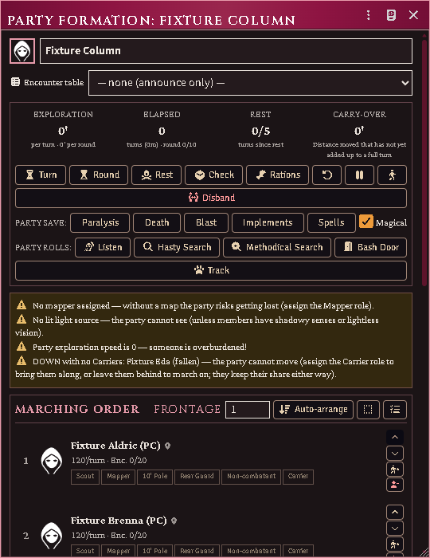

*The exploration warnings, including a fallen member the party must carry or
leave before it can move.*

Light is real: a lit torch occupies a hand, lights the party token, and goes out
when it burns through.

## Handing things out

A player has to own a torch to light one, and a free hand to hold it. **You do
not.** When a Judge gives a member a light from the party sheet, the gear appears
in their pack and a hand is emptied to hold it — the shield goes on the back
before the sword is sheathed, and nothing is put away that did not need to be. A
lantern arrives with its flask of oil. The same applies to roles that need a kit:
put someone on the map and they are handed a quill and parchment.

Nothing here blocks you. If the world has no such item to copy, or the character's
hands are full of *lit torches* — which sheathing cannot fix — you get told, and
it happens anyway.

**Mapping takes both hands.** The quill is in one and the parchment in the other
for as long as the role is held, which is why a mapper cannot also have a weapon
drawn. Set the role down and the hands come back.

## Seeing in the dark

Every token's vision now comes from its own sheet, whether or not it is in a
party. Ordinary eyes see **only what a light source reveals** — walk a torchless
character into a black corridor and they see nothing, which is the rule. A
character with **lightless vision** (or infravision) sees its recorded range,
and a thief's **shadowy senses** reach 30'; both see as dim light — colourless,
no reading, no fine detail.

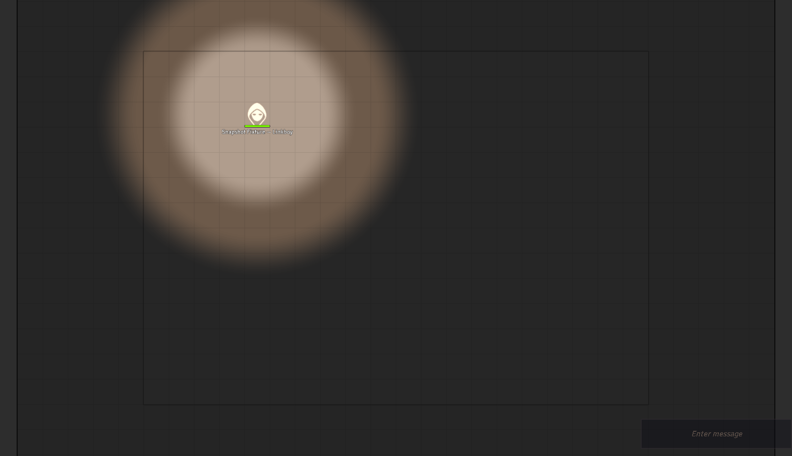

*A token under its own lantern's glow, and nothing beyond it. Nobody typed these
radii — they come off the lamp and the character's own senses.*

**Night vision** works differently from either, because it is not sight without
light — it is sight that makes more of the light there is. It brightens dim light
to daylight, and indoors it carries **twice as far as the light it is seeing
by**: a creature standing in a torch's 15' bright radius sees 30'. It does not
need to be *its* torch — the party's lamp will do, which is exactly the creature
watching you from beyond the edge of your own light. In a corridor with nothing
burning at all there is nothing to double, and a night-eyed creature is as blind
as you are.

> So if you want a monster to see indoors and it has no lightless vision, you do
> not need to give it any: put Night Vision on its stat block and make sure
> something nearby is lit. If you want it to see in *pitch dark*, that is
> lightless vision, and it is a different line on the sheet.

Monsters answer from their Full Monster Sheet stat block, so a creature with
lightless vision or echolocation gets it without you configuring anything. The
member list shows each character's dark-sight range beside their speed.

**Each sense behaves like itself, not like eyes.** That is the part worth
knowing at the table:

| Sense | Finds an invisible creature | Works in magical darkness | Reaches through walls | Stopped by |
|---|---|---|---|---|
| Lightless vision | no | no | no | blindness; a **hiding** character proficient in Hiding |
| Shadowy senses | yes | no | no | deafness, silence, **running** |
| Echolocation | yes | **yes** | no | deafness, silence |
| Mechanoreception (terrestrial) | yes | yes | **yes** — but only creatures that *move* | — |
| Mechanoreception (other) | yes | yes | no | — |

So a bat still hunts you inside a *darkness* spell, and going invisible does not
help; a thief creeping on shadowy senses goes blind the moment they break into a
run; and a burrowing horror feels you through the floor only while you are
moving.

Two of those need a switch Foundry does not ship, so this module adds them to the
token HUD: **Hiding** and **Running**. Neither is guessed — toggle them when the
character declares it.

If you want a token to see differently, **edit its vision by hand** — from then
on that token is yours and the module leaves it alone. The world setting
*Token vision from ACKS senses* turns the whole thing off.

### Bringing old scenes up to date

Tokens are re-derived when you open their scene or change the creature's sheet,
so a campaign already under way has scenes carrying whatever their tokens were
last set to. The **Migrate Token Vision** macro (in the ACKS Extras macro
compendium) does the lot at once: it walks every scene in the world, re-derives
every token from its sheet, and tells you how many it rewrote.

It asks one question first. Tokens you edited by hand are normally left alone
forever — that is the override working. Answer **Take hand-edited tokens back**
and it drops that protection so they follow their sheets again; those edits are
not recoverable afterwards, so the default is to leave them be. Run it after
switching the setting on, or after an update that changes how a sense is read.

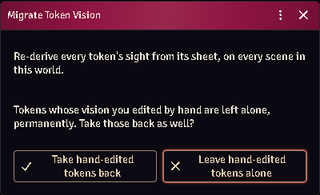

*The world-wide sweep, and the question it asks before touching a hand-edited
token.*

## Sending a scout ahead

The party travels as one token, but any member can **detach** — the arrow button
in their row — and step out onto their own token. They stay in the formation:
turns, rest, encounters and their place in the marching order all keep counting.
What changes is that they now carry their own light and see with their own eyes,
which is the entire point of scouting.

Players can detach their own character; the GM can detach anyone.

A scout can range **one round's movement** ahead, then must wait for the party
to catch up or pass before going further — you will see a notice when they hit
the limit. This keeps the exploration clock honest: the party token is still
what spends dungeon turns.

Press the button again to bring them back, with everything that happened to them
while they were out. If a fight starts, the party deploys around the scout as
normal and the leash lifts for the combat.

## Party checks

**Party roll** resolves the check for every member and posts **one GM-whispered
card**, not a wall of per-member public cards: a table of who rolled, what they
got, the number they needed and whether it landed, with the modifier stack under
each name and anyone who could not attempt it named at the foot.

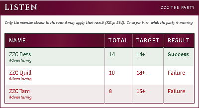

*A check every member made, on one card: total, target, verdict, and the
modifier stack behind each one.*

Party **saving throws** post the same card, and so does the Surprise Matrix
(below) — one shape for every roll the whole party makes at once.

Every number comes from your own imported book by way of acks-importer — this
module ships no skill ladder. Resolution order:

1. an explicit **Used for** binding on an ability item;
2. otherwise the ladder the item itself carries, at the owner's factored level;
3. otherwise the item's cookbook identity naming its skill.

Anything else falls back to the sheet's roll target.

The GM can overturn what the automation decided — the card is theirs.

## Surprise, on one card

Starting a combat opens the system's **Surprise Matrix**. Pick the square that
describes the encounter and the results come back as **one card** rather than a
chat message per combatant: monsters in one table, adventurers in the other,
each row naming the creature, its total and whether it was surprised.

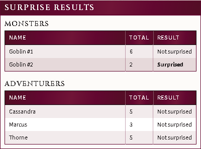

*The whole encounter on one card: monsters and adventurers, each row naming the
creature, its total and the verdict.*

Hover a total to see the dice and every modifier behind it. The rolls are the
system's own and are not changed by this — same numbers, same threshold, same
**Surprised** condition applied to the same creatures.

A **hidden** monster's result stays private: those rows travel on a second card
only the Judges can see, which is what the system already did for them one
message at a time. Nothing hidden means one card; something hidden means two.

Turn **Surprise results on one card** off to go back to the system's original
per-combatant messages. It takes effect on the next encounter — no reload.

## Initiative, on one card

Initiative comes back the same way: **one card**, one row per roll, highest
first, instead of a message per combatant.

A **combat group** is one row. The system already rolls a single die for a group
you have made with the tracker's people icon and gives that number to everyone
in it — but it announces the roll under one member's name and says nothing about
the others, so a grouped fight reads exactly like a fight where everyone rolled
separately. On the card the group is a single line, labelled the way the tracker
labels it (`Group 0`) and naming its members underneath.

Which creatures share a roll is still yours to say, and nothing is grouped for
you: select the tokens — a stack of kobolds, a summoner and everything they
called up — and press the people icon in the combat tracker. Everyone else rolls
as themselves and gets their own row.

A **hidden** combatant's number travels on a second card only the Judges can
see, as it already did. If a hidden creature is inside a group, the group's open
members stay on the public card and the hidden one appears on the Judges' card
with the same total.

Turn **Initiative results on one card** off for the system's original messages.
It takes effect on the next roll — no reload.

## Skill audit

**Skill Audit** (GM) shows how every party roll resolves for every member: which
item or target is used, the auto-scaled level and factor, and each bonus in the
stack.

It is also the editor for **custom skills**: flag any ability item to take part
in a party roll, scale it on a thief progression, and set a level factor (0.5
for "as a thief of half his class level").

## Common problems

**A binding shows a skill that isn't there.** Its skill was never imported, or
the import was removed. The binding still lists itself so you can see your own
choice rather than a blank select — import the skill or rebind it.

**The map went dark.** Scene sync steps are fault-isolated, so one failure costs
only itself. Check the console for which step failed.

**A phantom party keeps coming back.** Records whose party actor was deleted are
pruned at world load. If one survives, its actor still exists somewhere.

**Saves look wrong.** The party does not save — `rollPartySave` reads each
member's own saves.
