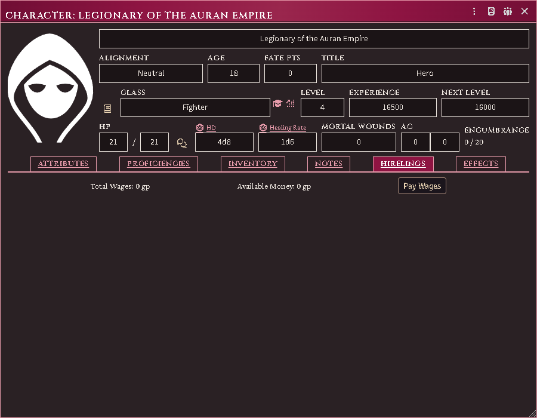

# Hiring henchmen and hirelings

Recruitment runs off a **place with a market**. You post a paid search, the
market rolls what turns up, and you make a hiring throw against the people it
found.

*A market on a location sheet, ready to take a posting.*

## Post a search

Open a location with a market → **Recruitment** tab → **New posting**.

Choose what you are looking for:

- **Adventuring henchmen** — the general post; covers the whole henchman market.
- **By level** — 0th to 4th. Capped by your character's level (RR 168).
- **By class**, optionally at a level — a directed search (JJ 118).
- **By proficiency**, optionally with a class — also directed.
- **Mercenaries** / **Specialists** — by troop or specialist type.

Set the employer, and the **presented level** if your character is passing
themselves off as more important than they are. That is a real option with a
real cost: if it is discovered later, the loyalty throw takes −1 per level of
difference.

**No GM needs to be online.** A location defaults to OWNER, so players can post,
process and hire on their own.

## Let time pass

Availability belongs to the town, not to you (RR 162): a market rolls a monthly
pool and candidates arrive across weeks 1, 2 and 3.

Advance the world clock, or press **Process now** — it is idempotent, so
pressing it twice costs nothing.

**Directed searches behave differently.** A directed result is available
immediately, for the whole month, and is private to the recruiter. It appears in
the Recruitment tab's directed bucket, not the shared walk-in tabs.

## Hire someone

**Henchmen** tab → **Recruit** on a candidate.

The throw dialog shows every modifier that applies, with the situational ones as
toggles so you decide what is really in play. Roll, and on success the candidate
becomes a real actor, owned by whoever owns the employer.

Candidates are plain records until this moment — a Class I market can roll
hundreds of them, and creating hundreds of actors would be unusable.

## Keep a retinue

**Roster** (from the character sheet, or the actor's context menu) shows every
hireling with its loyalty and morale standing, the wage ledger, and the event
history each score is computed from.

*An employer's roster tab: who is hired, on what terms.*

The Judge adds permanents (a rescue, a betrayal), and can mark an entry
**Compensated** — it stays on record but stops scoring.

## Common problems

**"No market at this place."** Add one from the location's GM Settings.

**Nobody arrived.** Time has not passed, or the month's pool was rolled and came
up empty. Check the posting's roll detail.

**A candidate says "reserved".** They accepted with no GM online and nobody
present could create the actor. It materializes at the next GM connect.

**The level cap rejected the posting.** RR 168 caps henchman level against the
employer's level — the level you *presented*, if you set one.

**Two actors appeared for one hire.** This should not happen; hiring is
exactly-once even across duplicate GM sockets. If you see it, it is a bug worth
reporting.
