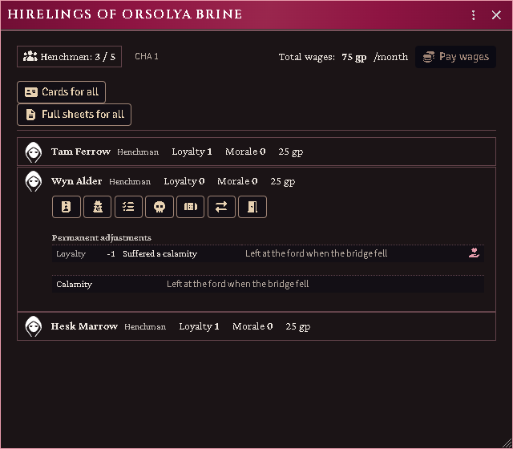
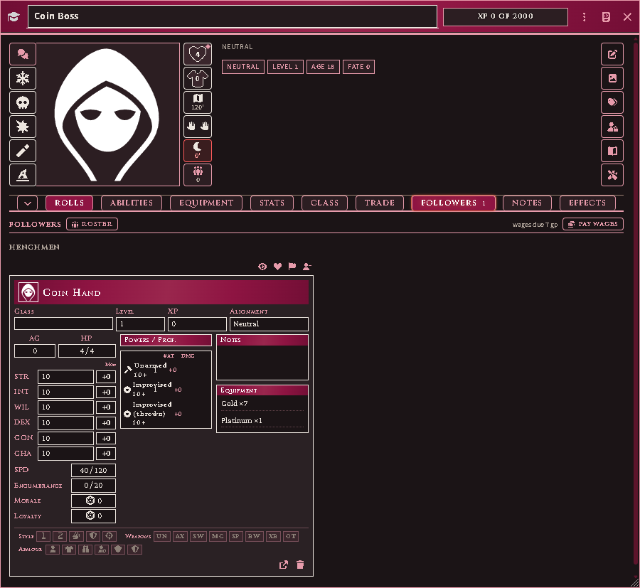
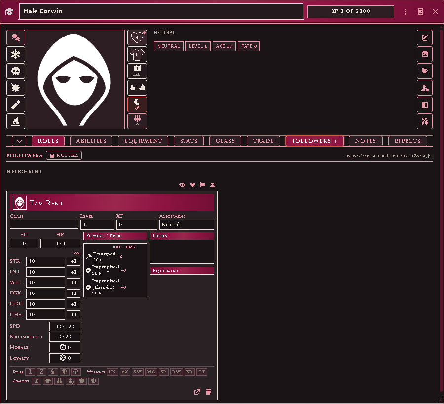
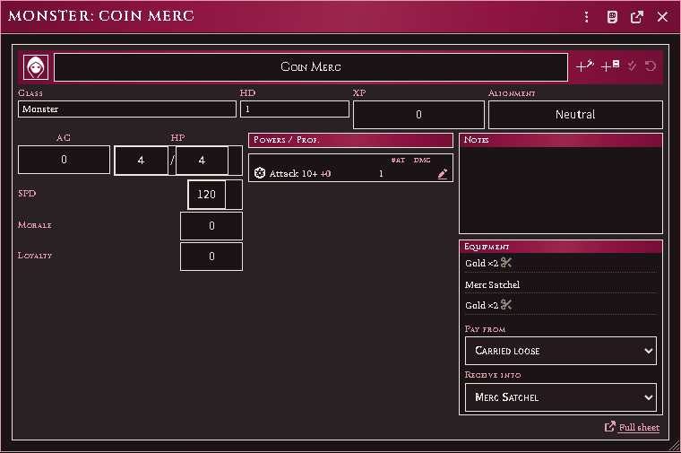
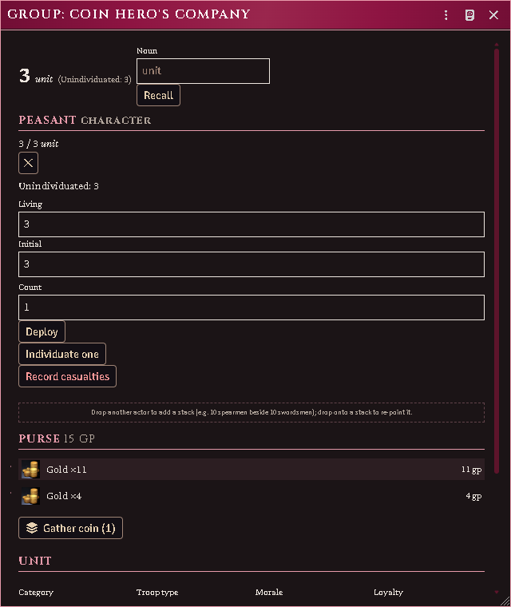

# Hiring henchmen and hirelings

Recruitment runs off a **place with a market**. You post a paid search, the
market rolls what turns up, and you make a hiring throw against the people it
found.

*A market on a location sheet, ready to take a posting.*

## Post a search

Open a location with a market → **Recruitment** tab → **New posting**.

Choose what you are looking for:

- **Adventuring henchmen** — the general post; covers the whole henchman market.
- **By level** — 0th to 4th. Capped by your character's level (RR 168).
- **By class**, optionally at a level — a directed search (JJ 118).
- **By proficiency**, optionally with a class — also directed.
- **Mercenaries** / **Specialists** — by troop or specialist type.

Set the employer, and the **presented level** if your character is passing
themselves off as more important than they are. That is a real option with a
real cost: if it is discovered later, the loyalty throw takes −1 per level of
difference.

**No GM needs to be online.** A location defaults to OWNER, so players can post,
process and hire on their own.

## Let time pass

Availability belongs to the town, not to you (RR 162): a market rolls a monthly
pool and candidates arrive across weeks 1, 2 and 3.

Advance the world clock, or press **Process now** — it is idempotent, so
pressing it twice costs nothing.

**Directed searches behave differently.** A directed result is available
immediately, for the whole month, and is private to the recruiter. It appears in
the Recruitment tab's directed bucket, not the shared walk-in tabs.

## Hire someone

**Henchmen** tab → **Recruit** on a candidate.

The throw dialog shows every modifier that applies, with the situational ones as
toggles so you decide what is really in play. Roll, and on success the candidate
becomes a real actor, owned by whoever owns the employer.

Candidates are plain records until this moment — a Class I market can roll
hundreds of them, and creating hundreds of actors would be unusable.

## Keep a retinue

**Roster** (from the character sheet, or the actor's context menu) shows every
hireling with its loyalty and morale standing, the wage ledger, and the event
history each score is computed from.

*An employer's roster: who is hired, on what terms. Open a row for that
hireling's history and the Judge's actions on it — a loyalty or obedience
throw, a calamity or a penalty on the record, a transfer, a dismissal.*

**A wage is coin that changes hands.** On payday the employer's coin leaves
their stores in the order their sheet states
([where coin is paid from](character-sheet.md#where-coin-is-paid-from-and-where-it-lands))
and lands where each hireling receives coin, so the two have to be where coin
can pass between them: together, or the hireling on the employer's roster.
What the employer cannot pay exactly is kept as arrears, and the hireling's
history records that payday as a part-payment with what is still owed. A
payment that is refused says why and records no payday.

**Pay wages is one payday wherever you press it** — on the character sheet's
Followers tab, on the system sheet's Hirelings tab, in the roster, or on the
Judge's wage card. It pays what the wage clock says is due — a month's wage
(RR 168) for each whole month gone by since that hireling was last paid — and
when nothing is due it says so, with the days until something will be. The
Followers tab states what is due beside the button, and offers the button
only while something is; until then it states what the payroll costs a month
and how many days remain before the next wage falls due. Those days pass as
the world's clock does. A player who presses it for hirelings the
Judge runs has the payday carried out by the Judge's seat; with no Judge
connected it is refused and says so, and no coin moves.

*The Followers tab with a wage due: what is owed stated beside Pay wages, and
the hireling's card listing the coin they hold.*

*The same tab with nothing due: what the payroll costs a month and the days
before the next wage, and no Pay wages button until then.*

**A hireling's coin is theirs to arrange.** Their card lists each coin row;
a row holding more than one carries the scissors, which divide a pile off to
hand over, and **Gather coin** folds matching rows back into one. Once they
have more than one place to keep coin, the card offers the same **Pay from**
and **Receive into** choices a character has.

*A hireling's card from their player's seat: coin carried loose and coin in a
satchel, each row with its divide control, wages set to land in the satchel.*

**A hired unit keeps its own purse.** A unit's sheet lists its coin under
**Purse**, which is where its wage lands. Coin can be dropped onto the sheet
and dragged off it again like any other purse. A unit carries nothing else, so
any other item dropped there is refused and stays with whoever held it.

*A hired unit's sheet: its purse totalled above the coin it holds, with Gather
coin offered because two rows hold the same coin.*

The Judge adds permanents (a rescue, a betrayal), and can mark an entry
**Compensated** — it stays on record but stops scoring.

## Common problems

**"No market at this place."** Add one from the location's GM Settings.

**Nobody arrived.** Time has not passed, or the month's pool was rolled and came
up empty. Check the posting's roll detail.

**A candidate says "reserved".** They accepted with no GM online and nobody
present could create the actor. It materializes at the next GM connect.

**The level cap rejected the posting.** RR 168 caps henchman level against the
employer's level — the level you *presented*, if you set one.

**Two actors appeared for one hire.** This should not happen; hiring is
exactly-once even across duplicate GM sockets. If you see it, it is a bug worth
reporting.
