# Importing from your books

Book content arrives from **your own PDFs**. The module ships extraction
recipes — page geometry, patterns and anchors — and never the book text. The GM
connects a book once, imports what the cookbook ships, and what comes out is
ordinary world documents that everyone at the table can read, players who own
no books included.

## Connecting a book

The importer reads **your own PDFs**, from a copy the importing seat can
reach: your own disk, or a book the GM has staged on the server for the table.
A book is read at the moment something is imported from it; what comes out is
written into the world, so nobody needs the file again afterwards.

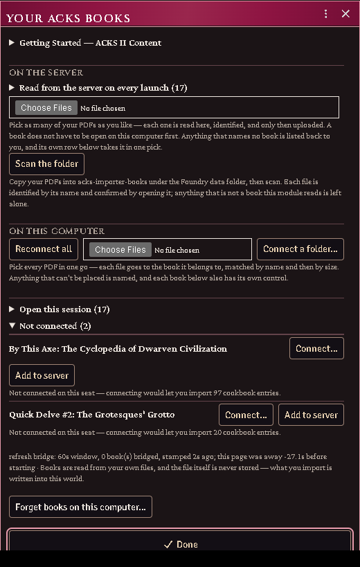

*The book loader, with three books already open on this seat.*

### Connect

Open **Your ACKS Books** (the macro in "Your Books") and use the control on
the book's own row. One window covers all of it: the walkthrough, the server's
books, the controls that answer for several books at once, and a row per book.

The module identifies the edition by **page count plus metadata title**, never by
file hash: DriveThruRPG watermarks each customer's copy, so the bytes differ from
person to person and a hash would only ever match one buyer's file.

Once connected, the count beside the book tells you how many shipped cookbook
entries that connection unlocks.

### Several books in one trip

Use **Pick PDFs…** and choose all of them at once. **The order does not
matter.** Each file goes to the book it belongs to, worked out from the name
this seat used for it last time, its size, or the book's title in the filename
— the stock DriveThruRPG filenames all carry one.

Anything that cannot be placed is **named rather than guessed at**: a book
filled from the wrong PDF is far worse than a book left closed. Connect those
from their own row, where the book is already named and nothing has to be
inferred.

### Connect a folder

Point **Connect a folder…** at the folder holding your PDFs (one level of
subfolders is scanned too). Every book recognised inside connects itself, by
the same evidence rules; other PDFs living there are left alone and named only
in the console — in a folder they are the normal case, not a mistake.

On a Chromium browser over a secure origin the folder itself is remembered:
next session, **one** permission click on the folder reopens everything in it,
where per-file permissions cost one click per book. Elsewhere the folder scan
still works; the books fall back to being remembered by name.

### Books on the server

Browsers will not hand a file back after a reload without a fresh click, which
is why a book connected from your own disk asks for a gesture every session.
A book the **server** holds asks for nothing.

There are three ways in, and none of them asks you to connect the book on this
computer first:

- in the Books window's **On the server** band, **pick your PDFs** — as many as
  you like at once. Each one is read here, identified, and uploaded into
  `acks-extras-books/` under the Foundry data folder. Anything that names no
  book is listed back to you and left alone;
- press **Add to server** on any book's own row. The row names the book, so
  the file you hand it needs no guessing at all;
- copy your PDFs into that folder yourself (drag, FTP, host panel) and press
  **Scan the folder**.

Every route **opens and checks the file before anything is staged**, and the
first two check it before anything is uploaded: a PDF is only recorded as a
book once it proves to be that book, so a misnamed file is refused rather than
staged wrong. From then on every GM seat, on any machine, reads it
automatically at launch — no picker, no permission click, nothing to remember.

If the server already holds a file under that book's name, nothing is uploaded
a second time: the copy already there is read and staged if it is that book,
and named to you if it is not.

Every book on the server is also a **journal**. Look in the Journal sidebar
under *Your Books*: one entry per book, holding a PDF page. Open it and press
*Load PDF* to read the book inside Foundry, from any GM seat; the **Open**
button on the book's row in the Books window goes to the same place. The
journal is yours alone until you share it — give a player Observer permission
on it the way you would on any other journal, and they can read the book too.

That journal *is* the module's record of the book. Delete it and the book is
no longer read from the server; the **Remove** button in the Books window does
the same. Either way the file stays where it was put, and the window tells you
where. A world that staged books before they became journals carries them
across the first time a GM loads it, and says how many.

One thing to be clear about: a file under the Foundry data folder can be
fetched by anyone signed in to your world who knows the path, whether or not
you shared its journal. Staging a book makes it undiscoverable, not
inaccessible. If that matters for your table, keep your books on your own disk
and connect them per seat.

### Status and reconnecting

The Books window lists every book with its state — open, waiting, or not
connected — and what connecting it would unlock. It opens on join when
remembered books are waiting, and from the **Your ACKS Books** macro any time.

**Reconnect all** does everything that needs no permission first — the server's
books, served paths, and anything the browser will still open by itself — and
then spends its single click on the remembered folder, which re-reads every
book inside. Whatever is left is named, because one click can only ever
re-grant one file's permission; those books keep their own button.

Each failure is reported as itself — "it did not reconnect" and "there was
nothing to reconnect" are different problems.

### Common problems

**"That is not the edition I expected."** The page count or metadata title does
not match any known printing. A different printing is not necessarily wrong; the
book is read anyway, and some passages may not be found where they are expected.

**"That file is X, not Y."** The file you picked is a book the module knows, and
it is not the one it was about to fill. It is not read: a book filled from the
wrong PDF imports the wrong pages under the right names, which is far harder to
undo than connecting again. Connect that book on its own, or pick the right file.

**The count says 0.** The book connected but ships no cookbook entries yet, or
you connected a book the current cookbook does not cover.

**It forgot my book after a reload.** Expected for a book on your own disk —
the browser will not re-grant file access without a click. Reconnect from the
window, or put the book on the server and stop being asked.


*The forget confirmation, reported only when the clear really happened.*

## Importing from the cookbook

The **cookbook** is the shipped database: structure, pointers and extraction
assists, with no prose and no values read from a page. Importing turns an entry
into a real Foundry document, filling in from *your* book what only your book can
supply.

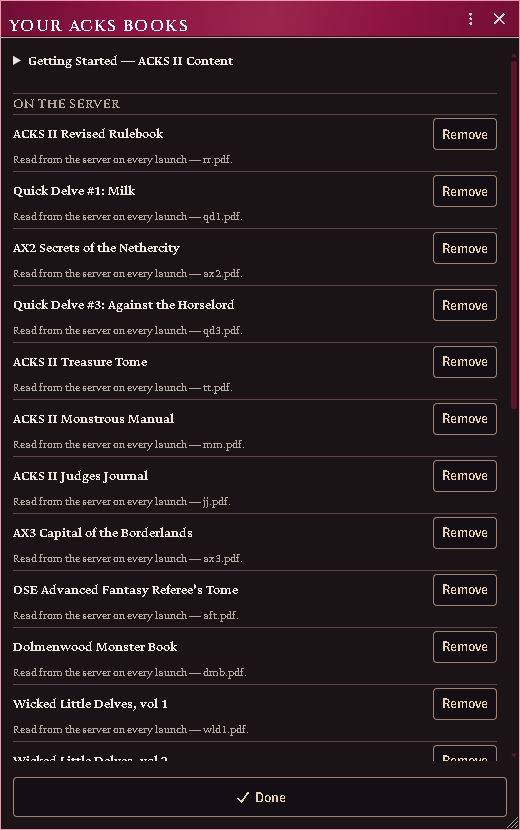

*Connect your books, then import everything the cookbook ships.*

### Import an entry

**ACKS Content → Cookbook**, find the entry, **Import**.

What you get depends on the entry's kind — a monster becomes an Actor with its
weapons and abilities as embedded Items; a proficiency becomes an `ability` Item;
a piece of gear becomes a weapon, armour or item.

The descriptor text is read from your PDF as the document is created and saved
into it, with the book and page as its closing line. Everyone at the table can
read it from then on, and you can edit it like any other description.

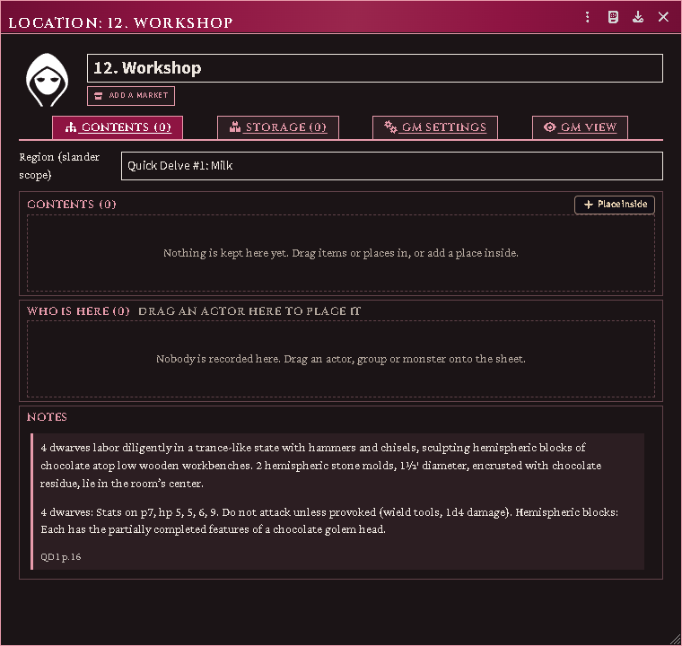

*What an import now leaves behind: the entry's own words in the document, closing on the book and page it was read from.*

### What is filled in, and what is not

**Name and citation, always.** Everything else depends on what a chef-authored
locator was able to read from your book.

Absent a locator, an item is created with the system's defaults and the printed
table governs — and the entry says so with an **unaudited** marker. What the type
buys even with nothing extracted is *behaviour*: a weapon can be equipped,
attacks and takes a fighting style; armour can be worn and counts toward AC.
A plain `item` could do none of that.

### Gear typing

With **ACKS Extras** installed, gear names route through its equipment root, so a
torch imports as a carried light stack and a flask of holy water as a thrown
splash weapon rather than both being generic items. Without it, the register's
own type stands.

### Starting equipment on a class template

A template's printed Starting Equipment line becomes one item per piece the book
lists, and two kinds of piece are taken off that list because they are not gear:

- **What a book is packed with.** A cell that names a spellbook or a prayer book
  and then its contents — the shape of "battered grimoire with *one spell*, *another*,
  and *a third*" — is one book and three spells. The book keeps its printed name,
  its contents are preserved on its note, and the spells go to the template's
  **spell list**. The contents are an English list written across commas, so they
  are put back together before anything is read from them; a divine caster's
  prayer book is read exactly as a mage's spellbook is.
- **A choice the player has not made.** A cell that offers a spell of the
  character's choosing names a decision, not a spell. It stays on the book's note
  and nothing is minted for it — see [ROADMAP.md](https://github.com/NocTempre/foundryvtt-acks-extras/blob/main/docs/importer/ROADMAP.md) for turning it into a prompt.

Before 2.13.2 neither separation happened: a three-spell book arrived as the book
welded to its first spell, with the rest of the list beside it as inventory. A
character built then keeps what that run produced — Foundry does not revisit
documents it has already written — so re-import the class and rebuild the
character to pick up the current shape.

#### A template's spells have to exist in your world already

The importer has **no spell list of its own** — the spells are book content it
carries no recipe for — so each name on a template's spell list is matched
against the **spell documents your world already holds**, and a name nothing
answers to is reported on the chat card rather than invented. Nothing is created
for it, and nothing is lost: the template still names it.

So a caster can finish generation with an empty repertoire while another caster
in the same world fills hers, and the difference is which spells the world holds
— not which class was applied. If that happens, bring a spell library into the
world and apply the template again. The system's own *Arcane Spells* and *Divine
Spells* compendia answer part of the ACKS II list; most worlds add the rest.

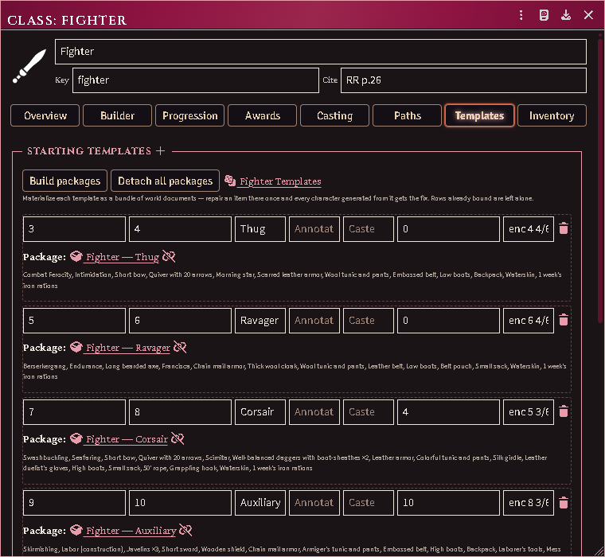

*A class doc's Templates pane: each printed template materialized as a bundle of world documents a Judge can repair.*

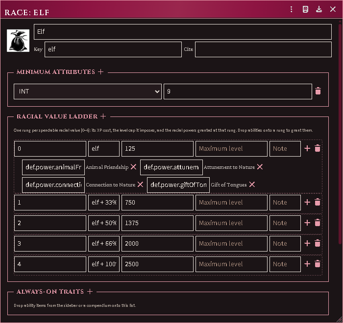

*A race document materialized from the Judges Journal — the ladder, costs, and every power resolved to the definition its rung names.*

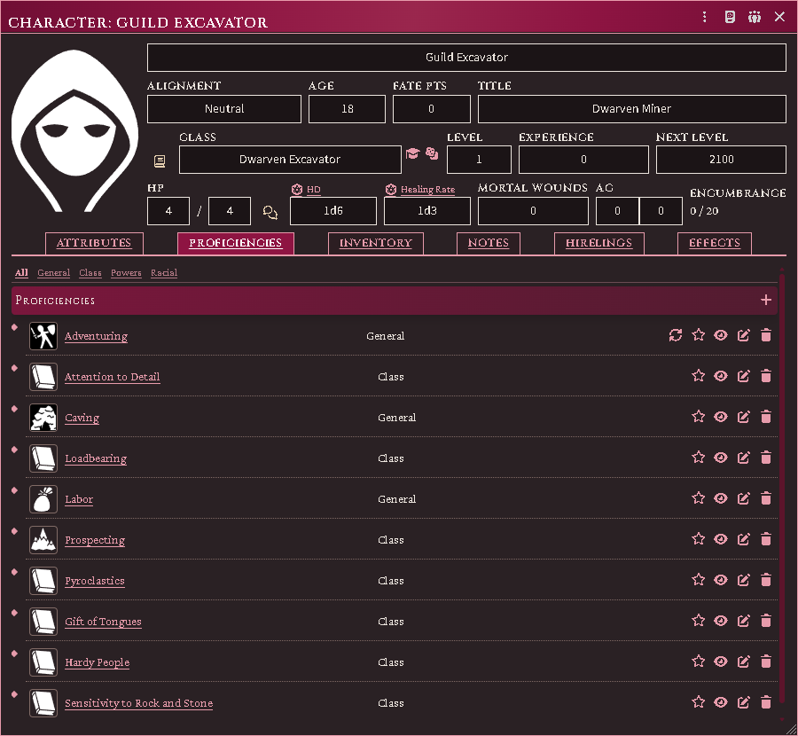

*A 1st-level Dwarven Excavator carrying every power its spread grants at the start of play — including the three the import used to leave behind.*

### Where a monster files itself

An imported monster lands in a folder named for the **type its own stat block
declares**, not for the chapter you found it in. A creature whose block types as
a beastman files under *Beastmen* beside the others, however unrelated its entry.

A name that looks misspelled is usually the book's own coinage — the Monstrous
Manual names many creatures unlike their familiar equivalents, and *Hobgholl*
(MM p.188) is a different creature from *Beastman, Hobgoblin* (MM p.53), not a
misreading of it. An entry only imports at all when the heading on your page
matches the one the cookbook expects, so a name that arrived is the name your
book prints. Compare the stat block before assuming a typo.

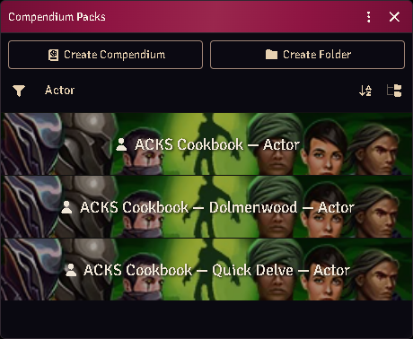

*Where everything lands: a set of compendiums per SERIES, so another game's creatures never share a shelf with the ACKS ones.*

### Cross-book merging

The same conceptual family imported from a second book gains that book's new
variants rather than becoming a twin. Two signals identify it: a shared member id
and a shared family suffix.

### Rules tables

**Import tables** materializes the rules tables as Foundry documents in your
world. In ACKS Extras, those register into the shared tables registry and the
henchmen and location features read them.

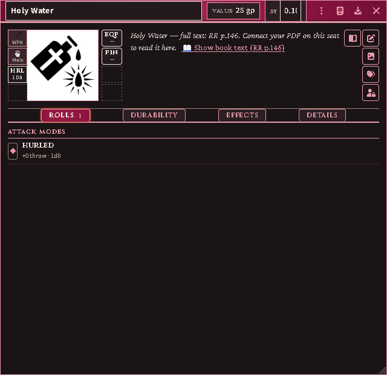

*An item priced only in prose, its cost read from its own paragraph.*

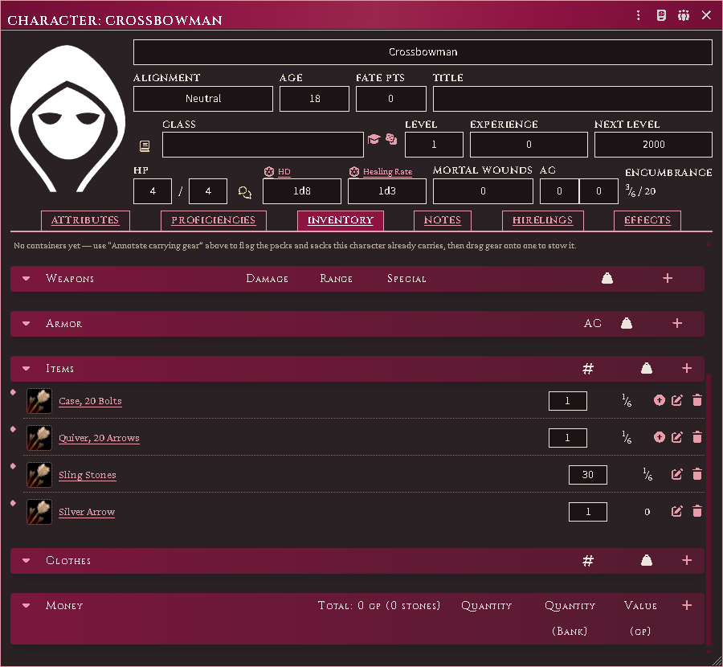

*The four rows the weapons grid types Ammunition, filed as gear with a count and a fraction of a stone rather than among the weapons with a damage die.*

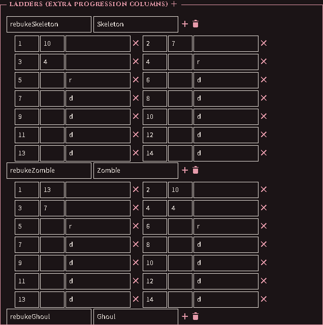

*The crusader's rebuking grid as ladders on the imported class — one per kind of undead, each rung carrying its target or the cell the page prints where no throw is made.*

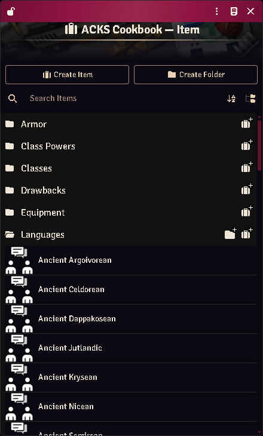

*The Appendix A taxonomy read from the connected book, filed on its own shelf in the library — none shipped.*

### Common problems

**"Missing book."** The entry cites a book this seat has not connected. Connect
it, or import anyway and accept the unresolved passage.

**Everything reports as a missing book.** No books are connected on this seat.

**An imported ability shows a ladder, not a number.** Correct — ladders travel
whole and resolve against the character who owns the item.

**I imported twice and got a duplicate.** Import checks for an entry already
present; a duplicate usually means the first copy was renamed or moved out of the
folder it was created in.

**A description shows `@PdfText[...]` instead of the text.** The document was
written by a version that stored a placeholder and resolved it while you looked
at it; the text is materialized into the document itself now, and nothing
renders the placeholder any more. Importing again does not clear it — import
creates documents and steps over the ones you already have. Connect the book and
run **Import Everything**, which now refreshes what it did not create; the same
repair reaches abilities living on a character, where *Delete Everything
Imported* does not look. A description you have written in yourself is left
alone, so if a placeholder sits beside your own words, clear the placeholder and
run it again.

**The page an item cites is two pages past the entry.** Fixed in 4.3.2: a
citation now names the number printed on the page, where before it named the
page's position in the PDF file, which the front matter puts two ahead (one, in
*By This Axe*). Documents already in your world keep the number they were written
with — run **Update Abilities** to rewrite them, or delete and import the entry
again. An item whose description you have edited yourself is left alone by
Update Abilities, so its citation stays as it was.

## Browsing, auditing and fixing entries

What the cookbook claims, what your book actually says, and what to do when they
disagree.

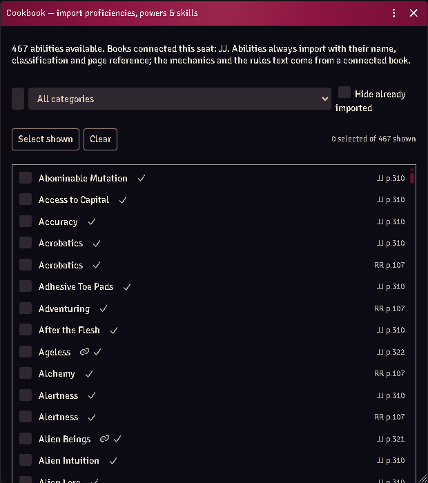

*The entry picker: every ability with its book and page citation.*

### Browse

**ACKS Content → Cookbook** lists every shipped entry with its book, its
citation, and whether this seat can currently read it.

Importing an entry extracts its passage from your own PDF and writes it into the
document. Extraction is per-entry — nothing is pulled on connect.

### Unaudited entries

An entry marked **unaudited** carries mechanics that have not been read against
the printed page. It is a parse, not an interpretation: probably right, genuinely
offered, and not asserted as the book's ruling.

Treat it as a suggestion. If it disagrees with your book, your book wins.

### When an entry points at nothing

A definition can be withdrawn — some have been, once it turned out a harvest had
read the tail of a spaceless heading as an ability of its own. Items already
created in your world stay behind, pointing at nothing.

They are unambiguously this module's (generated, with a cookbook id that no
longer resolves), which is what makes them safe to offer for removal.
**Cleanup** finds and lists them before touching anything.

### What never ships

Worth knowing when you are judging whether something is a bug:

- No prose. Passages are read from your own PDF at import; what ships is where
  to find them on the page.
- No values read from a page. Costs, damage, AC and build costs are matched
  against your own extracted text at runtime by a shipped *pattern* — the
  pattern ships, the number it finds never does.
- No book tables. They are imported from your copy into your world.

### Common problems

**The passage came out garbled.** A printed heading can carry glyph artifacts —
a detached superscript, a decomposed accent. Matching folds both forms and falls
back to a prefix, so a stray glyph does not zero the entry's mechanics. If it
still misses, the entry is worth reporting with the book and printing.

**An entry says it needs a book I own.** Check the edition: identification is
page count plus metadata title, and a different printing may not match.

**The art did not come through.** Art is resolved geometrically and only for
entries carrying an authored placement box. No box, no art — quietly, by design.

## Importing an OSE adventure

Turn a stat block in an Old-School Essentials (or B/X, BECMI, Labyrinth Lord,
LOTFP) adventure you own into an ACKS II monster, using ACKS II's own published
conversion.

Your PDF is read in your browser and nowhere else. Nothing about it is uploaded,
and nothing from it is stored except the creatures you choose to import.

### Before you start

You need the adventure PDF. You do **not** need anything else to begin — but the
**ACKS II System Compatibility Guide** is what carries the conversion
arithmetic, so armour class and attack throw are left blank until you connect
it. You can import first and fill those in later; see the last section.

### 1. Register the adventure

```
game.modules.get("acks-extras").api.importer.oseRegister()
```

Pick the file, **give it a name yourself**, say which **series or publisher** it
belongs to, and say which rules it was written for. The name matters: a PDF's
own title is often just the file it was exported from, so the importer will not
guess one for you.

The series is what decides which compendiums this book's creatures go into.
Books sharing a series share a set, so type the same thing for the next
adventure from the same line — the field suggests the ones you have already
used. Leave it blank and the book lands on a shared shelf with your other books.

If you register the same book twice, it recognises it and reopens it instead.

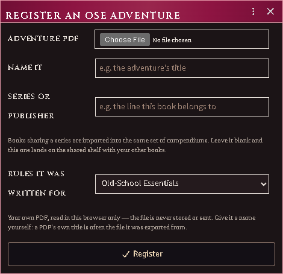

*Naming a third-party book yourself — and the series it belongs to, which is the shelf its creatures will land on.*

### Where your creatures go

Nothing you import from another game's book is mixed in with the ACKS ones. Each
series gets its own compendiums, named after it:

| Compendium | Holds |
|---|---|
| `ACKS Cookbook — Actor` | your ACKS books |
| `ACKS Cookbook — Dolmenwood — Actor` | the Dolmenwood books |
| `ACKS Cookbook — Your Books — Actor` | anything you registered without a series |

Inside, there is a folder per book, and inside that: **Creatures**, **Templates**
for the ones that come in several sizes, and **Areas** for numbered rooms.

They are ordinary world compendiums — unlocked, so you can edit and drag from
them — and sharing a whole book with your players is one setting on the pack
rather than a folder at a time.

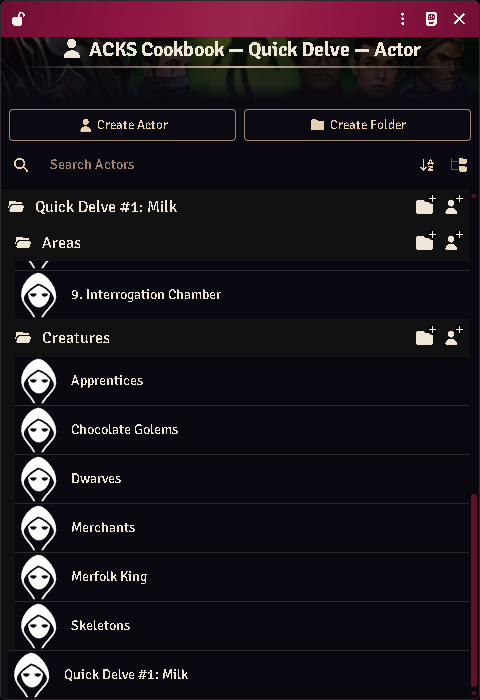

*What the import chain's OSE step leaves in the library: an authored adventure's keyed rooms and the creatures it prints, filed under the book they came from inside its series' own compendium.*

### 2. Choose a page

Any page with stat blocks on it. Blocks are found by their own labels, so you do
not need a contents page or a particular section.

### 3. Read what it found

Each block is shown three ways at once:

- **as printed** — the text exactly as it came off the page,
- **what converted** — every field, what it said, which rule was applied, and
  what it became in ACKS II,
- **what was left alone** — and why.

Check these against the page before ticking anything. That is what the step is
for.

Some things are deliberately never filled in:

| Left alone | Because |
|---|---|
| Experience | ACKS II awards experience on its own schedule |
| Treasure type | the two games' letters do not mean the same hoards |
| A single printed saving throw | one number is one number; the other four are not invented |
| A class ACKS II does not have | no equivalent to convert to |

The printed value is kept in every case — you can see it on the creature's
**Source** tab afterwards, and type it in yourself if you want it.

#### Blocks you cannot tick

Two warnings disable a block:

- **"from a different game"** — the block has an ascending armour class and
  ability modifiers rather than scores. Read as OSE its armour class would come
  out inverted, so it is refused rather than converted. (Some books print two
  systems' stat blocks side by side; this is how the wrong half is caught.)
- **"two blocks may have been read as one"** — the armour class appears twice,
  which means two creatures were gathered together. This happens where a narrow
  stat block is set inside a column of prose.

In both cases, import the creature by hand.

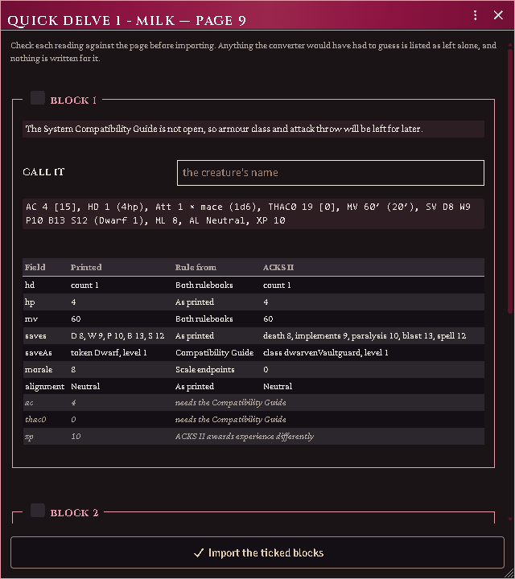

*Each block as printed, what every field converted to and on whose authority, and what was deliberately left alone.*

### 4. If the page uses unfamiliar labels

Some publishers head their hit dice `HIT DICE` rather than `HD`, and so on. When
the importer sees a word standing where a label should stand, it says so, and:

```
game.modules.get("acks-extras").api.importer.oseCalibrate(sourceId, page)
```

lets you say what each one means. **What you teach applies to that adventure
only** — one book's wording never changes how another book is read.

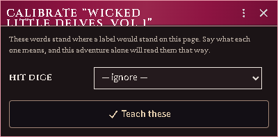

*A publisher heading its hit dice differently, taught to that adventure alone.*

### 5. Filling in what needed the guide

If you imported without the Compatibility Guide, each creature carries a note
saying armour class and attack throw are still missing. Connect the guide, then:

```
game.modules.get("acks-extras").api.importer.oseConvertAll()
```

It fills those in on everything waiting, and tells you how many. Running it
again does nothing — it only ever touches creatures that were waiting.

### When there is no PDF to read

Some blocks the automatic path cannot take: a scanned adventure with no text in
it, a block it refused because it could not tell two creatures apart, a monster
from a blog post, or one you invented. For those:

```
game.modules.get("acks-extras").api.importer.oseManual()
```

Paste the block and press **Read it**, and the fields fill in. Correct anything
it got wrong — each field takes the clause the way your own game writes it, so
`SV` holds `D13 W14 P13 B16 S15 (Magic-user 1)` and `HD` holds `1** (4hp)`.
Then **Convert**, check what it produced, and create the creature.

You can also ignore the paste box entirely and just fill the fields in. Nothing
requires a book at any point.

Two things worth knowing:

- It uses the **same reader** as the PDF path, so anything the importer learns
  about reading stat blocks applies here too, automatically.
- It uses **every wording you have calibrated** on any adventure you have
  registered — teach one book that it says `HIT DICE` and every block you paste
  afterwards understands it. The editor tells you when that happened and which
  book taught it.

Anything it could not place is listed as not recognised, and goes nowhere unless
you move it into a field. That is deliberate: it is better to see that a clause
was ignored than to find out later that a creature is missing something.

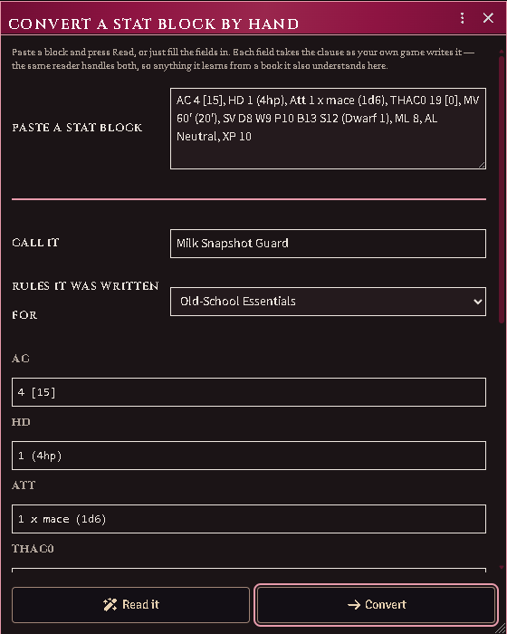

*Paste a stat block and it fills the fields; correct anything the reader got wrong before converting.*

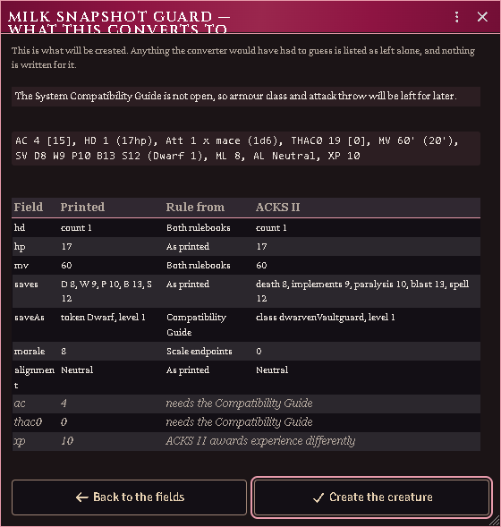

*What each field became and on whose authority, with everything deliberately left alone listed beneath.*

### Checking a conversion later

Every converted creature — imported or hand-entered — has a **Source** tab on its sheet with the original
block, the rule behind each converted value, and everything left alone. If a
number ever looks wrong at the table, that tab is where you check it against
your book.

