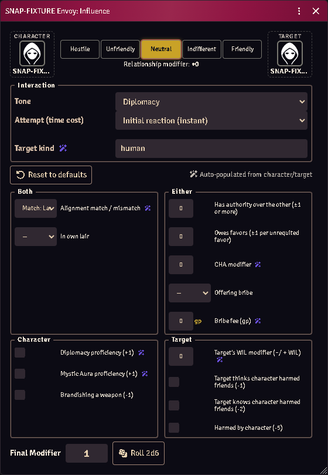

# Influence and reactions

A social roll with its whole modifier stack visible before you commit to it —
who is rolling, against whom, in what tone, and exactly what is adding to the
number.

*A social roll with every modifier itemized before you commit.*

## Make a roll

Select a character → **Influence** (actor context menu, or the API). Pick a
target actor if there is one, and a **tone**.

The dialog fills in what it can detect: alignment relationship, level gap, age,
relevant proficiencies. Everything else defaults to neutral — `false` for
checks, `0` for values.

Modifiers come in three kinds:

- **auto** — detected from the two actors, pre-filled;
- **effect-granted** — contributed by an Active Effect, at its declared default;
- **manual** — yours to set.

Situational modifiers are **toggles**, not silent additions. The roll is offered,
never asserted: you decide what is really in play, and the module does not decide
for you.

## Attitudes

An **attitude** item records how somebody feels about somebody else. Roll results
can move it, and the current attitude feeds later rolls.

## Effects that grant reactions

Any Active Effect keyed `flags.acks-extras.reaction` contributes, with its own
`situational` / `tone` / `label` flags controlling how it presents.

This is shared with hiring: a reaction effect written here also feeds henchmen
recruitment throws, so it is written once.

An ability is counted once per page. Where the page already offers a proficiency
as its own checkbox — Diplomacy, Intimidation, Seduction, Mystic Aura, and
Performance on a seduction — that checkbox is the ability's whole contribution,
and its effects add no second row. An ability the page has no checkbox for gets
a row under **Proficiencies & Powers**.

A class power can stand in for one of those proficiencies: give its effect
`flags.acks-extras.actsAs` naming the proficiency (`diplomacy`, `intimidation`,
`seduction`, `mysticAura`) and it fills that checkbox under its own name. A
character who has the power *and* the proficiency gets the box once, under the
proficiency's name — they are one capability, and the book does not stack it
with itself.

## Badged rows

A row marked **unaudited** (amber, not red) is a mechanic that has not been read
against the printed page. It is probably right and is genuinely offered — it is
just not asserted as the book's ruling. Treat it as a suggestion until you have
checked it.

## Common problems

**A modifier shows as "undetermined".** A value it needs could not be resolved —
usually a level or scale that is not set on the actor. It is skipped rather than
counted as zero, because an unknown is not a modifier.

**An effect I wrote isn't appearing.** Check the change key is exactly
`flags.acks-extras.reaction` — membership is tested exactly, not by prefix, so a
near-miss contributes nothing.

**Nothing auto-populated.** Both actors need the underlying data (alignment,
level). With one side missing, most `auto` sources have nothing to read.
