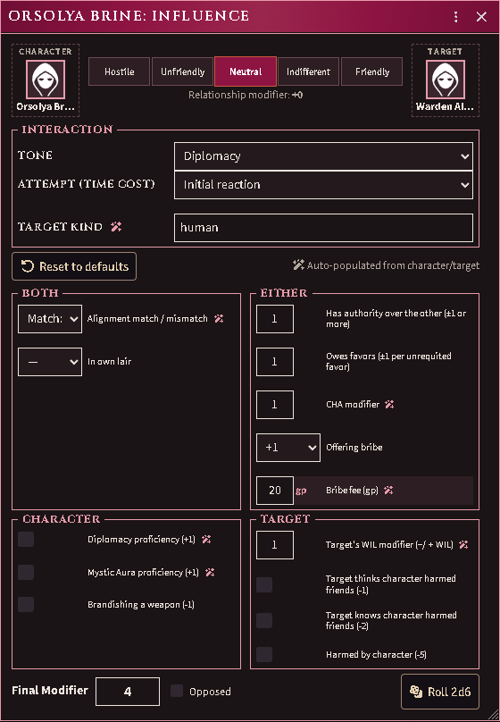
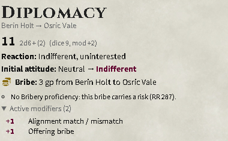
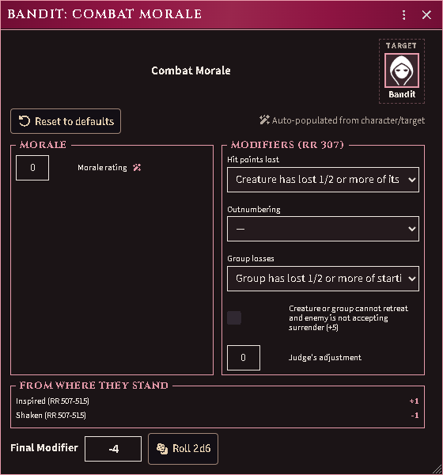

# Influence and reactions

A social roll with its whole modifier stack visible before you commit to it —
who is rolling, against whom, in what tone, and exactly what is adding to the
number.

*A social roll with its modifier stack itemized — here with a bribe armed and
its fee typed, which only moves gold the payer actually has.*

A bribe is paid in the payer's own coin, drawn in the order their sheet
states ([where coin is paid from](character-sheet.md#where-coin-is-paid-from-and-where-it-lands)).
A target who is an actor receives those coins, whoever runs them: where the
roller's seat cannot write to the target, the Judge's seat hands the coin
over. With no target actor, or with no Judge connected to hand it over, the
bribe is paid off-stage and the coin is gone. A payer who cannot cover the
fee is told so and pays nothing.

The result card says what was paid — the fee, who paid it, and who received
it where somebody did. A card with no bribe line is a roll on which no coin
moved. Where the roller has no Bribery proficiency, the card adds a line
marking that the bribe carries a risk, with the page that says what (RR 287).

*A result card after a bribe: the fee, the payer and the target who received
it, the line marking the risk, and the modifiers that were in force.*

## Make a roll

Select a character → **Influence** (actor context menu, or the API). Pick a
target actor if there is one, and a **tone**.

The dialog fills in what it can detect: alignment relationship, level gap, age,
relevant proficiencies. Everything else defaults to neutral — `false` for
checks, `0` for values.

Modifiers come in three kinds:

- **auto** — detected from the two actors, pre-filled;
- **effect-granted** — contributed by an Active Effect, at its declared default;
- **manual** — yours to set.

Situational modifiers are **toggles**, not silent additions. The roll is offered,
never asserted: you decide what is really in play, and the module does not decide
for you.

## Attitudes

An **attitude** item records how somebody feels about somebody else. Roll results
can move it, and the current attitude feeds later rolls.

## Effects that grant reactions

Any Active Effect keyed `flags.acks-extras.reaction` contributes, with its own
`situational` / `tone` / `label` flags controlling how it presents.

This is shared with hiring: a reaction effect written here also feeds henchmen
recruitment throws, so it is written once.

An ability is counted once per page. Where the page already offers a proficiency
as its own checkbox — Diplomacy, Intimidation, Seduction, Mystic Aura, and
Performance on a seduction — that checkbox is the ability's whole contribution,
and its effects add no second row. An ability the page has no checkbox for gets
a row under **Proficiencies & Powers**.

A class power can stand in for one of those proficiencies: give its effect
`flags.acks-extras.actsAs` naming the proficiency (`diplomacy`, `intimidation`,
`seduction`, `mysticAura`) and it fills that checkbox under its own name. A
character who has the power *and* the proficiency gets the box once, under the
proficiency's name — they are one capability, and the book does not stack it
with itself.

## What the surroundings add

Some rows are not yours to type. They come from where the party stands and who
it is dealing with, and they sit read-only under their own heading.

- A quarter's reception comes from the district the party is standing in
  ([streets and quarters](formation.md#streets-and-quarters)).
- **Standing with …** comes from a faction's ledger: whoever controls the
  quarter, on every reaction roll made there, and — when the roller is opened
  with its target named — the faction being spoken to and any faction the other
  party belongs to ([factions](factions.md#what-standing-does)).
- **Legal authority here** is a note with no number beside it. It says the
  speaker belongs to the watch or the noble house that holds this quarter; the
  authority tick is still yours to set.

The social status row fills itself with how many ranks the speaker stands above
the other party, when both have a rank ([status](factions.md#status)).

## Combat morale

A sheet's **Morale** button opens the Combat Morale page in place of the bare
roll, and so does **Roll Morale** on a hired group's entry in the Actors
sidebar. Choose what applies from each list, tick what is true, add an
adjustment of your own, and roll: the card lists every modifier by name with
its figure, the dice and the total, and names the result (RR 307).

The lists and the results are your book's. Until the rules tables are imported
each modifier is a field you type into, and the card names no result
([importing from your books](importer.md)).

The page lists the creature's [conditions](character-sheet.md#conditions) under
their own heading. One that changes the roll is a row in the total and on the
card; one whose figure this world has not imported is a note with nothing
added; and one under which the creature makes no morale roll says so.

*The Combat Morale page for a monster carrying two conditions: two modifiers
chosen from the imported lists, each condition a row of its own beneath them,
and the final modifier beside the roll.*

For the system's plain roll, hold the skip-dialog key, or turn off the world
setting **Morale rolls open the modifier page**.

## Badged rows

A row marked **unaudited** (amber, not red) is a mechanic that has not been read
against the printed page. It is probably right and is genuinely offered — it is
just not asserted as the book's ruling. Treat it as a suggestion until you have
checked it.

## Common problems

**A modifier shows as "undetermined".** A value it needs could not be resolved —
usually a level or scale that is not set on the actor. It is skipped rather than
counted as zero, because an unknown is not a modifier.

**An effect I wrote isn't appearing.** Check the change key is exactly
`flags.acks-extras.reaction` — membership is tested exactly, not by prefix, so a
near-miss contributes nothing.

**Nothing auto-populated.** Both actors need the underlying data (alignment,
level). With one side missing, most `auto` sources have nothing to read.
