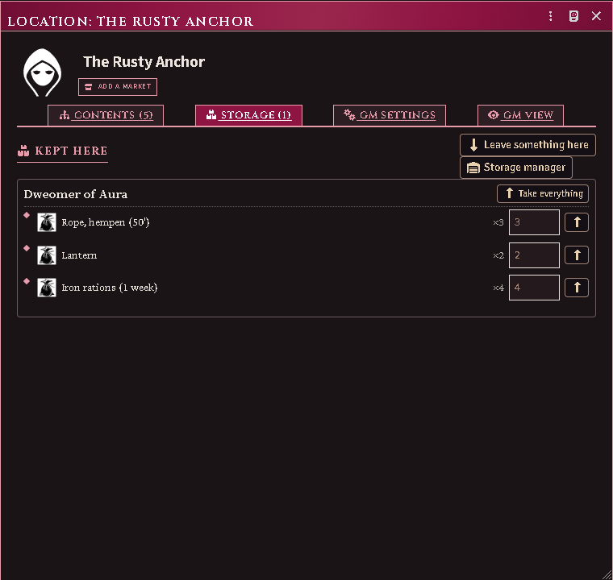

# Places, storage and markets

A **place** is anything that holds things: a duchy, a town, an inn, its cellar,
and the chest in the cellar. They nest, they hold goods and living things, and
some of them have a recruitment market. One actor type covers all of it.

*Goods kept at The Rusty Anchor, grouped by whose they are.*

## Make a place

Actors sidebar → **Create Actor** → type **Location**.

A new place opens on the **Contents** tab with nothing but a name. That is the
whole of the minimum: identity, and what it sits inside.

- **Parent** — the place this one is in. Set it and a breadcrumb appears
  (Duchy of Aura › Rusty Anchor › cellar).
- **Stack count** — for eight identical warehouse bays, keep one actor and set
  the count to 8. Split one off when it becomes interesting.
- **Roster** — the living things kept here: a garrison, a stabled horse, a
  captive. These are references to real actors, so a deleted actor leaves a
  struck-through row rather than vanishing.

If the place is a map you already have, link it: **Scene config → Location**, or
right-click the scene in the sidebar. The link is never made automatically —
most scenes are battle maps and lighting tests, and forty auto-created actors on
first load is not a favour.

## Store goods there

Drag an item onto the sheet's **Storage** tab, or use **Deposit here**.

Goods are grouped by **whose they are**, because a warehouse holding three
characters' gear is three inventories in one actor, not a shared pile. Each
character sees a **Retrieve** button on their own rows; the GM sees it on all of
them.

Stored goods are real items on the location actor, so an item that has left a
character genuinely stops weighing on them.

> Attribution is a UI convention, not a security boundary. Anything that must
> genuinely stay private belongs on a GM-owned actor.

**Deleting a place returns its goods by default** — each owner gets a container
named after the place. The GM setting `storageDeletePolicy` can change that to
"lose", for the campaign where a sacked city takes your warehouse with it.

Coin stows like anything else you carry: drag a coin row onto a place or into a
pouch, or pick it in **Deposit here**. Coin kept in the old **bank** column is
not carried, so it cannot be stowed from there — it is swept into a vault first.

## Give a character a vault

A vault is a place of one character's own: only they and their players can reach
it. You are given one automatically the first time a banked balance is swept out
of the retired bank column.

That sweep only visits a character who still has a balance to move, so a vault
that is **deleted does not come back on its own** — by then there is nothing left
to sweep. **Settings → Storage Manager → Give a character a vault** makes one on
demand.

This is not the same as **Let an actor hold goods**, which makes a *shared*
place — a wagon, a stronghold, an inn — that anyone with access can reach.

## Add a market

Most places have no market. **GM Settings → Add market** creates one, and four
extra tabs appear.

Removing a market removes the data with it, not just the tabs.

## Common problems

**The market tabs aren't there.** The place has no market. Add one from GM
Settings — they are opt-in per place.

**A roster row is struck through.** Its actor was deleted. The row stays so you
can act on it; remove it when you have.

**The breadcrumb stops short.** A parent points at a place you cannot see, or
one in an unloaded compendium. The chain renders as far as it resolves.

**Retrieve isn't offered.** The goods are attributed to a character you do not
own. A GM can reassign attribution in the **Storage Manager** (Settings →
Storage Manager).

**"Nothing was moved."** The stack you picked is empty. Coin sitting in the old
bank column is not carried, so it cannot be stowed from there — it is swept into
a vault at the next world load, and stows from the vault.

**My character has no vault any more.** Deleting one does not regenerate it. A GM
makes a new one with **Storage Manager → Give a character a vault**.
