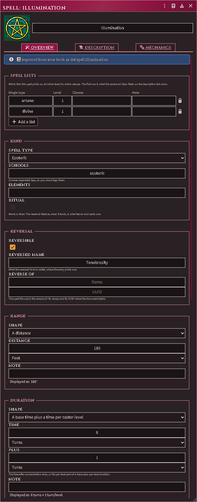

# Magic

The spell is a document with structure. Every spell — imported from your
book, dragged from a compendium, or made by hand — opens on the ACKS Spell
sheet.

## The spell sheet

**Overview** is the stat line as fields. *Lists* names every list the spell
prints on, each with its magic type and level; a spell on two lists is
offered to both traditions' casters, once. *Type* is the spell type the book
groups it under. *Range* and *Duration* are a shape — a distance, a touch,
the caster alone, a count per caster level, concentration — with the value
and unit the shape needs. *Reversible* marks the spell and *Reverse* names
what it becomes; a reverse you keep as a document of its own links to its
pair.

**Description** is the system's own tab: the text, and the level, class,
range, duration and save strings a plain sheet shows. Those strings follow
the fields above — change a shape and the string is rewritten; type one by
hand and it stays until the field beneath it changes.

**Mechanics** holds the effect rows, each edited in a window of its own:
what the row does, whom it applies to, its value flat or per level. Nothing
casts them yet; they are the record the cast engine will read. The system's
Active Effects sit below them.

*An imported spell on the Overview tab.*

## Importing your spells

Connect your Revised Rulebook (*Your ACKS Books (this seat)*) and run *Import
Everything (GM)*, or the *Spells* shelf of *Reimport One Shelf*. One document
per printed entry lands in the imported Items compendium's *Spells* folder,
and each of the sample rituals with them, the stat line already on the
fields and the text closing on its page. Run it again and nothing doubles;
*Repair in place* reads the entries again over the documents you hold,
keeping every id and what you set on each.

Spells import before classes, so a class's starting templates find the
spells their spellbooks name.

## Disabling

*Uninstall — Strip Spell Data* (the *ACKS Extras* macros folder) removes the
fields from every spell in the world and keeps the system's strings, so a
spell still shows its stat line with the module gone. Run it before
disabling; it needs the module's code.
