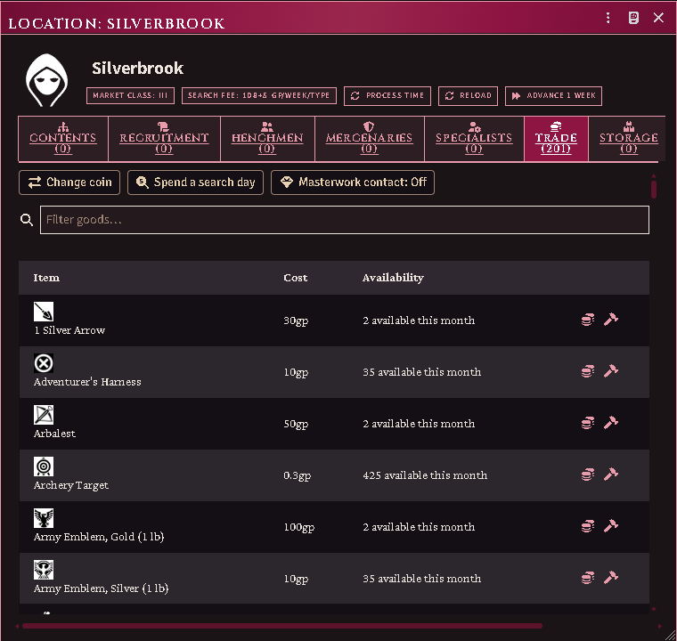
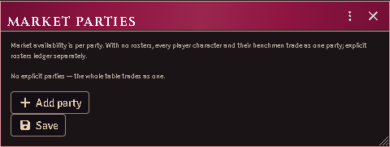
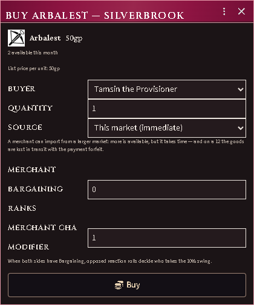
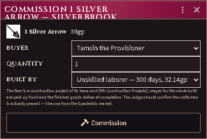
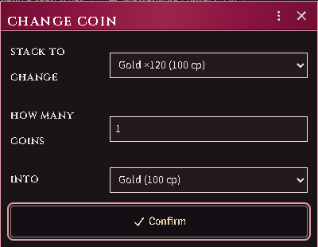
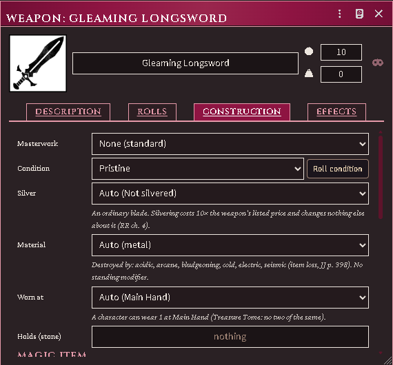

# Item Markets

Buy and sell equipment at any settlement with a market, at ACKS II
availability and prices — with merchant imports, commissions, directed
searches, the magic-item market, and mercantile ventures.

*The Trade tab: the catalog with live monthly availability at the settlement's
class, demand chips, search day and masterwork contact.*

## Setup

1. Import the market tables from your books via **the importer**: Equipment
   Availability, Merchandise & Market Characteristics, Magic Item
   Transactions, Wage and Construction Rates — or fill the generated
   placeholders by hand.
2. Give a location a market (its market class derives from urban families,
   or set the override). The location sheet grows a **Trade** tab.
3. Optional: **Configure parties** (module settings) if more than one group
   trades separately; otherwise the whole table is one party.

*The per-party roster behind availability.*

## Buying and selling

The Trade tab lists every priced item known to the world and its
compendiums, with live availability: so many per month per party at this
market's class, scarce goods as a percent chance your merchants find one.
Buy opens the purchase dialog — quantity, an optional merchant Bargaining
profile (GM), and for parties of twelve or more adventurers the dedicated
shopping day that doubles the month's purchases. Purchases stack: countable
gear merges, and thirty swords arrive as one bundle you can drag out to
distribute. Sell offers your own priced goods at their condition-reduced
value; sold goods leave play.

*The purchase dialog: buyer, quantity, hub sourcing with its 2d6 risk, and the
merchant's Bargaining profile.*

A **search day** (button on the toolbar) spends another dedicated day
looking: your party's caps rise by one base increment and scarce goods get
a fresh look.

If the market cannot supply an item:

- **Import it** (in the purchase dialog): a merchant sources it from a
  local hub (+1 class, 2d6 days) or regional hub (+2, 2d6 weeks), paid up
  front — on a 12 the goods are lost with the payment.
- **Post a directed search** (binoculars on the row): the merchant keeps
  looking each market month and holds a find for you.
- **Commission it** (hammer on the row): a craftsman builds it at their
  construction rate; wages paid up front, delivery on completion.

*The commission dialog: buyer, quantity, and who builds it at the imported
construction rates.*

Masterwork gear appears only where the Judge toggles the **masterwork
contact** on (Trade tab, GM button).

## Changing coin

**Change coin** turns one denomination into another at face value: pick the
stack, say how many, and pick what you want them as.

*The market changer: denominations at face value.*

It is a market's service rather than a party's, so it is refused where no market
stands.

## Magic items

The equipment sheet's Construction tab carries the magic panel: the GM
marks an item magical with its kind, rarity, apparent value, and base cost.

*The magic panel on an item's Construction tab: kind, rarity, apparent value,
identification.*

Unidentified items trade at apparent value. Identification runs the JJ
ladder — trial by use, sipping, a day's training, Alchemy, Arcane Dabbling,
Magical Engineering, Loremastery, magic research — through any qualified
character or henchman; failures wait for a level. Fully identified items
sell at base cost (double for their maker) and buy at 225%.

## Mercantile ventures

*The ventures block: in-market status with impact, and the dedicated-day
actions.*

Ventures run on dedicated days that resolve as game time passes:

1. **Enter the market** — declare cargo capacity; the gate takes its toll
   and your market impact is fixed from the imported baselines.
2. **Assess supply & demand** — 2d6 + CHA decides how many demand modifiers
   you learn, and whether they are true. What your party believes shows on
   the Trade tab; only the Judge knows if it is right.
3. **Solicit** a merchandise type — opens base stones × impact to trade and
   reveals the month's price (rolled once per type per month).
4. **Trade merchandise** — buy or sell stones against your solicitation,
   optionally negotiating the spot price a step your way — or into an
   outraged refusal.

Merchandise loads ride in inventory one stone per unit, ready to haul to a
market whose demand pays better.

## The clock

Imports, commissions, searches, and venture days all resolve when world
time advances (any worldTime clock), on the GM's client — or the **Process
due orders** button on the Trade tab.
