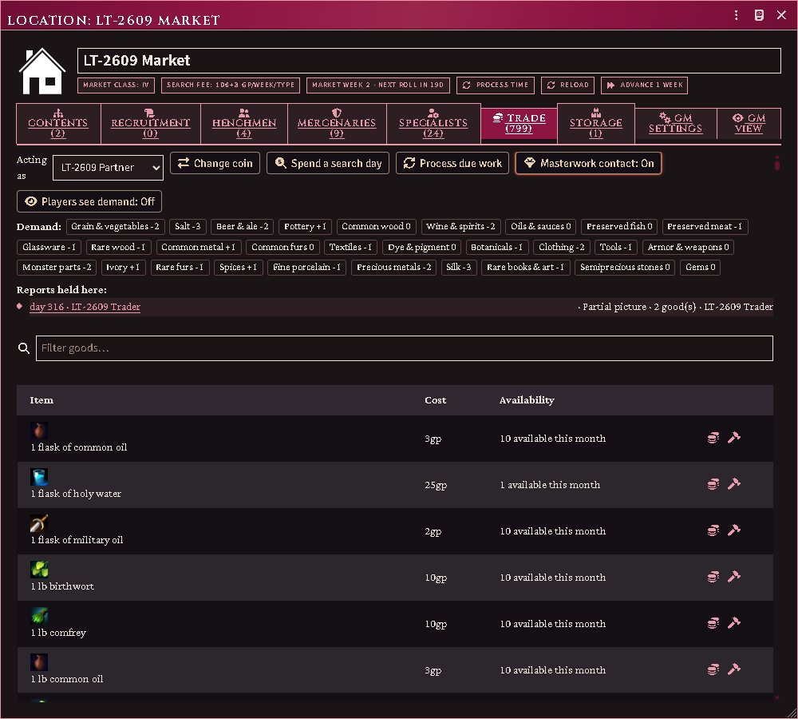
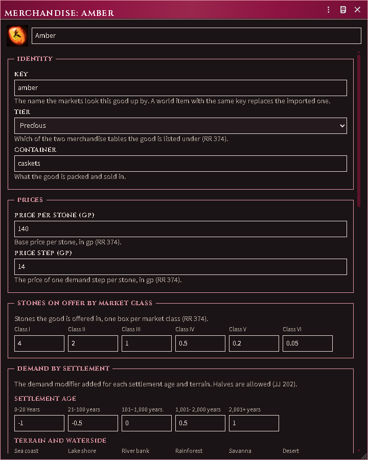
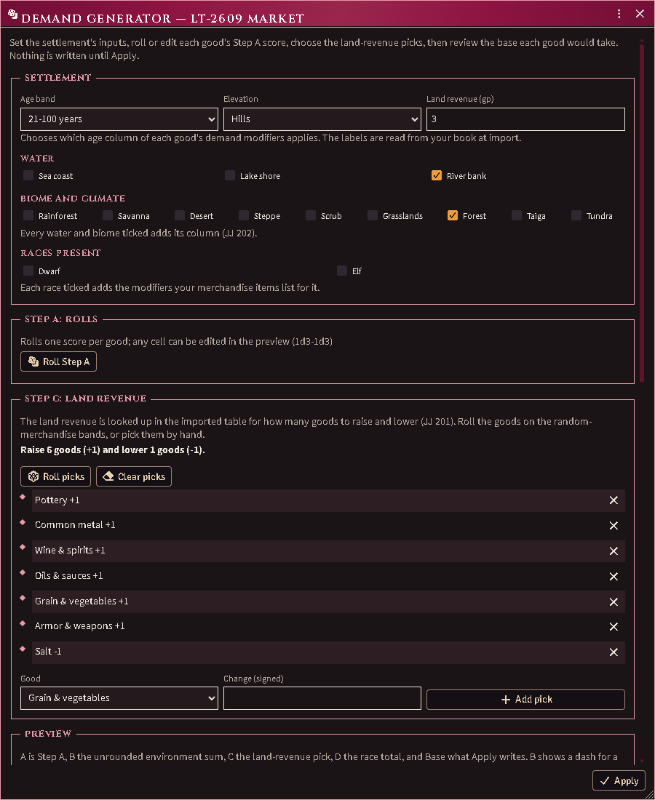
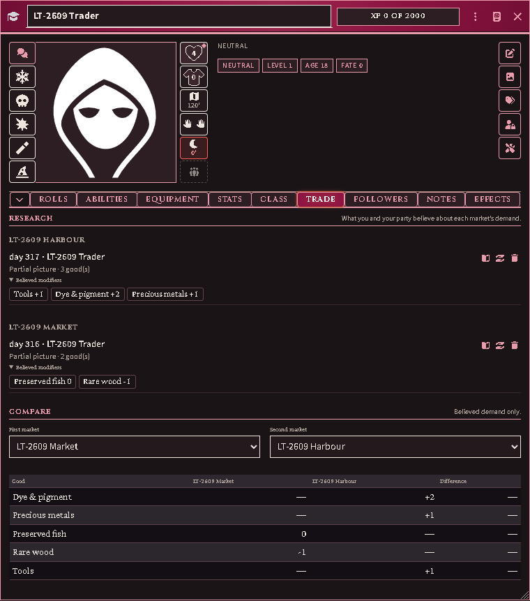
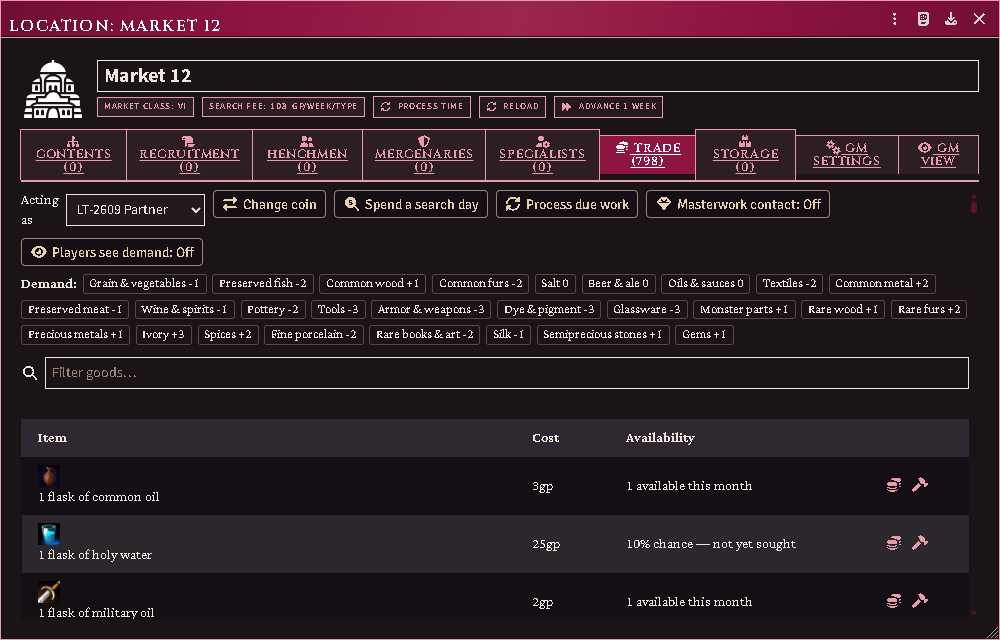

# Item Markets

Buy and sell equipment at any settlement with a market, at ACKS II
availability and prices — with merchant imports, commissions, directed
searches, the magic-item market, mercantile ventures, market research, and
the goods and demand a settlement trades in.

*A market's Trade tab: who the Judge is acting as, the coin, search-day and
process controls, the two Judge switches, the settlement's demand modifier per
good, the one report held about it, and the catalog with what the class makes
available this month.*

## Setup

1. Import the rules tables from your books via **the importer** (Getting
   Started, or Reimport One Shelf → Rules tables): equipment availability,
   market characteristics, magic-item transactions, wages and construction,
   and the market chapter's prose figures. Every number the market applies is
   read from these; an action whose table is missing refuses and names it.
   A table the extractor could not fill completely is reported at import and
   shows as incomplete rather than as "unavailable".
2. Import **merchandise** (the same step): each trade good becomes a
   Merchandise Item in the cookbook compendium. A world Item of the same key
   overrides it, and a good you make yourself joins every roll and window.
3. Give a location a market (its market class derives from urban families,
   or set the override). The location sheet grows a **Trade** tab.
4. Optional: **Configure parties** (module settings) if more than one group
   trades separately; otherwise the whole table is one party.

## Acting as

Every trade action on a market's Trade tab is taken as one character: the
**Acting as** picker at the top of the tab. A player chooses among the
characters they own; the Judge among the player characters and their own.
The choice is remembered on that client. Orders, searches and ventures show
to the party that made them; the Judge sees every party's, labelled, with a
block per party of what it believes about demand and where its venture
stands.

## Buying and selling

The Trade tab lists every priced item known to the world and its
compendiums, with live availability: so many per month per party at this
market's class, scarce goods as a percent chance your merchants find one.
Buy opens the purchase dialog — quantity, an optional merchant Bargaining
profile (GM), and for a large party the dedicated shopping day (RR 124).
Purchases stack: countable gear merges, and thirty swords arrive as thirty
swords to hand out. Sell offers your own priced goods at their
condition-reduced value; sold goods leave play.

A **search day** (button on the toolbar) spends another dedicated day
looking: your party's caps rise by one base increment and scarce goods get
a fresh look.

If the market cannot supply an item:

- **Import it** (in the purchase dialog): a merchant sources it from a local
  or a regional hub, paid up front; the wait and the risk of loss in transit
  are rolled for you (RR 124).
- **Post a directed search** (binoculars on the row): say how many; the
  merchant keeps looking each market month and holds a find for you.
- **Commission it** (hammer on the row): a craftsman builds it at their
  construction rate; wages paid up front, delivery on completion.

Masterwork gear appears only where the Judge switches the **Masterwork
contact** on (Trade tab). The gate reads the masterwork tier the equipment
sheet writes.

## Changing coin

**Change coin** turns one denomination into another at face value: pick the
stack, say how many, and pick what you want them as. It is a market's
service rather than a party's, so it is refused where no market stands, and
the Judge can set a market's exchange to derived, market or none on the GM
Settings tab. A player's exchange is carried out on the Judge's seat, so
coin moves only when both sides of it do.

## Magic items

The equipment sheet's Construction tab carries the magic panel: the GM
marks an item magical with its kind, rarity, apparent value, and base cost.

Unidentified items trade at apparent value. Identification runs the JJ
ladder (JJ 130) through any qualified character or henchman; failures wait
for a level. Fully identified items sell at base cost (more for their
maker) and buy at the Tower's premium (JJ 131). Availability and the
purchase preview band a magic item on the magic grid, never the equipment
one. A magic item sold to a market stays on its shelf — a **held** row on
the Trade tab — and can be bought back.

## Merchandise

*A Merchandise Item the Judge made: its key, tier and container, the prices
and the stones offered per market class, and the demand columns it answers
to.*

A Merchandise Item is one trade good: its price per stone and price step,
the daily stones on offer by market class, the settlement age and terrain
columns that move its demand, the peoples that want it, its band on the
random-merchandise tables, and the item kinds it stands for. The importer
fills these from your books (RR 374, JJ 202); a good you add as a world
Item — or a world Item with an imported good's key — takes part in every
roll and window like a printed one. **Aliases** name the older or
setting-book goods it stands for; a setting-book import translates through
them first.

## Demand

A market's demand modifier per good is three layers: the **base** the
Demand Generator or a book wrote, a derived layer reserved for trade routes,
and the Judge's **pins**, which win. *Set demand* on the Trade tab sets,
pins, clears or unpins one good; **Players see demand** is the Judge switch
that shows players the true modifiers rather than only what their party
believes.

*The Demand Generator: the settlement's inputs, Step A rolled per good, the
land-revenue picks, and (below) the preview of what Apply writes.*

The **Demand Generator** (Trade tab, Judge) builds the base from the
settlement's age, water, biome, elevation, land revenue and peoples (JJ Ch6
Step 7 A–D). Every good's roll and total is shown before anything is
written; Apply replaces the base and leaves pins alone, and a base you typed
or a book imported asks before it is replaced. The inputs and rolls are kept
for the next visit.

## Market research

*A trader's Trade tab as the player sees it: the party's reports by market
with the modifiers each learned, and Compare across two markets.*

An assessment (below) writes a **market report**: the market, when, who
assessed, and the modifiers learned. Reports are Items kept in a trade
house — a location actor the module makes on first use — and stamped to the
assessor. A character with Bargaining, Mercantile Network, a merchant
profession or a report of their own (or one the Judge marks as a trader on
their sheet) has a **Trade** tab: Research lists the party's reports by
market, and Compare sets two markets side by side on believed demand only.
A report can be opened and annotated, given to another character of the
party, or discarded. A market's own Trade tab lists the reports held about
it. A false assessment is a report with wrong beliefs; only the Judge's copy
says so.

## Setting-book market profiles

*A market a setting book prints: imported as a location with its market
class and the base demand modifier for every good the book's grid names.*

Importing a setting book that prints a regional demand grid and domain
records (AX3) gives each market its class, urban families and base demand.
A market the book gives no other entry becomes a location of its own; its
printed name arrives with the import. Older-edition goods translate to your
merchandise through the Judge's aliases first, then the module's map; a good
that translates nowhere is reported, never dropped. A class, family count or
base you already set is kept, and a re-import refreshes only what the same
page wrote.

## Mercantile ventures

Ventures run on dedicated days that resolve as game time passes:

1. **Enter the market** — declare cargo capacity; the gate takes its toll
   and your market impact is fixed from the imported baselines (RR 371).
2. **Assess supply & demand** — a throw against the imported bands decides
   how many demand modifiers you learn, and whether they are true; what you
   learn lands as a market report (RR 373).
3. **Solicit** a merchandise type — opens base stones × impact to trade and
   reveals the month's price (rolled once per type per month).
4. **Trade merchandise** — buy or sell stones against your solicitation,
   optionally negotiating the spot price a step your way — or into an
   outraged refusal (RR 376).

A day that cannot resolve because its table is not imported posts the
table's name to the trader and the Judge. Merchandise loads ride in
inventory one stone per unit, ready to haul to a market whose demand pays
better.

## The clock

Imports, commissions, searches, and venture days all resolve when world
time advances (any worldTime clock), on the GM's client — or the **Process
due work** button on the Trade tab, which the Judge always has and an owner
has while something of theirs is pending.
