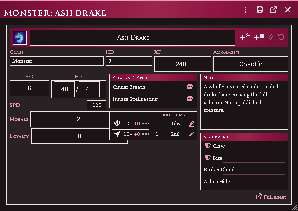
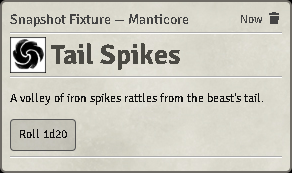
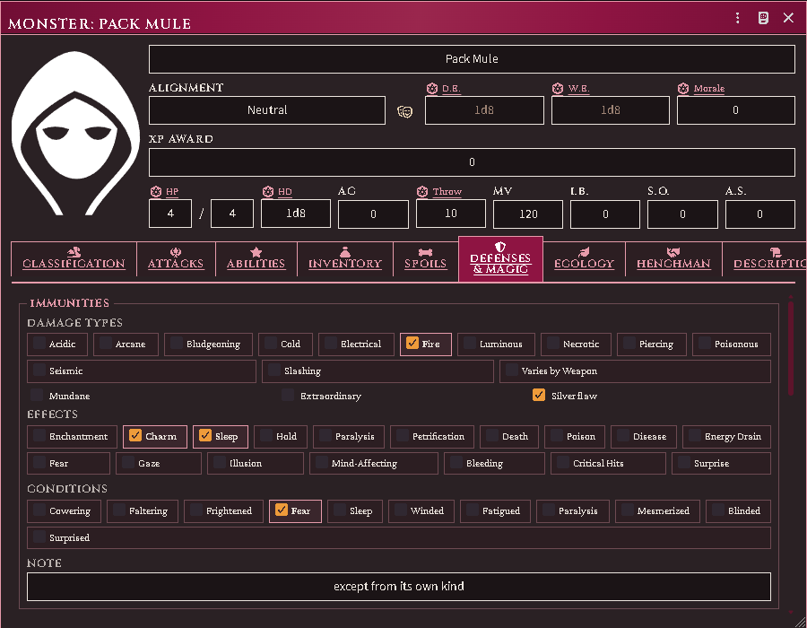
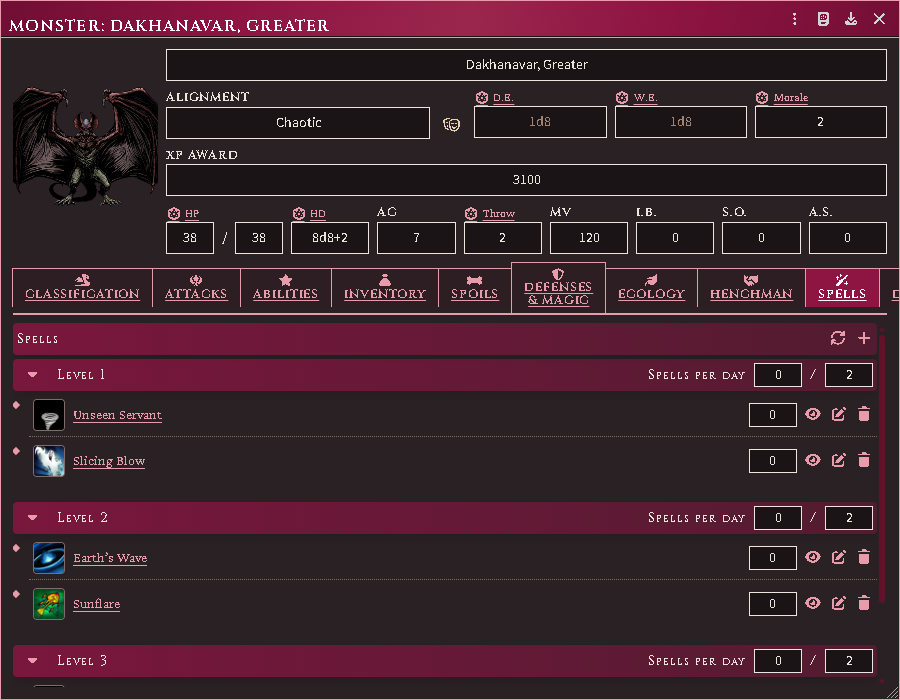
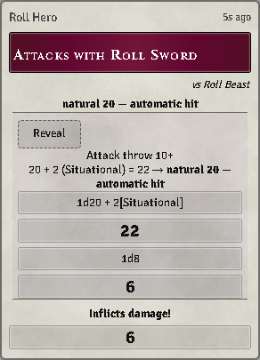
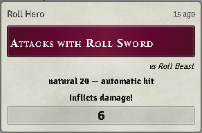
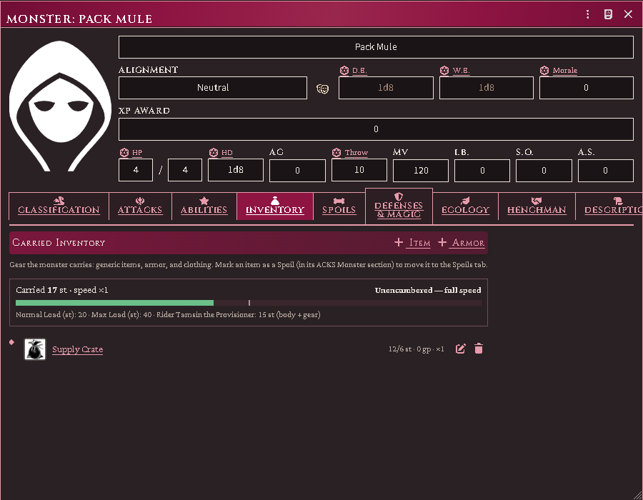
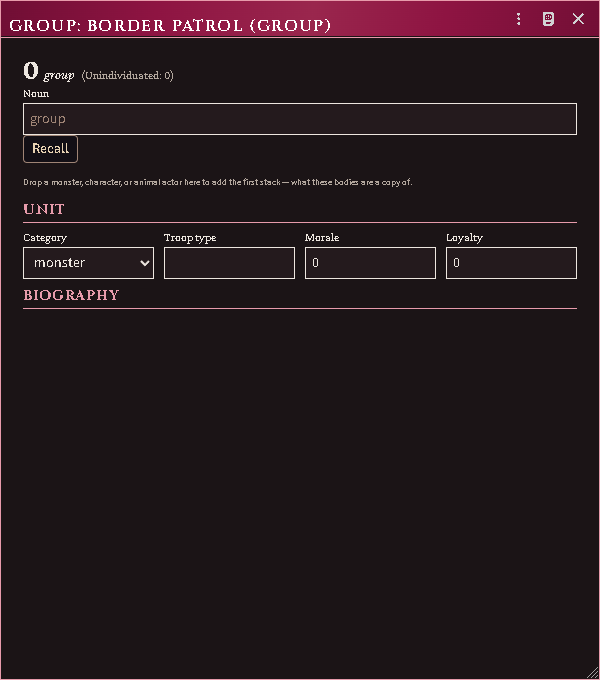
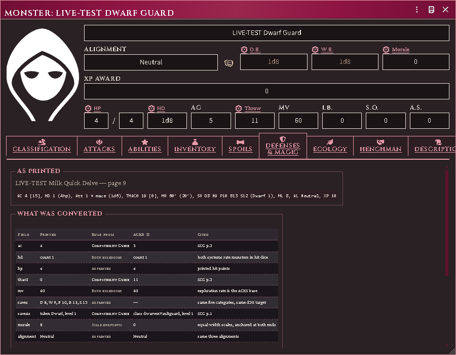

# The Monstrous Manual stat block

The system's own `monster` actor, given the full stat block: classification,
ecology, defences, attack routines, spoils, and the henchman fields that let a
monster be hired.

## What opens first

A monster opens on its **card** — the half-page you fight from. Attacks and
their damage, the creature's powers, and its spells by level, in a window a
little over half the height of the full block.

*What a monster opens on: attacks, powers and spells on one page.*

A power or spell whose entry carries prose has a **speech bubble** beside it.
Click it and the whole entry goes to chat, so the table reads "Terrifying
Visage" instead of waiting for someone to find the book. Rolling is separate and
still sits on its own d20, and a power with no prose gets no button.

*A named power posted to chat for the table to read.*

Everything else is one click away on **Expand** in the window header. If you
would rather land on the full block, set it once under **Sheet Configuration**
on any monster — that choice is yours and this module will not move it again.
**Animals** still open on the full block.

## The sheet

*The extended stat block's Defenses tab, one click behind the card: the silver
flaw beside Mundane and Extraordinary.*

**Expand** from the card, or open an **animal** actor, and this is the sheet you
get. An animal's combat block uses the monster's own field paths, and the
extended block is where its body form, carrying load and training live. The
sheet replaces core's flat "attributes" and "notes" panes with tabs:

- **Classification** — type, size, body form, intelligence, alignment.
- **Attacks** — the attack routine, natural weapons and their damage types.
- **Defenses** — immunities, resistances, senses and vision modes.
- **Abilities** — special abilities, tagged by category and carrying their XP
  contribution.
- **Inventory** — generic items, armor and clothing the monster carries.
  Armor Class is the value typed on the header and is not changed by
  anything carried here.
- **Ecology** — habitat, number appearing, lair chance, treasure.
- **Spoils** — what a body is worth.
- **Henchman** — the fields that apply when this creature is hired.
- **Description** — the prose.

No new actor type is invented: this is core's `monster`, extended through flags,
so everything that already reads a monster keeps working. The sheet is a
subclass of the system's own, so it keeps every tab core defines — and core's
plain sheet is still there under **Sheet Configuration** if you want the lean
view for a particular actor.

## A monster that casts

An imported creature whose entry names spells carries them. A spell it casts
"(as the spell)" or lists among its spell-like abilities is a copy of the
imported document on its Spells tab, marked with the frequency the page
prints beside it; one that casts as a class of a level gets that class's
slots at that level and a repertoire drawn from the class's list; one whose
entry prints a repertoire carries it as printed. A name no imported spell
answers stays in the prose. The Spells tab is on for any creature that
carries a spell, its slots at zero unless the entry fills them. A creature
imported before the spells were gains its spells on *Repair in place*; a
creature generated from a template whose row prints a spell column gets its
slots and a drawn repertoire at generation.

*A creature that casts as a class: its slots by level and the repertoire
drawn to them.*

## Who reads an attack card

With **Attack roll: throw as target** on, as it is unless you turn it off, an
attack posts this module's card. Everyone reading chat sees whether it hit and
the damage it does. The attack throw, every bonus, the target's Armor Class and
the dice are shown only to the attacker's owners and the Judge, so a monster's
numbers stay behind the screen while a player's own attacks show them
everything. The player who rolled, or the Judge, can press **Reveal** on the
card to show the math to the table. To show it to everyone every time, set
**Attack card math** to *Everyone* in the module's settings. Applying damage
from the card works the same either way.

*The attacker's owner reads the throw, every bonus and the dice, with Reveal
to show them to the table.*

*Everyone else reads the same card as its result and its damage.*

## Monsters as hirelings

A monster can be hired like any other follower. Core's own `addHenchman` rejects
non-character actors, so the module wires the retainer fields directly.

Animals are typed here too, which is what lets the group and mount features tell
an animal from a person.

What a beast can carry, and who is riding it, sit on the extended block with the
rest of its body.

*The capacity primitive on the sheet: carried weight, MM loads, and the rider
named.*

## Groups of monsters

A monster's **number appearing** sizes a group: the group feature reads it into a
dice formula, but nothing auto-rolls it — the Judge decides when a group is
sized. A source with no ecology data returns nothing, and you type the size.

*A retinue kept as one document rather than a dozen.*

## Where an imported creature came from

A creature converted from another game's book — an Old-School Essentials
adventure brought in by the importer — carries a **Source** tab that a
hand-built monster does not.

It shows three things side by side:

- **the stat block exactly as printed**, so you can hold it against your own
  copy of the book;
- **every field that was converted**, with the rule it was converted by — a
  published conversion, both rulebooks agreeing, a straight transcription, or a
  derivation;
- **every field deliberately left alone**, and why. Experience and treasure type
  are the common ones: neither game's numbers mean the same thing, so the
  printed value is kept and shown here rather than written into a field where it
  would read as an ACKS II value.

Anything the importer's reader did not recognise is listed too, so a clause it
could not place is visible rather than lost.

The tab is read-only. If a number looks wrong at the table, this is where you
check it — and then correct the field itself on the tab that owns it.

## Common problems

**A save throws an error on an old monster.** Pre-migration monsters store saves
under the old keys (`breath`/`wand` rather than `blast`/`implements`). The sheet
warns instead of throwing — re-save the actor to bring it current.

**The stat block is empty.** The actor is a `monster` but was never given extras.
Fill in the Classification tab; everything else keys off it.

**Damage types show a neutral icon.** The weapon has no type and none could be
resolved from the equipment classifier. That is honest — it shows a neutral icon
rather than guessing.
