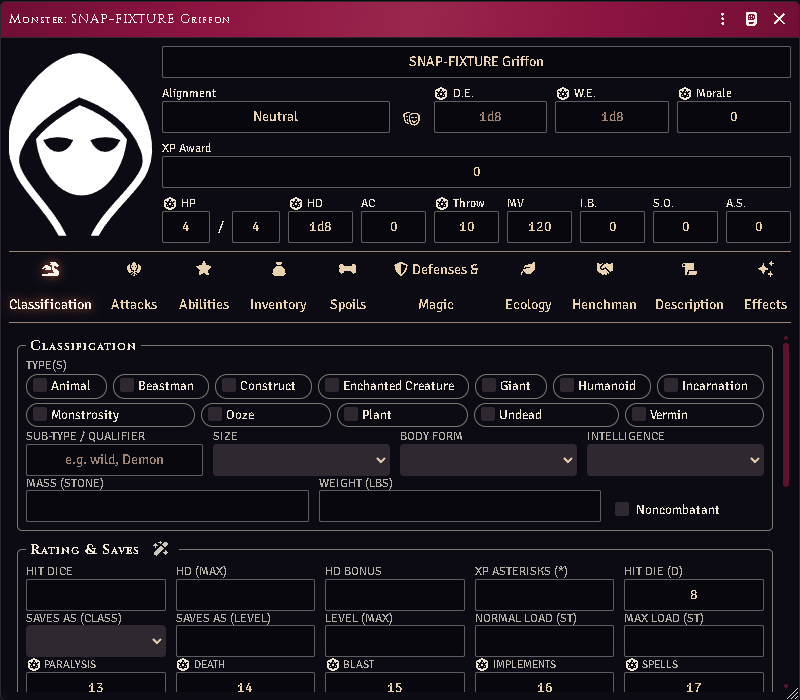

# The Monstrous Manual stat block

The system's own `monster` actor, given the full stat block: classification,
ecology, defences, attack routines, spoils, and the henchman fields that let a
monster be hired.

*A Monstrous Manual stat block on the monster sheet.*

## The sheet

Open any **monster** actor — this is the sheet you get, no configuration needed.
**Animals** open on it too: an animal's combat block uses the monster's own
field paths, and the extended block is where its body form, carrying load and
training live. The sheet replaces core's flat "attributes" and "notes" panes
with tabs:

- **Classification** — type, size, body form, intelligence, alignment.
- **Attacks** — the attack routine, natural weapons and their damage types.
- **Defenses** — immunities, resistances, senses and vision modes.
- **Abilities** — special abilities, tagged by category and carrying their XP
  contribution.
- **Ecology** — habitat, number appearing, lair chance, treasure.
- **Spoils** — what a body is worth.
- **Henchman** — the fields that apply when this creature is hired.
- **Description** — the prose.

No new actor type is invented: this is core's `monster`, extended through flags,
so everything that already reads a monster keeps working. The sheet is a
subclass of the system's own, so it keeps every tab core defines — and core's
plain sheet is still there under **Sheet Configuration** if you want the lean
view for a particular actor.

## Monsters as hirelings

A monster can be hired like any other follower. Core's own `addHenchman` rejects
non-character actors, so the module wires the retainer fields directly.

Animals are typed here too, which is what lets the group and mount features tell
an animal from a person.

## Groups of monsters

A monster's **number appearing** sizes a group: the group feature reads it into a
dice formula, but nothing auto-rolls it — the Judge decides when a group is
sized. A source with no ecology data returns nothing, and you type the size.

## Common problems

**A save throws an error on an old monster.** Pre-migration monsters store saves
under the old keys (`breath`/`wand` rather than `blast`/`implements`). The sheet
warns instead of throwing — re-save the actor to bring it current.

**The stat block is empty.** The actor is a `monster` but was never given extras.
Fill in the Classification tab; everything else keys off it.

**Damage types show a neutral icon.** The weapon has no type and none could be
resolved from the equipment classifier. That is honest — it shows a neutral icon
rather than guessing.
