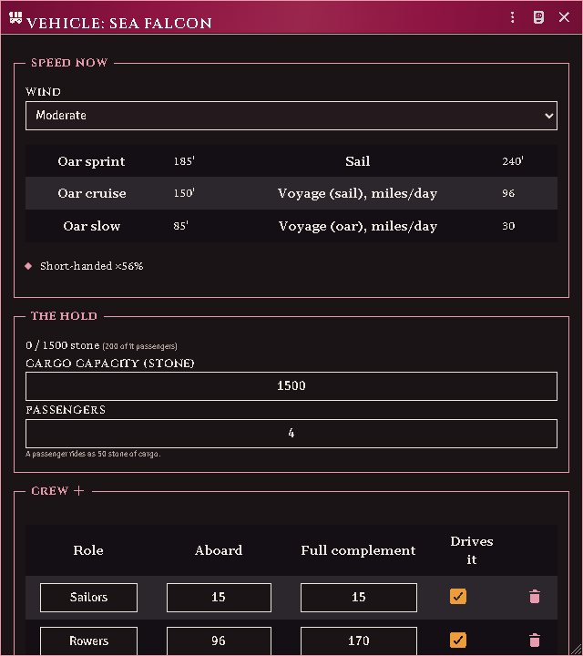
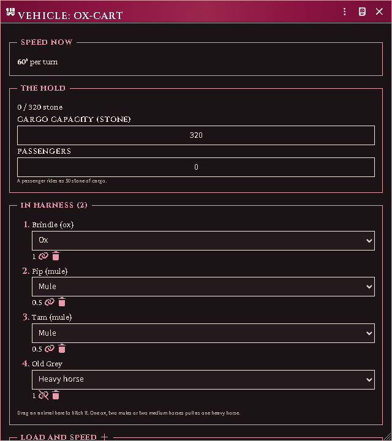
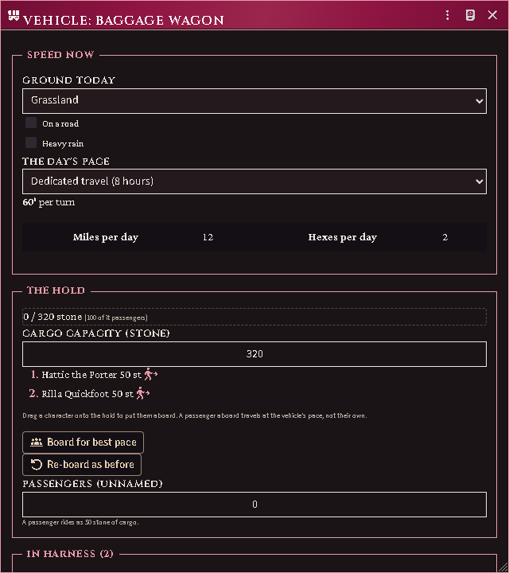
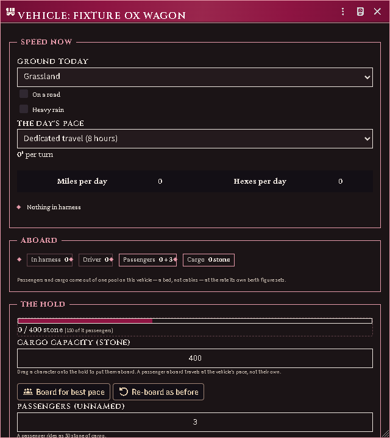
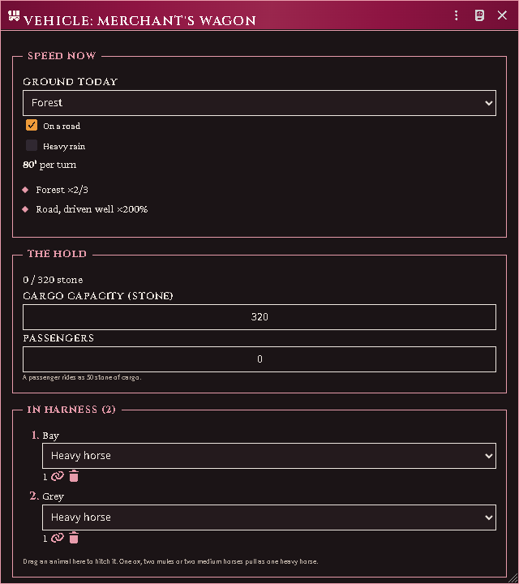
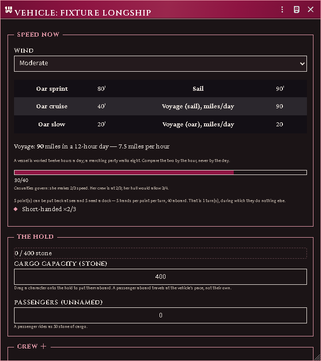

# Vehicles

Carts, wagons, chariots, palanquins, galleys and ships are actors, like
characters. Make one from the Actors tab: **Create Actor → Vehicle**.

## Setting one up

A vehicle holds what its book prints and derives everything else. Fill in the
**cargo capacity in stone**, the **crew** it wants, the **team** it is built for
(land) or its **oar and sail speeds** (sea), and its **AC and structural hit
points** if it is a vessel. Nothing you type says what is aboard — that comes
from what you actually put aboard.

Pick **Land** or **Sea** first. It decides which sections you get: a wagon is
pulled and driven, a ship is crewed, and offering either the other's controls
would teach you the wrong model.

*A half-manned galley, its real speeds, and what reduced them.*

## Stations, and loading it

The **Stations** panel is the vehicle at a glance: one group per seat the
vehicle actually has — the driver's seat (or the whole printed complement, on
a chariot or a howdah), each crew role with its `filled / required` counter,
the captain's and navigator's chairs, the passengers, the team. Named people
are chips; typed counts are the **unnamed** complement and the two add up.
Empty seats show as dashed slots you can drop someone straight onto; an empty
officer's chair says what it is costing her; and a crew member without the
proficiency their seat wants wears a **½** badge — an unproficient hand
counts as half a hand, and the group says what it is effectively worth.

Drag a character, an animal, another vehicle or an item onto the sheet. An
**actor drop asks what they are** — passenger, a crew station, the team, or
lashed on as cargo — with the cost of each choice stated before anything is
written. A drop **on a specific seat** skips the question. An item dropped
anywhere is loaded as freight; another vehicle can only ride as cargo.

The typed team rows remain for the ABSTRACT complement — "2 heavy horses"
without minting two actor documents — and real and abstract pull add up.

What each role costs:

- a **named passenger** weighs what they actually weigh — body plus carried
  gear — and travels at the vehicle's pace. An **unnamed** head costs the
  vehicle's printed per-head rate, belongings included: that rate is the
  book's generic traveller, not a floor under a real one;
- **crew** and **draft animals** do not weigh against cargo at all — except
  that a non-motive crew's **gear** (marines' arms and armour) is freight,
  and the hold bar names that share;
- an actor carried **as cargo** — a canoe on the wagon — costs its full mass;
- a **stack** (a group actor — a merc platoon, a rower gang) counts every
  body it stands for: twenty hands at the bench, twenty bodies of weight, its
  chip marked ×20;
- on a **land vehicle**, passengers and cargo come out of one pool — a cart has
  a bed, not cabins. On a **vessel** they are separate: she can be full of
  people and still have a hold to fill.

*An ox and two mules pulling as two heavy horses, with one animal unhitched.*

*Two riders aboard, the day's march in miles and hexes, and the boarding
macros.*

**Board for best pace** loads everyone the vehicle would carry faster than their
own legs, slowest first, and stops when the hold is full. **Re-board as before**
puts everyone back where the last change found them, which is what you want at a
ford.

*A vehicle shows only the load buckets it actually has, each with its fill — a
cart has no cabins to draw.*

## Mounts, and animals in harness

A mount is an actor, not a piece of gear. Drop an animal onto a character (or
call `acksExtras.lib.mount.mountActor`) and the two are bound: the rider moves
at the mount's pace, the party sheet shows a mount chip beside the rider, and
the mounted-combat rules have something to read. Harness the same animal to a
wagon instead and it joins the team; a rider on a horse that is itself in
harness travels at the WAGON's pace, because a carried thing resolves to
whatever is really doing the moving.

Two things about an animal decide what the rules do with it, and they are
different questions. Its **training** — riding, draft, war, hunting, herding —
is what it was schooled for; a war-trained mount joins its rider's charge,
where an untrained one shies off. Its **mountability** is whether the species
can be ridden at all: an ox is rideable in principle and untrained in
practice, and a war dog is trained for war and is still not a mount.

Both are filled by importing the animals from your own book. The rulebook
prices animals by role — a *Heavy War* horse, a *Draft* mule, a *Riding* camel
— so the importer reads the training out of the name the page printed, and
treats a species the book sells in a riding form as one you can sit on. If you
create an animal by hand instead, set them yourself on its sheet; an animal
that has never said arrives *untrained*, which the rules read as "not stated"
rather than as a claim, and fall back to its name.

A team is counted in heavy-horse equivalents. The heavy horse is the unit, so
it always counts as one; what an ox or a mule is worth against it is a number
your book prints, and it arrives with the travel tables. Until you import
them, a team of heavy horses still adds up and anything else is shown as
unpriced rather than quietly counted as nothing.

## Making it move

The sheet always shows the speed the vehicle *actually* makes, with a list of
what reduced it — short crew, a heavy load, a hungry crew, a stowed mast, the
wind, the ground. Change the **wind** or the **terrain** selector to see the
answer change; those are your view of the moment, not properties of the vehicle.

*A wagon on a forest road, and what the terrain and the driver each did to its
pace.*

A wagon on ground that wheels cannot enter without a road is **stopped**, not
slow, and says so.

## A ship's day is not a party's day

A vessel is worked **twelve hours**; a marching party walks **eight**. So a ship
that shows 90 miles a day and a party that shows 24 are not two numbers you can
compare — the sheet prints the **miles per hour** beside the day for exactly
that reason. Compare those.

Under sail, in open water, with a navigator and a full crew, a ship may work
around the clock: **twice the distance in a day, at the same speed**.

## Damage, and what it costs

Most things cannot hurt a hull. A man-sized or large creature swinging at a
warship does **nothing** — hull damage is artillery's business and the business
of things far bigger than a person. Light and medium ballistae reach a tenth of
the way; heavy ballistae and the lighter catapults a third; siege artillery and
the truly enormous all of it.

Damage **slows her**, in proportion to the hull she has lost. So do casualties,
in proportion to the hands missing — but the two are **not added together**.
Whichever is worse governs, and the sheet names which one, so you do not patch a
hull to fix a speed the missing rowers were costing.

At nothing left she cannot move under her own power and goes down in 1d10
rounds.

*A holed longship: her hull, her twelve-hour day beside its hour, which of
casualties and damage governs her speed, and what a repair would cost.*

**Repairs** are hand work: five of the crew, one turn, one point, doing nothing
else meanwhile. Only **half** of what she took at sea can be put back before she
reaches a dock, so a long voyage accumulates damage no amount of crew-turns will
clear. The sheet works that out for the hands you actually have aboard.

## Getting lost, and getting holed

Two different questions, with two different people answering them.

The **navigator** keeps her on course: a throw at the start of each day *and*
each night — a river is nearly unmissable, the open sea is not. Someone aboard
with Pathfinding or Navigation is worth +4, and both together +8.

The **captain** keeps her off the rocks: on entering water that holds a hazard,
a Seafaring throw, easier for a master mariner. **Slowing down helps twice** —
it makes the throw easier *and* halves the damage if she strikes anyway. Kelp
holds her until she is cut free; rock, reef and wreck hole her; a shoal grounds
her until the tide lifts her or the crew throws enough cargo over the side.

These are derived and published for macros, but nothing rolls them for you yet
— see [the roadmap](https://github.com/NocTempre/foundryvtt-acks-extras/blob/main/docs/vehicles/ROADMAP.md).
