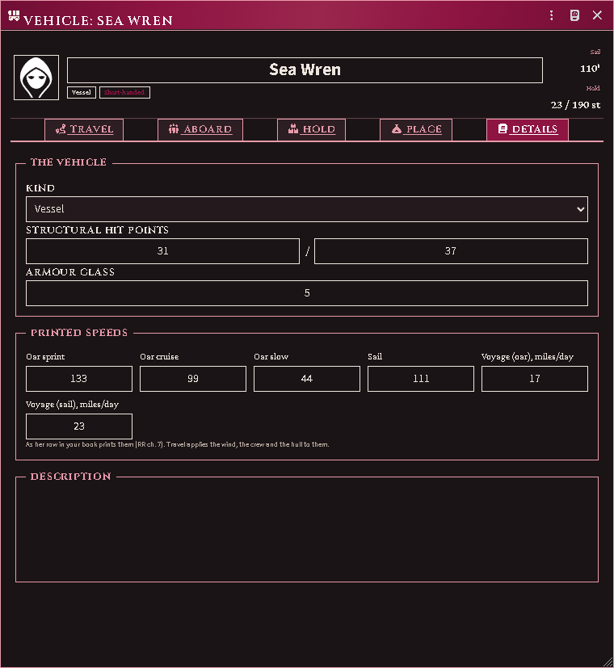
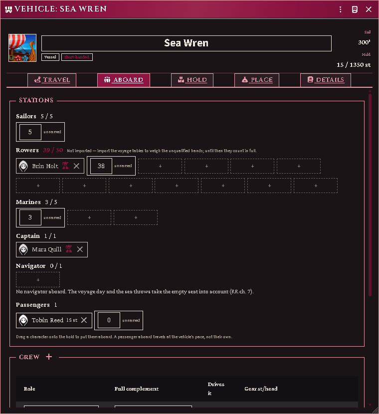
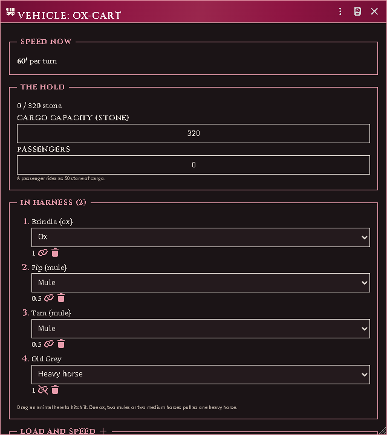
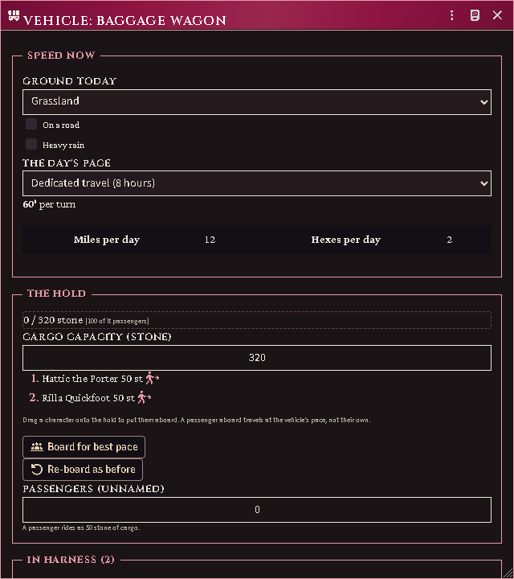
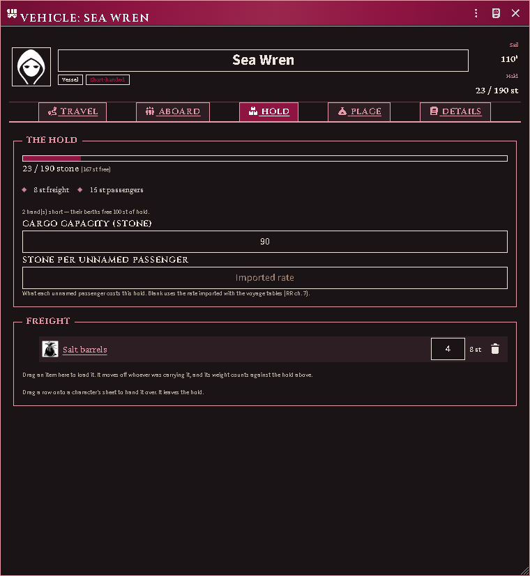
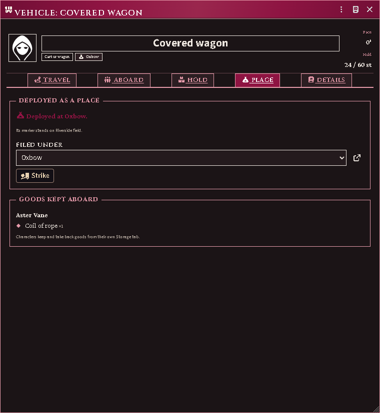
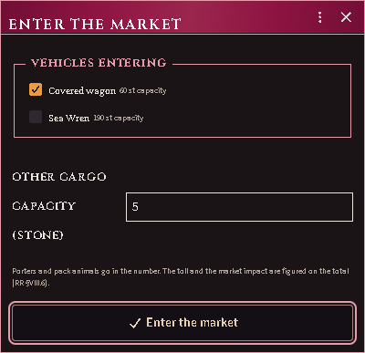
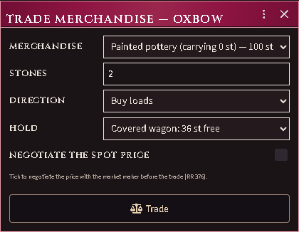
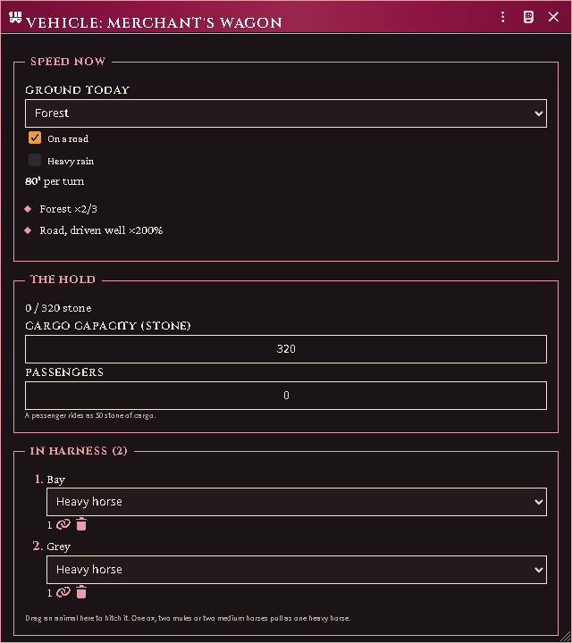
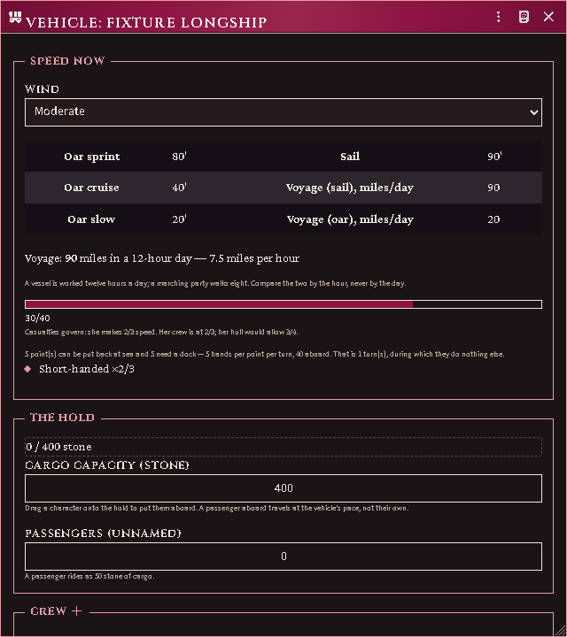

# Vehicles

Carts, wagons, chariots, palanquins, galleys and ships are actors, like
characters. Make one from the Actors tab: **Create Actor → Vehicle**.

## The sheet

A header stays pinned at the top whatever you are looking at: the picture
(click it to change it), the name, and tags for what matters right now —
**deployed**, **sinking**, **over capacity**, **short-handed** — with the pace
and how full the hold is. Under it are five tabs:

- **Travel** — the speed she makes now and why, the ground or the wind, the
  crew's condition, the hull, and (at sea) the seamanship throws;
- **Aboard** — who is where: the seats, the crew complement, the team;
- **Hold** — how full she is and with what;
- **Place** — deploying her as a place, and whose goods are kept aboard;
- **Details** — what the book prints for her, and a description.

## Setting one up

A vehicle holds what its book prints and derives everything else. On
**Details**, pick **Land** or **Sea** first — it decides what the other tabs
offer: a wagon is pulled and driven, a ship is crewed, and offering either the
other's controls would teach you the wrong model. Then fill in her **AC and
structural hit points** and her **printed oar and sail speeds** (a vessel), or
her **load and speed rows** (a land vehicle). On **Hold**, type her **cargo
capacity in stone**; on **Aboard**, the **crew** she wants or the **team** she
is built for. Nothing you type says what is aboard — that comes from what you
actually put aboard.

*A galley's Details: her kind, her hull and armour, and the speeds her book
prints.*

## Stations, and loading it

**Aboard** is the vehicle at a glance: one group per seat she actually has —
the driver's seat (or the whole printed complement, on a chariot or a howdah),
each crew role with its `filled / required` counter, the captain's and
navigator's chairs, the passengers, the team. Named people are chips; typed
counts are the **unnamed** complement and the two add up. Empty seats show as
dashed slots you can drop someone straight onto, and an empty officer's chair
says what it is costing her. A crew member without the proficiency their seat
asks for wears an **unqualified** badge. Once your voyage tables are imported,
the group shows what its hands are effectively worth beside their head count
(RR ch. 7); until then it counts them in full and says so.

*A galley short of rowers: the sailors at full strength, a named hand without
the proficiency the seat asks for wearing the unqualified badge beside the
unnamed complement; the marines are short, the captain's chair is filled, the
navigator's is empty with what that costs, and one passenger is aboard.*

Drag a character, an animal, another vehicle or an item onto the sheet. An
**actor drop asks what they are** — passenger, a crew station, the team, or
lashed on as cargo — with the cost of each choice stated before anything is
written. A drop **on a specific seat** skips the question. An item dragged
from another character's sheet is moved into the hold; one from the sidebar or
a compendium is copied in. Another vehicle can only ride as cargo.

The typed team rows remain for the ABSTRACT complement — "2 heavy horses"
without minting two actor documents — and real and abstract pull add up.

What each role costs:

- a **named passenger** weighs what they actually weigh — body plus carried
  gear. An **unnamed** head costs the vehicle's per-head rate, belongings
  included: that rate is the book's generic traveller, not a floor under a
  real one. Leave the rate blank on **Hold** to use the one imported with
  the voyage tables, or type the vehicle's own;
- **crew** and **draft animals** do not weigh against cargo at all — except
  that a non-motive crew's **gear** (marines' arms and armour) is freight, and
  the hold names that share;
- an actor carried **as cargo** — a canoe on the wagon — costs its full mass;
- a **stack** (a group actor — a merc platoon, a rower gang) counts every
  body it stands for, its chip marked with the count;
- passengers and cargo come out of **one pool** on every vehicle: a cart
  carries its riders on its bed, and a ship carries hers as cargo (RR ch. 4,
  ch. 7). A ship short of hands has their berths free for cargo, and the hold
  grows by them on its own.

*An ox and two mules pulling as two heavy horses, with one animal unhitched.*

*Two riders aboard, the day's march in miles and hexes, and the boarding
macros.*

**Board for best pace** loads everyone the vehicle would carry faster than their
own legs, slowest first, and stops when the hold is full. **Re-board as before**
puts everyone back where the last change found them, which is what you want at a
ford.

## The hold

**Hold** shows one bar — everything she carries against what she can carry —
and what it is made of: freight, passengers, anything lashed on as cargo, and
the marines' gear. The same figure decides a wagon's speed row, whether
**Board for best pace** has room for one more, and whether a market will load
a purchase into her, so a load is refused at the same line the bar turns red.

*A galley's hold: freight and a passenger against one capacity, grown by the
berths of the two hands she is short.*

The freight list tags **trade goods** bought at a market, and goods kept aboard
**for someone** (see below). Change a quantity in place, unload a row, or drag
it onto a character's sheet to hand it over — it leaves the hold rather than
being copied.

## Deploying it as a place

Circle the wagons for the night, or tie the ship up at the quay: on **Place**,
**Deploy** sets her down as a place in her own right.

- Her **token stands beside the party** as a point of interest on the map,
  walked to and stood beside like any place's.
- Characters can **keep goods aboard** from their own Storage tabs, under
  whose they are; the Place tab lists them by owner.
- She is **filed under a place** — by default wherever the party stands (the
  town it is in, or the place the map belongs to) — or under one you choose,
  or none.
- Anyone **aboard** her is at her, whether or not she is on a map.

**Strike** takes the marker up and moves on; everything aboard stays aboard,
and only what deploying did is undone — a token you placed yourself, or a
place she was already filed under, stays as it was. The party's **train**, on
the formation sheet, has the same toggle beside each vehicle it brings. A
player can deploy and strike a vehicle they own; the Judge's client places the
token for them.

*A wagon deployed at a camp: the map its marker stands on, the place it is
filed under, and a coil of rope a trader keeps aboard.*

## Taking it to market

A party entering a market for a mercantile venture brings its transport, and
the size of it is what the gate tolls and how much the party moves the market
(RR §VIII.6). **Enter the market** lists your vehicles — one someone in the
party rides is already ticked — and a number for anything else: porters, pack
animals. Each vehicle counts at its hold's capacity.

*Entering with the wagon a trader rides already ticked, the galley offered
beside it, and five stone of other cargo.*

When you buy or sell a load, pick the **hold**: your own packs, or one of the
vehicles you entered with, shown with its free room. A purchase too big for
the vehicle's free room is refused before any haggling; a sale takes its loads
from that hold, across as many sacks as it needs. Goods someone else keeps
aboard are theirs, and never sold for you.

*Buying two stone of pottery into the wagon, the hold picker showing the room
it has left.*

## Mounts, and animals in harness

A mount is an actor, not a piece of gear. Drop an animal onto a character (or
call `acksExtras.lib.mount.mountActor`) and the two are bound: the rider moves
at the mount's pace, the party sheet shows a mount chip beside the rider, and
the mounted-combat rules have something to read. Harness the same animal to a
wagon instead and it joins the team; a rider on a horse that is itself in
harness travels at the WAGON's pace, because a carried thing resolves to
whatever is really doing the moving.

Two things about an animal decide what the rules do with it, and they are
different questions. Its **training** — riding, draft, war, hunting, herding —
is what it was schooled for, and the mounted-combat overlay reads it (RR
ch. 6). Its **mountability** is whether the species
can be ridden at all: an ox is rideable in principle and untrained in
practice, and a war dog is trained for war and is still not a mount.

Both are filled by importing the animals from your own book. The rulebook
prices animals by role — a *Heavy War* horse, a *Draft* mule, a *Riding* camel
— so the importer reads the training out of the name the page printed, and
treats a species the book sells in a riding form as one you can sit on. If you
create an animal by hand instead, set them yourself on its sheet; an animal
that has never said arrives *untrained*, which the rules read as "not stated"
rather than as a claim, and fall back to its name.

A team is counted in heavy-horse equivalents. The heavy horse is the unit, so
it always counts as one; what an ox or a mule is worth against it is a number
your book prints, and it arrives with the travel tables. Until you import
them, a team of heavy horses still adds up and anything else is shown as
unpriced rather than quietly counted as nothing.

## Making it move

**Travel** always shows the speed the vehicle *actually* makes, with a list of
what reduced it — short crew, a heavy load, a hungry crew, a stowed mast, the
wind, the ground. Change the **wind** or the **terrain** selector to see the
answer change; those are your view of the moment, not properties of the vehicle.

*A wagon on a forest road, and what the terrain and the driver each did to its
pace.*

A wagon on ground that wheels cannot enter without a road is **stopped**, not
slow, and says so.

## A ship's day is not a party's day

A voyage day and a march day are not the same length (RR ch. 7), so a ship's
miles a day and a party's are not two numbers you can compare. **Travel**
prints the hours in her day and her **miles per hour** beside the miles; compare
those.

## Damage, and what it costs

Her hull is her **structural hit points** on **Details**: what she has left,
beside what she has when whole. **Travel** draws the hull as a bar, and once
she has taken damage it says two things under it:

- whether her **damage** or her **missing hands** is governing her speed, and
  what the other would allow — so you do not patch a hull to fix a speed the
  empty benches were costing;
- what a **repair** takes with the hands actually aboard: how much can be put
  back at sea, how much waits for a dock, and how many turns the work runs, at
  your book's rates (RR ch. 7).

At nothing left she is **holed through**: **Start the clock** rolls how long
she stays up, and **Round passes** counts it down.

*A holed longship: her hull, her voyage day beside its hour, which of
casualties and damage governs her speed, and what a repair would cost.*

Which attacks can harm a hull, and how much of a hit lands, is your book's to
say (RR ch. 7). A macro can ask `acksExtras.vehicles.damageToVessel(amount,
source)` what a hit does to her at your imported shares; type the result into
her hull.

## Getting lost, and getting holed

At sea, **Travel** carries two throws (RR ch. 7):

- **Navigation throw** — keeping her on course. The dialog asks which waters
  she is in, and prefills whether anyone aboard has Pathfinding or Navigation.
- **Hazard throw** — the captain's, on entering water that holds a hazard. The
  dialog asks which hazard, prefills whether a master mariner has the helm,
  and asks about her speed and her draft; on a failure it states what that
  hazard does to her, from your imported tables.

Both dialogs list the throw's parts before anything is rolled and whisper the
result to the Judge. The prefills are a reading of who is aboard, and you can
change them.
